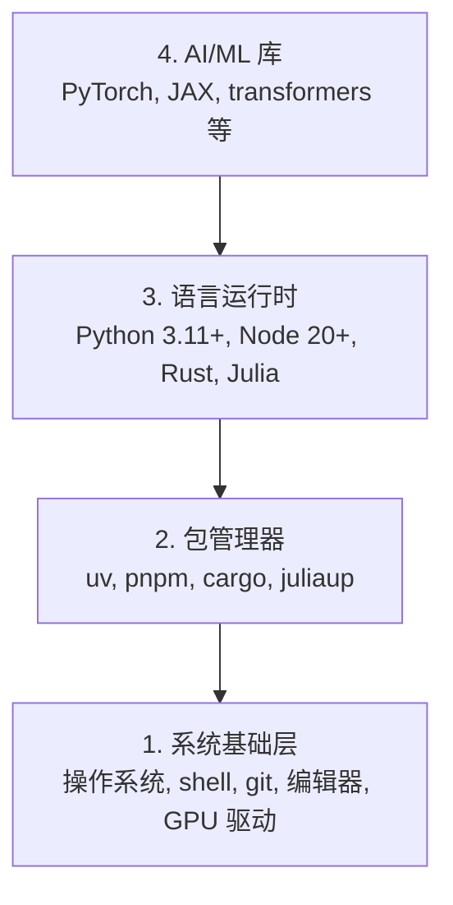

# 开发环境

> 你的工具塑造你的思维。一次配好，终身受益。

**Type:** Build
**Languages:** Python, Node.js, Rust
**Prerequisites:** None
**Time:** ~45 minutes

## 学习目标

- 从零搭建 Python 3.11+、Node.js 20+ 和 Rust 工具链
- 配置虚拟环境和包管理器以实现可复现构建
- 验证 GPU 访问（CUDA/MPS）并运行测试张量操作
- 理解四层架构：系统层、包管理层、运行时层、AI 库层

## 问题

你即将在 200+ 节课中学习 AI 工程，涉及 Python、TypeScript、Rust 和 Julia。如果你的环境有问题，每节课都会变成与工具的斗争，而不是学习。

大多数人跳过环境搭建。然后他们花数小时调试导入错误、版本冲突和缺少的 CUDA 驱动。我们要一次性地正确完成这一步。

## 概念

一个 AI 工程环境有四个层次：



我们从底层向上安装。每一层都依赖于它的下一层。

## Build It

### 第 1 步：系统基础环境

检查系统并安装基础工具。

```bash
# macOS
xcode-select --install
brew install git curl wget

# Ubuntu/Debian
sudo apt update && sudo apt install -y build-essential git curl wget

# Windows（推荐使用 WSL2）
wsl --install -d Ubuntu-24.04
```

### 第 2 步：安装 Python 和 uv

我们使用 `uv`——它比 pip 快 10-100 倍，并自动处理虚拟环境。

```bash
curl -LsSf https://astral.sh/uv/install.sh | sh

uv python install 3.12

uv venv
source .venv/bin/activate  # Windows 上使用 .venv\Scripts\activate

uv pip install numpy matplotlib jupyter
```

验证：

```python
import sys
print(f"Python {sys.version}")

import numpy as np
print(f"NumPy {np.__version__}")
a = np.array([1, 2, 3])
print(f"向量: {a}, 自身点积: {np.dot(a, a)}")
```

### 第 3 步：安装 Node.js 和 pnpm

用于 TypeScript 课程（agent、MCP 服务器、Web 应用）。

```bash
curl -fsSL https://fnm.vercel.app/install | bash
fnm install 22
fnm use 22

npm install -g pnpm

node -e "console.log('Node', process.version)"
```

### 第 4 步：安装 Rust

用于性能关键的课程（推理、系统编程）。

```bash
curl --proto '=https' --tlsv1.2 -sSf https://sh.rustup.rs | sh

rustc --version
cargo --version
```

### 第 5 步：安装 Julia（可选）

用于数学密集型的课程，Julia 在此类场景中表现优异。

```bash
curl -fsSL https://install.julialang.org | sh

julia -e 'println("Julia ", VERSION)'
```

### 第 6 步：GPU 设置（如果你有 GPU）

```bash
# NVIDIA
nvidia-smi

# 安装支持 CUDA 的 PyTorch
uv pip install torch torchvision torchaudio --index-url https://download.pytorch.org/whl/cu124
```

```python
import torch
print(f"CUDA 可用: {torch.cuda.is_available()}")
if torch.cuda.is_available():
    print(f"GPU: {torch.cuda.get_device_name(0)}")
```

没有 GPU？没问题。大多数课程可以在 CPU 上运行。对于训练密集型的课程，请使用 Google Colab 或云 GPU。

### 第 7 步：验证一切

运行验证脚本：

```bash
python phases/00-setup-and-tooling/01-dev-environment/code/verify.py
```

## Use It

你的环境现在已经为本课程的所有课程准备好了。以下是你将在哪里使用它们：

| 语言 | 使用阶段 | 包管理器 |
|----------|---------|-----------------|
| Python | 第 1-12 阶段（ML、DL、NLP、视觉、音频、LLM） | uv |
| TypeScript | 第 13-17 阶段（工具、Agent、集群、基础设施） | pnpm |
| Rust | 第 12、15-17 阶段（性能关键系统） | cargo |
| Julia | 第 1 阶段（数学基础） | Pkg |

## Ship It

本课程生成一个验证脚本，任何人都可以运行它来检查他们的环境配置。

请参阅 `outputs/prompt-env-check.md`，了解帮助 AI 助手诊断环境问题的提示词。

## 练习

1. 运行验证脚本并修复任何失败
2. 为本课程创建一个 Python 虚拟环境并安装 PyTorch
3. 用全部四种语言各写一个 "hello world" 并运行它们
