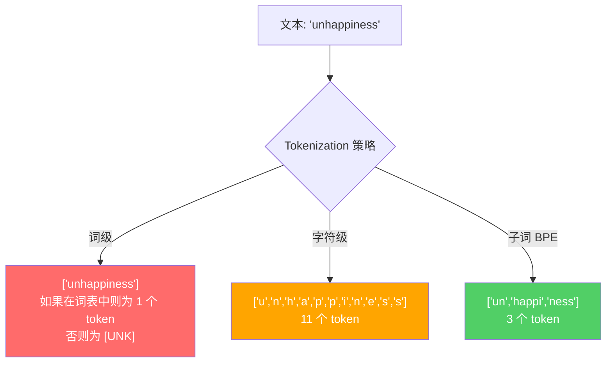
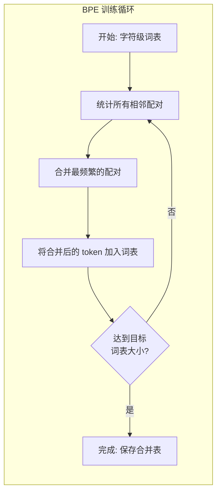
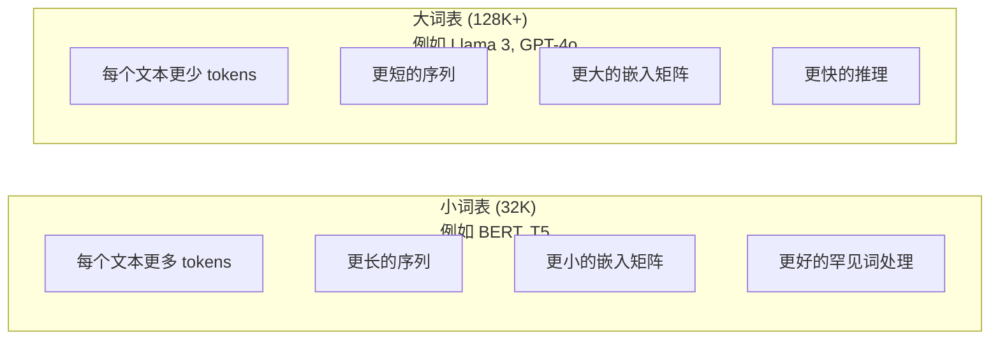

# Tokenizer：BPE、WordPiece、SentencePiece

> 你的 LLM 不读英文，它读整数。tokenizer 决定了这些整数是承载意义还是浪费它。

**Type:** Build
**Languages:** Python
**Prerequisites:** Phase 05 (NLP Foundations)
**Time:** ~90 minutes

## Learning Objectives

- 从零实现 BPE（字节对编码）、WordPiece 和 Unigram（一元语言模型）tokenization 算法，并比较它们的合并策略
- 解释词表大小如何影响模型效率：太小会产生长序列，太大则浪费嵌入（embedding）参数
- 分析跨语言和代码的 tokenization 伪迹，识别特定 tokenizer 失效的场景
- 使用 tiktoken 和 sentencepiece 库对文本进行 tokenize 并检查产生的 token ID

## The Problem

你的 LLM 不读英文。它不读任何语言。它只读数字。

"Hello, world!" 与 [15496, 11, 995, 0] 之间的鸿沟就是 tokenizer。每个词、每个空格、每个标点符号都必须在模型处理之前被转换成一个整数。这个转换不是中性的，它将假设固化到模型中，以后无法撤销。

搞错了，你的模型就会在编码常见词语时浪费容量。"unfortunately" 变成四个 token 而不是一个。对于多音节词较多的文本，你的 128K 上下文窗口会缩水 75%。搞对了，同样的上下文窗口可以承载两倍的信息量。"这个模型处理代码很好"和"这个模型在 Python 上表现很差"之间的差异，往往归结于 tokenizer 是如何训练的。

你每次对 GPT-4 或 Claude 调用的 API 都按 token 计费。你的模型生成的每个 token 都会消耗算力。表示输出所需的 token 越少，端到端推理就越快。tokenization 不是预处理，它是架构。

## The Concept

### 三种失败的方法（和一种成功的方法）

将文本转换为数字有三种显然的方法，其中两种在大规模下不适用。

**词级（word-level）tokenization** 按空格和标点符号拆分。"The cat sat" 变成 ["The", "cat", "sat"]。简单。但 "tokenization" 呢？"GPT-4o" 呢？或者像 "Geschwindigkeitsbegrenzung" 这样的德语复合词呢？词级需要一个庞大的词表来覆盖每种语言中的每个词。遗漏一个词你就会得到可怕的 `[UNK]` token——模型表示"我完全不知道这是什么"的方式。仅英语就有超过一百万个词形。加上代码、URL、科学符号和其他 100 种语言，你需要一个无限大的词表。

**字符级（character-level）tokenization** 走另一个方向。"hello" 变成 ["h", "e", "l", "l", "o"]。词表很小（几百个字符），永远不会产生未知 token。但序列变得极其长。一个 10 个词级 token 的句子变成 50 个字符级 token。模型必须自己去学到 "t"、"h"、"e" 合在一起就是 "the"——把注意力能力烧在一个人三岁就学会的事情上。

**子词（subword）tokenization** 找到了最佳平衡点。常用词保持完整："the" 是一个 token。罕见词被分解为有意义的片段："unhappiness" 变成 ["un", "happi", "ness"]。词表保持可控（30K 到 128K token），序列保持较短，未知 token 实际上消失了，因为任何词都可以由子词片段构建。

每个现代 LLM 都使用子词 tokenization。GPT-2、GPT-4、BERT、Llama 3、Claude——全都在用。问题在于用哪种算法。



### BPE：Byte Pair Encoding（字节对编码）

BPE 是一个被重新用于 tokenization 的贪心压缩算法。其思想简单到可以写在一张索引卡上。

从单个字符开始。统计训练语料库中每一个相邻配对。将最频繁的配对企业合并为一个新的 token。重复直到达到目标词表大小。

```figure
tokenizer-bpe
```

以下是 BPE 在一个包含 "lower"、"lowest" 和 "newest" 的小型语料库上的运行过程：

```
语料库（带有词频）：
  "lower"  x5
  "lowest" x2
  "newest" x6

第 0 步 -- 从字符开始：
  l o w e r       (x5)
  l o w e s t     (x2)
  n e w e s t     (x6)

第 1 步 -- 统计相邻配对：
  (e,s): 8    (s,t): 8    (l,o): 7    (o,w): 7
  (w,e): 13   (e,r): 5    (n,e): 6    ...

第 2 步 -- 合并最频繁的配对 (w,e) -> "we"：
  l o we r        (x5)
  l o we s t      (x2)
  n e we s t      (x6)

第 3 步 -- 重新统计并合并 (we,s) -> "wes"：
  合并 (we,s) -> "wes":
  l o we r        (x5)
  l o wes t       (x2)
  n e wes t       (x6)

第 4 步 -- 合并 (wes,t) -> "west":
  l o we r        (x5)
  l o west        (x2)
  n e west        (x6)

...持续直到达到目标词表大小。
```

合并表（merge table）就是 tokenizer。要编码新文本，按照学习到的顺序依次应用合并操作。训练语料库决定了哪些合并存在，而这种选择会永久性地塑造模型看到的内容。



### 字节级 BPE（GPT-2、GPT-3、GPT-4）

标准 BPE 操作在 Unicode 字符上。字节级 BPE 操作在原始字节（0-255）上。这给你一个恰好 256 的基础词表，能处理任何语言或编码，且永不产生未知 token。

GPT-2 引入了这种方法。基础词表涵盖了每一个可能的字节，BPE 合并在此基础上构建。OpenAI 的 tiktoken 库使用以下词表大小实现了字节级 BPE：

- GPT-2: 50,257 个 token
- GPT-3.5/GPT-4: ~100,256 个 token（cl100k_base 编码）
- GPT-4o: 200,019 个 token（o200k_base 编码）

### WordPiece（BERT）

WordPiece 看起来与 BPE 相似，但选择合并的方式不同。它不是基于原始频率，而是最大化训练数据的似然：

```
BPE 合并标准:      count(A, B)
WordPiece 合并标准: count(AB) / (count(A) * count(B))
```

BPE 问："哪个配对出现最频繁？"WordPiece 问："哪个配对比偶然共现更频繁地一起出现？"这个微妙的差异产生了不同的词表。WordPiece 偏向于共现令人惊讶的合并，而不仅仅是频繁的合并。

WordPiece 还为续接子词使用 "##" 前缀：

```
"unhappiness" -> ["un", "##happi", "##ness"]
"embedding"   -> ["em", "##bed", "##ding"]
```

"##" 前缀告诉你这个片段是前一个 token 的延续。BERT 使用 WordPiece，词表大小为 30,522 个 token。每个 BERT 变体——DistilBERT、RoBERTa 的 tokenizer 实际上是 BPE，但 BERT 本身使用的是 WordPiece。

### SentencePiece（Llama、T5）

SentencePiece 将输入视为原始 Unicode 字符流，包括空白字符。没有预分词步骤，也没有关于词边界的特定语言规则。这使它真正做到了语言无关——它在中文、日语、泰语以及其他不用空格分隔词语的语言上都能正常工作。

SentencePiece 支持两种算法：
- **BPE 模式**：与标准 BPE 相同的合并逻辑，应用在原始字符序列上
- **Unigram 模式**：从一个大型词表开始，迭代地移除对整体似然影响最小的 token。与 BPE 相反——剪枝而不是合并。

Llama 2 使用 SentencePiece BPE，词表大小为 32,000 个 token。T5 使用 SentencePiece Unigram，同样 32,000 个 token。注意：Llama 3 切换到了基于 tiktoken 的字节级 BPE tokenizer，词表大小为 128,256 个 token。

### 词表大小的权衡

这是一个有可衡量后果的实际工程决策。



具体数字。对于 128K 词表和 4,096 维嵌入，仅嵌入矩阵就有 128,000 x 4,096 = 5.24 亿个参数。对于 32K 词表，是 1.31 亿个参数。仅 tokenizer 的选择就带来了 4 亿参数的差异。

但更大的词表会更激进地压缩文本。同样的英文段落用 32K 词表可能需要 100 个 token，用 128K 词表可能只需要 70 个 token。这意味着生成时前向传播少了 30%。对于服务数百万请求的模型，这是对算力成本的直接缩减。

趋势很明确：词表大小在增长。GPT-2 用了 50,257。GPT-4 用了约 100K。Llama 3 用了 128K。GPT-4o 用了 200K。

| 模型 | 词表大小 | Tokenizer 类型 | 每个英文词平均 Token 数 |
|-------|-----------|----------------|---------------------------|
| BERT | 30,522 | WordPiece | ~1.4 |
| GPT-2 | 50,257 | 字节级 BPE | ~1.3 |
| Llama 2 | 32,000 | SentencePiece BPE | ~1.4 |
| GPT-4 | ~100,256 | 字节级 BPE | ~1.2 |
| Llama 3 | 128,256 | 字节级 BPE (tiktoken) | ~1.1 |
| GPT-4o | 200,019 | 字节级 BPE | ~1.0 |

### 多语言税

主要用英文训练的 tokenizer 对其他语言非常残酷。韩文文本在 GPT-2 的 tokenizer 中平均每词产生 2-3 个 token。中文可能更糟。这意味着一个韩文用户实际拥有的上下文窗口大小是英文用户的一半——为更少的信息密度支付相同的价格。

这就是 Llama 3 将词表从 32K 四倍扩展到 128K 的原因之一。更多专门用于非英文文字的 token 意味着在多种语言上更公平的压缩。

```figure
tokenizer-tradeoff
```

## Build It

### Step 1: 字符级 Tokenizer

从基础开始。一个字符级 tokenizer 将每个字符映射到其 Unicode 码点。无需训练，不会产生未知 token，就是一个直接的映射。

```python
class CharTokenizer:
    def encode(self, text):
        return [ord(c) for c in text]

    def decode(self, tokens):
        return "".join(chr(t) for t in tokens)
```

"hello" 变成 [104, 101, 108, 108, 111]。每个字符就是自己的 token。这是我们要改进的基线。

### Step 2: 从零开始 BPE Tokenizer

真正的实现。我们在原始字节上训练（像 GPT-2），统计配对，合并最频繁的，并按顺序记录每一次合并。合并表就是 tokenizer。

```python
from collections import Counter

class BPETokenizer:
    def __init__(self):
        self.merges = {}
        self.vocab = {}

    def _get_pairs(self, tokens):
        pairs = Counter()
        for i in range(len(tokens) - 1):
            pairs[(tokens[i], tokens[i + 1])] += 1
        return pairs

    def _merge_pair(self, tokens, pair, new_token):
        merged = []
        i = 0
        while i < len(tokens):
            if i < len(tokens) - 1 and tokens[i] == pair[0] and tokens[i + 1] == pair[1]:
                merged.append(new_token)
                i += 2
            else:
                merged.append(tokens[i])
                i += 1
        return merged

    def train(self, text, num_merges):
        tokens = list(text.encode("utf-8"))
        self.vocab = {i: bytes([i]) for i in range(256)}

        for i in range(num_merges):
            pairs = self._get_pairs(tokens)
            if not pairs:
                break
            best_pair = max(pairs, key=pairs.get)
            new_token = 256 + i
            tokens = self._merge_pair(tokens, best_pair, new_token)
            self.merges[best_pair] = new_token
            self.vocab[new_token] = self.vocab[best_pair[0]] + self.vocab[best_pair[1]]

        return self

    def encode(self, text):
        tokens = list(text.encode("utf-8"))
        for pair, new_token in self.merges.items():
            tokens = self._merge_pair(tokens, pair, new_token)
        return tokens

    def decode(self, tokens):
        byte_sequence = b"".join(self.vocab[t] for t in tokens)
        return byte_sequence.decode("utf-8", errors="replace")
```

训练循环是 BPE 的核心：统计配对，合并赢家，重复。每次合并减少总的 token 数。经过 `num_merges` 轮后，词表从 256（基础字节）增长到 256 + num_merges。

编码按照学习到的确切顺序依次应用合并。这很重要。如果合并 1 创建了 "th" 而合并 5 创建了 "the"，编码时必须先应用合并 1，这样 "the" 才能在合并 5 中从 "th" + "e" 形成。

解码是逆操作：在词表中查找每个 token ID，拼接字节，解码为 UTF-8。

### Step 3: 编码和解码往返

```python
corpus = (
    "The cat sat on the mat. The cat ate the rat. "
    "The dog sat on the log. The dog ate the frog. "
    "Natural language processing is the study of how computers "
    "understand and generate human language. "
    "Tokenization is the first step in any NLP pipeline."
)

tokenizer = BPETokenizer()
tokenizer.train(corpus, num_merges=40)

test_sentences = [
    "The cat sat on the mat.",
    "Natural language processing",
    "tokenization pipeline",
    "unhappiness",
]

for sentence in test_sentences:
    encoded = tokenizer.encode(sentence)
    decoded = tokenizer.decode(encoded)
    raw_bytes = len(sentence.encode("utf-8"))
    ratio = len(encoded) / raw_bytes
    print(f"'{sentence}'")
    print(f"  Tokens: {len(encoded)} (from {raw_bytes} bytes) -- ratio: {ratio:.2f}")
    print(f"  Roundtrip: {'PASS' if decoded == sentence else 'FAIL'}")
```

压缩比告诉你 tokenizer 的有效性。比率为 0.50 意味着 tokenizer 将文本压缩到了原始字节数一半的 token 数。越低越好。在训练语料库上，比率会很好。在分布外文本如 "unhappiness"（未出现在语料库中）上，比率会变差——tokenizer 对未见过的模式回退到字符级编码。

### Step 4: 与 tiktoken 对比

```python
import tiktoken

enc = tiktoken.get_encoding("cl100k_base")

texts = [
    "The cat sat on the mat.",
    "unhappiness",
    "Hello, world!",
    "def fibonacci(n): return n if n < 2 else fibonacci(n-1) + fibonacci(n-2)",
    "Geschwindigkeitsbegrenzung",
]

for text in texts:
    our_tokens = tokenizer.encode(text)
    tiktoken_tokens = enc.encode(text)
    tiktoken_pieces = [enc.decode([t]) for t in tiktoken_tokens]
    print(f"'{text}'")
    print(f"  Our BPE:   {len(our_tokens)} tokens")
    print(f"  tiktoken:  {len(tiktoken_tokens)} tokens -> {tiktoken_pieces}")
```

tiktoken 使用完全相同的算法，但在数百 GB 的文本上训练了 100,000 次合并。算法是一样的，区别在于训练数据和合并次数。你在一个段落上用 40 次合并训练的 tokenizer 无法与 tiktoken 在大规模语料库上的 100K 次合并竞争。但机制是相同的。

### Step 5: 词表分析

```python
def analyze_vocabulary(tokenizer, test_texts):
    total_tokens = 0
    total_chars = 0
    token_usage = Counter()

    for text in test_texts:
        encoded = tokenizer.encode(text)
        total_tokens += len(encoded)
        total_chars += len(text)
        for t in encoded:
            token_usage[t] += 1

    print(f"Vocabulary size: {len(tokenizer.vocab)}")
    print(f"Total tokens across all texts: {total_tokens}")
    print(f"Total characters: {total_chars}")
    print(f"Avg tokens per character: {total_tokens / total_chars:.2f}")

    print(f"\nMost used tokens:")
    for token_id, count in token_usage.most_common(10):
        token_bytes = tokenizer.vocab[token_id]
        display = token_bytes.decode("utf-8", errors="replace")
        print(f"  Token {token_id:4d}: '{display}' (used {count} times)")

    unused = [t for t in tokenizer.vocab if t not in token_usage]
    print(f"\nUnused tokens: {len(unused)} out of {len(tokenizer.vocab)}")
```

这揭示了词表中的 Zipf 分布。少数 token 占主导地位（空格、"the"、"e"）。大多数 token 很少使用。生产级 tokenizer 会针对这种分布进行优化——常见模式获得短的 token ID，罕见模式获得更长的表示。

## Use It

你的手工 BPE 可以工作了。现在看看生产工具是什么样子的。

### tiktoken（OpenAI）

```python
import tiktoken

enc = tiktoken.get_encoding("cl100k_base")

text = "Tokenizers convert text to integers"
tokens = enc.encode(text)
print(f"Tokens: {tokens}")
print(f"Pieces: {[enc.decode([t]) for t in tokens]}")
print(f"Roundtrip: {enc.decode(tokens)}")
```

tiktoken 是用 Rust 写的，带有 Python 绑定。它每秒编码数百万个 token。同样的 BPE 算法，工业级的实现。

### Hugging Face tokenizers

```python
from tokenizers import Tokenizer
from tokenizers.models import BPE
from tokenizers.trainers import BpeTrainer
from tokenizers.pre_tokenizers import ByteLevel

tokenizer = Tokenizer(BPE())
tokenizer.pre_tokenizer = ByteLevel()

trainer = BpeTrainer(vocab_size=1000, special_tokens=["<pad>", "<eos>", "<unk>"])
tokenizer.train(["corpus.txt"], trainer)

output = tokenizer.encode("The cat sat on the mat.")
print(f"Tokens: {output.tokens}")
print(f"IDs: {output.ids}")
```

Hugging Face 的 tokenizers 库底层也是 Rust。它在秒级时间内就能在 GB 级语料库上训练 BPE。这是你在训练自己的模型时使用的工具。

### 加载 Llama 的 Tokenizer

```python
from transformers import AutoTokenizer

tokenizer = AutoTokenizer.from_pretrained("meta-llama/Llama-3.1-8B")

text = "Tokenizers are the unsung heroes of LLMs"
tokens = tokenizer.encode(text)
print(f"Token IDs: {tokens}")
print(f"Tokens: {tokenizer.convert_ids_to_tokens(tokens)}")
print(f"Vocab size: {tokenizer.vocab_size}")

multilingual = ["Hello world", "Hola mundo", "Bonjour le monde"]
for text in multilingual:
    ids = tokenizer.encode(text)
    print(f"'{text}' -> {len(ids)} tokens")
```

Llama 3 的 128K 词表在压缩非英文文本方面显著优于 GPT-2 的 50K 词表。你可以自行验证——用多种语言编码同一个句子并统计 token 数。

## Ship It

本课产出 `outputs/prompt-tokenizer-analyzer.md`——一个可复用的提示词，用于分析任何文本和模型组合的 tokenization 效率。输入一段文本样本，它会告诉你哪个模型的 tokenizer 处理得更好。

## Exercises

1. 修改 BPE tokenizer，在每一步合并时打印词表。观察 "t" + "h" 如何变成 "th"，然后 "th" + "e" 如何变成 "the"。追踪常见英文单词是如何一步步组装起来的。

2. 为 BPE tokenizer 添加特殊 token（`<pad>`、`<eos>`、`<unk>`）。将它们分配为 ID 0、1、2，并相应偏移所有其他 token。实现一个在 BPE 之前按空白字符拆分的预分词步骤。

3. 实现 WordPiece 的合并标准（似然比而不是频率）。在相同的语料库上用相同数量的合并在 BPE 和 WordPiece 上训练。比较结果词表——哪个产生了更具语言学意义的子词？

4. 构建一个多语言 tokenizer 效率基准测试。取英文、西班牙语、中文、韩语和阿拉伯语的 10 个句子。用 tiktoken（cl100k_base）对每个句子进行 tokenize，测量每字符平均 token 数。量化每种语言的"多语言税"。

5. 在更大的语料库（下载一篇 Wikipedia 文章）上训练你的 BPE tokenizer。调整合并次数，使压缩比在相同文本上达到 tiktoken 的 10% 以内。这迫使你去理解语料库大小、合并次数和压缩质量之间的关系。

## Key Terms

| Term | What people say | What it actually means |
|------|----------------|----------------------|
| Token | "一个词" | 模型词表中的一个单元——可以是一个字符、子词、词或多词块 |
| BPE | "某种压缩方法" | Byte Pair Encoding（字节对编码）——迭代合并最频繁的相邻 token 对，直到达到目标词表大小 |
| WordPiece | "BERT 的 tokenizer" | 类似 BPE，但合并时最大化似然比 count(AB)/(count(A)*count(B)) 而非原始频率 |
| SentencePiece | "一个 tokenizer 库" | 一种语言无关的 tokenizer，在原始 Unicode 上操作，无需预分词，支持 BPE 和 Unigram 算法 |
| Vocabulary size | "它知道多少个词" | 唯一 token 的总数：GPT-2 有 50,257，BERT 有 30,522，Llama 3 有 128,256 |
| Fertility | "一个非 tokenizer 术语" | 每词平均 token 数——衡量 tokenizer 跨语言的效率（1.0 表示完美，3.0 表示模型需要三倍的功夫） |
| Byte-level BPE | "GPT 的 tokenizer" | 在原始字节（0-255）上操作的 BPE，而非 Unicode 字符，保证对任何输入都不会出现未知 token |
| Merge table | "tokenizer 文件" | 训练中学到的有序配对合并列表——这本身就是 tokenizer，且顺序很重要 |
| Pre-tokenization | "按空格拆分" | 在子词 tokenization 之前应用的规则：空白字符拆分、数字分离、标点处理 |
| Compression ratio | "tokenizer 的效率" | 产生的 token 数除以输入字节数——越低意味着压缩越好、推理越快 |

## Further Reading

- [Sennrich et al., 2016 -- "Neural Machine Translation of Rare Words with Subword Units"](https://arxiv.org/abs/1508.07909) -- 将 BPE 引入 NLP 的论文，把一个 1994 年的压缩算法变成了现代 tokenization 的基石
- [Kudo & Richardson, 2018 -- "SentencePiece: A simple and language independent subword tokenizer"](https://arxiv.org/abs/1808.06226) -- 语言无关的 tokenization，使多语言模型成为可能
- [OpenAI tiktoken 仓库](https://github.com/openai/tiktoken) -- 生产级 BPE 的 Rust 实现，带 Python 绑定，用于 GPT-3.5/4/4o
- [Hugging Face Tokenizers 文档](https://huggingface.co/docs/tokenizers) -- 生产级 tokenizer 训练工具，具有 Rust 性能
