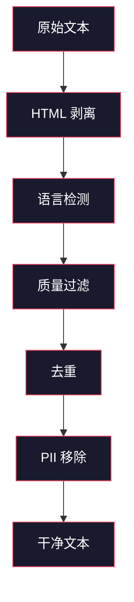
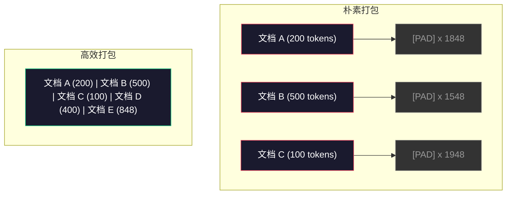

# 预训练数据流水线

> 模型是一面镜子。它反映你喂给它的任何数据。喂给它垃圾，它就会以完美的流利度反映垃圾。

**Type:** Build
**Languages:** Python
**Prerequisites:** Phase 10, Lessons 01-02 (Tokenizers, Building a Tokenizer)
**Time:** ~90 minutes

## Learning Objectives

- 构建一个流式数据流水线（streaming data pipeline），在不全部加载到内存的情况下对 TB 级文本进行 tokenize、分块、混洗和批处理
- 实现真实预训练流水线中使用的数据质量过滤器（去重、语言检测、内容过滤）
- 创建具有正确注意力掩码（attention mask）和文档边界处理能力的固定长度训练序列
- 分析流水线吞吐量，确保数据加载器能跟上 GPU 训练速度

## The Problem

你现在有了一个 tokenizer，接下来需要数据。

不是一个数据集，也不是一个 CSV 文件——而是 TB 级的文本：经过清洗、去重、质量过滤，被 tokenize 成固定长度的序列，并以随机批次的形式快速供应，使你的 8-GPU 集群永远不需要等待下一批数据。

大多数人认为训练一个 LLM（大语言模型）靠的是模型架构。事实并非如此。Llama 3 使用了 15.6 万亿 token。GPT-3 使用了 3000 亿。DeepSeek-V2 使用了 8.1 万亿。这三者的架构大致相同：堆叠的 transformer block（注意力层加前馈层）。输出质量的差异绝大部分来自数据。

DeepMind 的 Chinchilla 论文将这一点精确化了。对于给定的算力预算，模型参数量与训练 token 数之间存在一个最优比例。Chinchilla 表明，2022 年大多数模型都严重训练不足——它们的参数量相对于所见的数据量来说太多了。一个 70B 参数的模型在 1.4 万亿 token 上训练（Chinchilla 最优比例），其表现优于一个 280B 参数的模型在 3000 亿 token 上训练（Gopher）。

你的数据流水线决定了你的模型是学到语言还是学到噪音。

## The Concept

### 数据从哪里来

每个大语言模型都是在多种来源的混合数据上训练出来的。确切的组成对大多数实验室来说都是严密保护的秘密，但我们已经知道足够多来理解这些类别。

| 来源 | 大小 | 质量 | 使用者 |
|--------|------|---------|---------|
| Common Crawl | ~250 TB 原始数据 | 低（需要大量过滤） | GPT-3, Llama, 大多数开源模型 |
| Wikipedia | ~20 GB | 高 | 所有主要 LLM |
| GitHub 代码 | ~1 TB+ | 中等（大量重复代码、死代码） | StarCoder, CodeLlama, DeepSeek-Coder |
| 书籍（BookCorpus、Pile） | ~100 GB | 高 | GPT-2, GPT-3, 早期模型 |
| 学术论文（arXiv、S2ORC） | ~100 GB | 对 STEM 领域高 | Llama, Galactica |
| StackOverflow、Reddit | ~100 GB | 中等 | Llama, Falcon |
| 精选网页（C4、RefinedWeb） | ~5 TB | 中高（预过滤过） | T5, Falcon |

Llama 3 披露了其数据混合比例：大约 50% 网页数据、25% 代码、13% 书籍和学术论文、8% 数学数据以及 4% 多语言网页数据。总共是 15.6 万亿 token，源自超过 5 TB 的原始文本。

配比与总大小同样重要。网页数据太多，模型就会变成 Reddit 学舌鸟。代码太少，它就无法编程。数学太少，它在推理上就会失败。把这种混合比例做对是训练 LLM 最困难的部分之一，而且没有公式——需要实验和评估。

### 数据清洗

原始网页数据非常脏。一个典型的 Common Crawl 转储包含：

- HTML 标签和 JavaScript
- 模板化的页眉、页脚、导航菜单
- 重复页面（完全重复和近似重复）
- 机器生成的垃圾信息
- 个人身份信息（PII）
- 低质量文本（关键词列表、SEO 垃圾信息）
- 以文本形式编码的非文本内容

清洗这些数据不是可选的。它决定了一个模型是生成连贯的段落，还是输出混合着产品列表的 HTML 标签。



每一步消除一类噪音：

**HTML 剥离：** 移除所有标记。只保留可见文本内容。像 `trafilatura` 或 `readability` 这样的库在提取文章内容时丢弃导航栏、广告和模板文字。

**语言检测：** 使用 fastText 的语言识别模型（lid.176.bin）对每个文档进行分类。筛选到你的目标语言。一个被分类为英语但置信度低于 0.8 的文档很可能不是干净的英语。

**质量过滤：** 这才是真正有趣的部分。RefinedWeb（Falcon 背后的数据集）使用了基于困惑度（perplexity）的过滤器：在一个小型语言模型上用 Wikipedia 训练，然后对每个文档打分。高困惑度意味着该文档与 Wikipedia 不相似——很可能是垃圾信息、关键词列表或机器生成内容。困惑度超过阈值的文档会被移除。

**去重（Deduplication）：** 影响最大的单步清洗操作。Common Crawl 包含海量的重复页面——法律免责声明、cookie 通知、服务条款。用重复数据训练浪费算力，并可能使模型逐字记忆和复述特定段落。

**PII 移除：** 姓名、邮箱地址、电话号码、社会保险号码。基于正则表达式检测结构化的 PII，使用 NER（命名实体识别）模型检测上下文中的姓名。

### 使用 MinHash 去重

精确去重很简单：对每个文档做哈希，移除重复项。但近似重复才是真正的问题。同一篇新闻文章的两个副本，周围带有略有不同的广告，这就是近似重复。内容 95% 相同，但逐字节比较是不同的。

MinHash + LSH（局部敏感哈希）高效地解决了这个问题。


基本思想：

1. **Shingling：** 将每个文档转换为 n-gram 集合（例如 5-gram 的词或字符）。用 3-gram 单词 shingling 的 "the quick brown fox" 变成 {"the quick brown", "quick brown fox"}。

2. **MinHash：** 对于每个文档的 shingle 集合，计算 k 个哈希值。每个哈希值是所有 shingle 在不同哈希函数下的最小哈希值。这创建了一个固定大小的"签名"，近似了任意两个文档之间的 Jaccard 相似度。

3. **LSH：** 根据 MinHash 签名的 bands（带状分区）将文档分组到桶中。同一桶中的文档是近重复候选。这避免了比较每一对文档——你只比较候选对。

4. **验证：** 对每个候选对计算精确的 Jaccard 相似度。如果相似度超过阈值（通常为 0.8），移除一个副本。

Llama 团队报告通过去重移除了大约 38% 的网页数据。这不是一个小数字。Common Crawl 有超过三分之一的内容是重复或近似重复的。

### 序列打包

你的模型期望固定长度的输入序列。但你的文档长度是可变的。有些只有 50 个 token，有些有 5 万个 token。

朴素做法：将每个文档填充到最大序列长度。这在填充 token 上浪费了大量算力，而填充 token 对学习毫无贡献。

更好的做法：将多个文档打包到一个序列中，用序列结束 token 分隔。一个 2048 token 的序列可能包含三个用 [EOS] token 连接的短文档。



注意力掩码必须正确设置。文档 A 的 token 不应该关注同一打包序列中文档 B 的 token。这需要一个块对角注意力掩码（block-diagonal attention mask）。

长文档在序列边界处被截断或分割成块。分割点很重要：在句子中间截断会迫使模型看到不完整的想法。有些流水线会在可能时将分割点对齐到段落或句子边界。

### Chinchilla 缩放定律

对于固定的算力预算 C（以 FLOPs 计量），最优模型大小 N 和数据集大小 D 满足：

```
N_opt ~ C^0.5
D_opt ~ C^0.5
```

在实践中，这意味着你应该大致同等程度地缩放模型大小和数据集大小。参数多 10 倍的模型大约需要多 10 倍的训练 token 才能达到相同的损失。

| 模型 | 参数量 | 训练 Token 数 | 是否 Chinchilla 最优？ |
|-------|-----------|----------------|-------------------|
| GPT-3 | 175B | 300B | 否（训练不足 3-4 倍） |
| Chinchilla | 70B | 1.4T | 是（有意为之） |
| Llama 2 | 70B | 2T | 过度训练（有意为之） |
| Llama 3 | 70B | 15T | 严重过度训练 |

Llama 3 有意违反了 Chinchilla 定律。Meta 发现，在比算力最优比例更多的数据上过度训练，能够产生更好的推理模型。额外的训练成本只需支付一次，但更小的模型永远更便宜地提供推理服务。这有时被称为"推理最优"的缩放方法，自 2024 年以来已成为行业标准。

## Build It

### Step 1: Text Cleaning

剥离 HTML、归一化空白字符、移除非文本内容。我们将使用公共领域文本（Project Gutenberg）作为我们的小型语料库。

```python
import re

def clean_text(text):
    text = re.sub(r"<[^>]+>", "", text)
    text = re.sub(r"http\S+", "", text)
    text = re.sub(r"[^\x20-\x7E\n]", "", text)
    text = re.sub(r"\n{3,}", "\n\n", text)
    text = re.sub(r" {2,}", " ", text)
    return text.strip()

def quality_filter(text, min_words=50, max_ratio_caps=0.3, max_ratio_special=0.1):
    words = text.split()
    if len(words) < min_words:
        return False
    caps_ratio = sum(1 for w in words if w.isupper()) / len(words)
    if caps_ratio > max_ratio_caps:
        return False
    special_chars = sum(1 for c in text if not c.isalnum() and not c.isspace())
    if special_chars / max(len(text), 1) > max_ratio_special:
        return False
    return True
```

质量过滤器能识别 SEO 垃圾信息（全大写）、机器生成的噪音（高特殊字符比例）和占位页面（过短）。仅这三项检查就能从网页抓取中移除惊人数量的垃圾。

### Step 2: MinHash Deduplication

从零实现 MinHash。不需要外部库——只需 `hashlib`。

```python
import hashlib
from collections import defaultdict

def get_shingles(text, k=5):
    words = text.lower().split()
    if len(words) < k:
        return set()
    return {" ".join(words[i:i+k]) for i in range(len(words) - k + 1)}

def minhash_signature(shingles, num_hashes=128):
    signature = []
    for i in range(num_hashes):
        min_hash = float("inf")
        for shingle in shingles:
            h = int(hashlib.sha256(f"{i}:{shingle}".encode()).hexdigest(), 16)
            min_hash = min(min_hash, h)
        signature.append(min_hash)
    return signature

def lsh_buckets(signature, bands=16):
    rows_per_band = len(signature) // bands
    buckets = []
    for b in range(bands):
        start = b * rows_per_band
        band_data = tuple(signature[start:start + rows_per_band])
        bucket_hash = hashlib.md5(str(band_data).encode()).hexdigest()
        buckets.append((b, bucket_hash))
    return buckets

def deduplicate(documents, threshold=0.8, num_hashes=128, bands=16):
    signatures = []
    shingle_sets = []
    for doc in documents:
        shingles = get_shingles(doc)
        shingle_sets.append(shingles)
        signatures.append(minhash_signature(shingles, num_hashes))

    bucket_map = defaultdict(list)
    for doc_idx, sig in enumerate(signatures):
        for band_id, bucket_hash in lsh_buckets(sig, bands):
            bucket_map[(band_id, bucket_hash)].append(doc_idx)

    duplicate_pairs = set()
    for bucket_docs in bucket_map.values():
        if len(bucket_docs) < 2:
            continue
        for i in range(len(bucket_docs)):
            for j in range(i + 1, len(bucket_docs)):
                duplicate_pairs.add((bucket_docs[i], bucket_docs[j]))

    removed = set()
    for i, j in duplicate_pairs:
        if i in removed or j in removed:
            continue
        s1, s2 = shingle_sets[i], shingle_sets[j]
        if not s1 or not s2:
            continue
        jaccard = len(s1 & s2) / len(s1 | s2)
        if jaccard >= threshold:
            removed.add(j)

    return [doc for idx, doc in enumerate(documents) if idx not in removed], len(removed)
```

`num_hashes=128` 和 `bands=16` 参数控制了精度-召回权衡。更多的哈希值给出更准确的相似度估计。更多的 bands 增加了召回率（捕获更多重复项），但代价是更多误报。这些值对典型的网页文本效果很好。

### Step 3: Tokenize and Pack Sequences

取经过清洗和去重的文本，进行 tokenize，并打包为训练用的固定长度序列。

```python
def tokenize_corpus(documents, tokenizer):
    all_tokens = []
    for doc in documents:
        tokens = tokenizer.encode(doc)
        all_tokens.extend(tokens)
        all_tokens.append(tokenizer.eos_id)
    return all_tokens

def pack_sequences(token_ids, seq_length, pad_id=0):
    sequences = []
    attention_masks = []
    for i in range(0, len(token_ids), seq_length):
        seq = token_ids[i:i + seq_length]
        mask = [1] * len(seq)
        if len(seq) < seq_length:
            pad_count = seq_length - len(seq)
            seq = seq + [pad_id] * pad_count
            mask = mask + [0] * pad_count
        sequences.append(seq)
        attention_masks.append(mask)
    return sequences, attention_masks
```

### Step 4: DataLoader for Training

产出打包序列的随机批次。这是训练循环消费的内容。

```python
import random

class PreTrainingDataLoader:
    def __init__(self, sequences, attention_masks, batch_size, shuffle=True):
        self.sequences = sequences
        self.attention_masks = attention_masks
        self.batch_size = batch_size
        self.shuffle = shuffle

    def __len__(self):
        return (len(self.sequences) + self.batch_size - 1) // self.batch_size

    def __iter__(self):
        indices = list(range(len(self.sequences)))
        if self.shuffle:
            random.shuffle(indices)
        for start in range(0, len(indices), self.batch_size):
            batch_idx = indices[start:start + self.batch_size]
            batch_seqs = [self.sequences[i] for i in batch_idx]
            batch_masks = [self.attention_masks[i] for i in batch_idx]
            yield batch_seqs, batch_masks
```

### Step 5: Dataset Statistics

计算重要的数字：总 token 数、唯一 token 数、压缩比、文档长度分布。

```python
from collections import Counter

def compute_statistics(documents, token_ids, sequences, tokenizer_vocab_size):
    total_chars = sum(len(d) for d in documents)
    total_tokens = len(token_ids)
    unique_tokens = len(set(token_ids))
    compression_ratio = total_chars / total_tokens

    doc_lengths = [len(d.split()) for d in documents]
    avg_doc_length = sum(doc_lengths) / max(len(doc_lengths), 1)
    max_doc_length = max(doc_lengths) if doc_lengths else 0
    min_doc_length = min(doc_lengths) if doc_lengths else 0

    token_counts = Counter(token_ids)
    top_tokens = token_counts.most_common(10)

    non_pad_tokens = sum(sum(1 for t in seq if t != 0) for seq in sequences)
    total_positions = sum(len(seq) for seq in sequences)
    utilization = non_pad_tokens / max(total_positions, 1)

    stats = {
        "total_documents": len(documents),
        "total_characters": total_chars,
        "total_tokens": total_tokens,
        "unique_tokens": unique_tokens,
        "vocab_utilization": unique_tokens / tokenizer_vocab_size,
        "compression_ratio": compression_ratio,
        "avg_doc_length_words": avg_doc_length,
        "max_doc_length_words": max_doc_length,
        "min_doc_length_words": min_doc_length,
        "num_sequences": len(sequences),
        "sequence_utilization": utilization,
        "top_10_tokens": top_tokens,
    }
    return stats
```

压缩比告诉你 tokenizer 在该语料库上的效率。英文文本通常压缩为每个 token 大约对应 3-4 个字符。如果你看到每字符 1.5 个 token，你的 tokenizer 拆分太激进了。如果你看到 8+，它学到了非常领域特定的合并。

序列利用率告诉你打包序列中有多少是真实数据而非填充。低于 90% 意味着你的打包效率低下——你在填充 token 上浪费算力。

## Use It

### Compare With HuggingFace Datasets

通过 HuggingFace 的 datasets 库加载相同的语料库并比较流水线速度。

```python
from datasets import load_dataset
from transformers import AutoTokenizer

ds = load_dataset("wikitext", "wikitext-2-raw-v1", split="train")
tokenizer = AutoTokenizer.from_pretrained("meta-llama/Meta-Llama-3-8B")

import time

start = time.time()
tokenized = ds.map(
    lambda x: tokenizer(x["text"], truncation=True, max_length=2048),
    batched=True,
    num_proc=4,
)
hf_time = time.time() - start
total_tokens = sum(len(t) for t in tokenized["input_ids"])
print(f"HuggingFace: {total_tokens:,} tokens in {hf_time:.2f}s ({total_tokens/hf_time:,.0f} tokens/sec)")
```

HuggingFace 流水线在底层使用 Rust tokenizer 并且跨 4 个核心并行处理。你的纯 Python 流水线会慢 10-50 倍。这个差距就是为什么生产团队使用编译型 tokenizer。算法相同，实现语言是差异所在。

## Ship It

本课产出一个用于验证和调试 LLM 训练流水线中数据质量的提示词。参见 `outputs/prompt-data-quality-checker.md`。

## Exercises

1. **Easy:** 使用简单的启发式方法（字符集分析）在清洗流水线中添加语言检测。只过滤出英文文档，衡量有多少文档被移除。
2. **Medium:** 使用 SHA-256 哈希实现精确去重，同时保留 MinHash 进行近似去重。在网页抓取语料库上比较两种方法各自捕获的重复项数量。
3. **Hard:** 构建一个基于困惑度的质量过滤器。在 Wikipedia 文本上训练一个小型 bigram 语言模型，用困惑度对每个文档进行评分，移除末尾 20%。比较在过滤后和未过滤数据上训练的模型输出质量。

## Key Terms

| Term | What people say | What it actually means |
|------|----------------|----------------------|
| Common Crawl | "互联网" | 一个每月爬取网页的非营利组织——约 250TB 原始数据，大多数 LLM 训练数据的起点 |
| MinHash | "某种哈希技巧" | 一种使用固定大小签名来估计集合之间 Jaccard 相似度的技术——使得大规模近似重复检测成为可能 |
| LSH | "局部敏感哈希" | 一种将相似项分组到同一桶中的方法——将成对比较从 O(n²) 降至接近线性 |
| Sequence packing | "拼接文档" | 将多个文档放入固定长度序列中并设置正确注意力掩码——消除填充浪费 |
| Chinchilla scaling | "用更多数据训练" | 对于固定算力预算，最优性能需要大致同等程度地缩放模型大小和训练 token 数 |
| Fertility | "每个词对应多少 token" | 每词平均 token 数——GPT-4 在英文上约为 1.3，非拉丁语言文字更高 |
| Data mixing | "选择训练数据" | 代码 vs 文本 vs 数学 vs 多语言数据的比例——没有公式，需要实验 |
| Perplexity filter | "质量评分" | 使用一个小型语言模型对文档评分——高困惑度意味着文本与干净的参考数据不相似 |
| Deduplication | "移除副本" | 消除完全重复和近似重复的文档——通常移除了 30-40% 的原始网页数据 |
| Attention mask | "关注哪些 token" | 一个二元掩码，阻止注意力跨越打包序列中的文档边界 |

## Further Reading

- [Hoffmann et al., 2022 -- Training Compute-Optimal Large Language Models (Chinchilla)](https://arxiv.org/abs/2203.15556) -- 改变了我们对数据规模认知的论文
- [Penedo et al., 2023 -- The RefinedWeb Dataset for Falcon LLM](https://arxiv.org/abs/2306.01116) -- 如何将 Common Crawl 过滤为高质量数据
- [Touvron et al., 2023 -- Llama 2: Open Foundation and Fine-Tuned Chat Models](https://arxiv.org/abs/2307.09288) -- Llama 2 的数据流水线细节
- [Lee et al., 2022 -- Deduplicating Training Data Makes Language Models Better](https://arxiv.org/abs/2107.06499) -- 为什么去重比你想象的更重要
- [Broder, 1997 -- On the Resemblance and Containment of Documents](https://ieeexplore.ieee.org/document/666900) -- 原始的 MinHash 论文
- [Meta, 2024 -- Llama 3 Technical Report](https://arxiv.org/abs/2407.21783) -- 15.6T token、数据混合比例、过滤流水线
