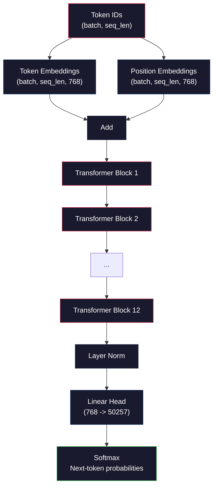
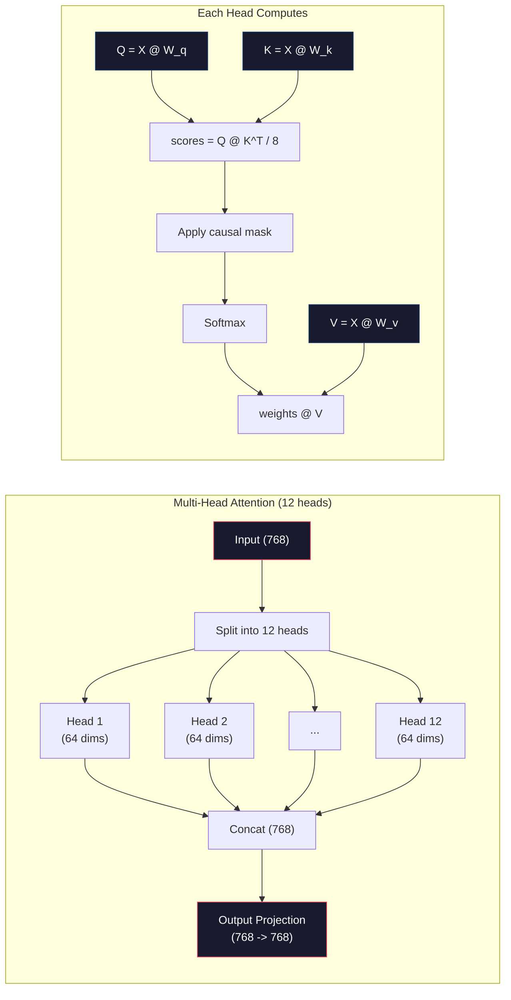
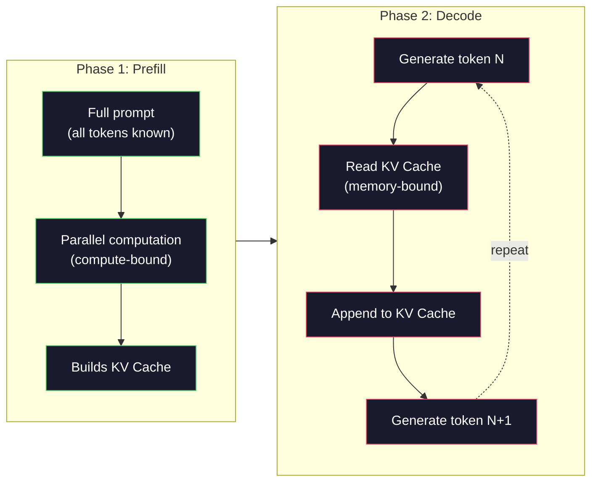

# 预训练迷你 GPT（Pre-Training a Mini GPT，1.24 亿参数）

> GPT-2 Small 拥有 1.24 亿参数。那是 12 个 transformer 层、12 个注意力头（attention head）和 768 维 embedding。你可以在单张 GPU 上用几小时从头训练它。大多数人从未这样做过。他们使用预训练的检查点（checkpoint）。但如果你不亲自训练一个，你就不会真正理解你正在构建产品的模型内部到底发生了什么。

**Type:** Build
**Languages:** Python (with numpy)
**Prerequisites:** Phase 10, Lessons 01-03（分词器 Tokenizer、构建分词器、数据管道）
**Time:** ~120 minutes

## Learning Objectives

- 从零实现完整的 GPT-2 架构（1.24 亿参数）：token embedding、位置 embedding（positional embedding）、transformer 块（block）和语言模型头（language model head）
- 使用下一 token 预测（next-token prediction）和交叉熵损失（cross-entropy loss）在文本语料库上训练 GPT 模型
- 实现自回归文本生成（autoregressive text generation），支持温度采样（temperature sampling）和 top-k/top-p 过滤
- 监控训练损失曲线（loss curve），验证模型学习到了连贯的语言模式

## The Problem

你知道 transformer 是什么。你读过那些示意图。你可以背诵"attention is all you need"，并在白板上画出标着"多头注意力（Multi-Head Attention）"的方框图。

但这并不意味着你理解模型生成文本时发生了什么。

GPT-2 Small 有 124,438,272 个参数（使用权重绑定 weight tying 时）。每一个参数都是通过运行训练循环设置的：前向传播（forward pass），计算损失（loss），反向传播（backward pass），更新权重。12 个 transformer 块。每块 12 个注意力头。768 维 embedding 空间。50,257 个 token 的词汇表。模型每次生成一个 token 时，所有 1.24 亿个参数都参与一次矩阵乘法链，该链接受一组 token ID 并生成下一个 token 的概率分布。

如果你从未亲手构建过这些，你面对的是一个黑盒。你可以用 API，可以做微调（fine-tune）。但当问题出现时——模型产生幻觉（hallucinate）、自我重复、拒绝遵循指令——你没有理解*为什么*的心智模型。

本节课从零构建 GPT-2 Small。不在 PyTorch 中，而是在 numpy 中。每次矩阵乘法都是可见的。每个梯度都由你的代码计算。你将亲眼看到 1.24 亿个数字是如何合谋预测下一个词的。

## The Concept

### GPT 架构

GPT 是一个自回归语言模型（autoregressive language model）。"自回归"意味着它一次生成一个 token，每个 token 都以前面所有 token 为条件。其架构是一堆 transformer 解码器块（decoder block）。

以下是从 token ID 到下一 token 概率的完整计算图：

1. 输入 token ID。形状：(batch_size, seq_len)。
2. Token embedding 查找。每个 ID 映射到一个 768 维向量。形状：(batch_size, seq_len, 768)。
3. 位置 embedding 查找。每个位置 (0, 1, 2, ...) 映射到一个 768 维向量。形状相同。
4. 将 token embedding + 位置 embedding 相加。
5. 通过 12 个 transformer 块。
6. 最终层归一化（layer normalization）。
7. 线性投影到词汇表大小。形状：(batch_size, seq_len, vocab_size)。
8. Softmax 得到概率。

这就是整个模型。没有卷积（convolution），没有循环（recurrence）。只有 embedding、注意力、前馈网络和层归一化，堆叠了 12 次。



### Transformer 块（Block）

12 个块中的每一个都遵循相同的模式。GPT-2 使用前置归一化（pre-norm）架构（与原始 transformer 的后置归一化 post-norm 不同）：

1. LayerNorm
2. 多头自注意力（Multi-Head Self-Attention）
3. 残差连接（residual connection，将输入加回来）
4. LayerNorm
5. 前馈网络（Feed-Forward Network, MLP）
6. 残差连接（将输入加回来）

残差连接至关重要。没有它们，梯度在反向传播时会在到达第 1 块之前消失。有了它们，梯度可以通过"跳跃"路径直接从损失流到任何层。这就是为什么你可以堆叠 12、32 甚至 96 个块（据传 GPT-4 使用了 120 个）。

### 注意力（Attention）：核心机制

自注意力让每个 token 都能看到前面所有 token，并决定对每个 token 的关注程度。以下是数学原理。

对于每个 token 位置，从输入计算三个向量：
- **Query（Q）**："我在寻找什么？"
- **Key（K）**："我包含什么？"
- **Value（V）**："我携带什么信息？"

```
Q = input @ W_q    (768 -> 768)
K = input @ W_k    (768 -> 768)
V = input @ W_v    (768 -> 768)

attention_scores = Q @ K^T / sqrt(d_k)
attention_scores = mask(attention_scores)   # 因果遮罩 causal mask：未来位置设为 -inf
attention_weights = softmax(attention_scores)
output = attention_weights @ V
```

因果遮罩（causal mask）正是让 GPT 成为自回归模型的关键。位置 5 可以关注位置 0-5，但不能关注 6、7、8 等。这阻止了模型在训练期间通过"偷看"未来 token 来作弊。

**多头注意力**将 768 维空间拆分为 12 个头，每个头 64 维。每个头学习不同的注意力模式。一个头可能追踪句法关系（主谓一致），另一个可能追踪语义相似性（同义词），还有一个可能追踪位置邻近性（相邻词）。所有 12 个头的输出被拼接起来，再投影回 768 维。



除以 sqrt(d_k)——sqrt(64) = 8——是缩放（scaling）操作。没有它，对于高维向量，点积会变得很大，将 softmax 推入梯度几乎为零的区域。这是原始"Attention Is All You Need"论文中的关键见解之一。

### KV 缓存（KV Cache）：为什么推理这么快

训练期间，一次性处理整个序列。推理期间，一次生成一个 token。没有优化的情况下，生成 token N 需要重新计算所有 N-1 个之前 token 的注意力。每次生成 token 都是 O(N^2)，对于长度为 N 的序列总计为 O(N^3)。

KV Cache 解决了这个问题。在计算每个 token 的 K 和 V 后，将它们存储起来。当生成 token N+1 时，只需要计算新 token 的 Q，并从缓存中查找所有之前 token 的 K 和 V。这将每个 token 的 K 和 V 计算成本从 O(N) 降低到 O(1)。注意力分数计算仍然是 O(N)，因为你需要关注所有之前位置，但你避免了输入上的冗余矩阵乘法。

对于具有 12 层和 12 个头的 GPT-2，KV Cache 存储每个 token 2 (K + V) × 12 层 × 12 头 × 64 维 = 18,432 个值。对于 1024 token 的序列，在 FP32 下约为 75MB。对于具有 128 层的 Llama 3 405B，单个序列的 KV Cache 可能超过 10GB。这就是为什么长上下文推理受内存带宽约束。

### 预填充 vs 解码（Prefill vs Decode）：推理的两个阶段

当你向 LLM 发送提示词时，推理分为两个不同的阶段。

**预填充（Prefill）** 并行处理整个提示词。所有 token 都已知，因此模型可以同时计算所有位置的注意力。此阶段受计算约束（compute-bound）——GPU 以满吞吐量执行矩阵乘法。对于 A100 上的 1000 token 提示词，预填充大约需要 20-50 毫秒。

**解码（Decode）** 一次生成一个 token。每个新 token 依赖于所有之前的 token。此阶段受内存约束（memory-bound）——瓶颈是从 GPU 内存中读取模型权重和 KV Cache，而不是矩阵运算本身。GPU 的计算核心大部分空闲，等待内存读取。对于 GPT-2，无论矩阵乘法需要多少 FLOPs，每个解码步骤的时间大致相同，因为内存带宽才是约束。

这一区别对生产系统至关重要。预填充的吞吐量随 GPU 计算能力扩展（更多 FLOPS = 更快的预填充）。解码的吞吐量随内存带宽扩展（更快的内存 = 更快的解码）。这就是 NVIDIA H100 专注于提升比 A100 更好的内存带宽的原因——这直接加速了 token 生成。



### 训练循环（Training Loop）

训练 LLM 是下一 token 预测。给定 token [0, 1, 2, ..., N-1]，预测 token [1, 2, 3, ..., N]。损失函数是模型预测的概率分布与实际下一个 token 之间的交叉熵（cross-entropy）。

一个训练步骤：

1. **前向传播**：将批次数据通过全部 12 个块。得到每个位置的 logits（softmax 前的分数）。
2. **计算损失**：logits 与目标 token（输入向后移一位）之间的交叉熵。
3. **反向传播**：使用反向传播计算所有 1.24 亿参数的梯度。
4. **优化器步骤**：更新权重。GPT-2 使用 Adam 优化器，配合学习率预热（warmup）和余弦衰减（cosine decay）。

学习率调度（learning rate schedule）比你预期的更重要。GPT-2 在前 2,000 步从 0 预热到峰值学习率，然后按余弦曲线衰减。以高学习率开始会导致模型发散。在后期训练中保持恒定的高学习率会导致振荡。预热然后衰减的模式被所有主流 LLM 所采用。

### GPT-2 Small：数字一览

| 组件 | 形状 | 参数量 |
|-----------|-------|------------|
| Token embedding | (50257, 768) | 38,597,376 |
| 位置 embedding | (1024, 768) | 786,432 |
| 每块的注意力 (W_q, W_k, W_v, W_out) | 4 x (768, 768) | 2,359,296 |
| 每块的前馈网络 (up + down) | (768, 3072) + (3072, 768) | 4,718,592 |
| 每块的 LayerNorm (2x) | 2 x 768 x 2 | 3,072 |
| 最终 LayerNorm | 768 x 2 | 1,536 |
| **每块总计** | | **7,080,960** |
| **总计（12 块）** | | **85,054,464 + 39,383,808 = 124,438,272** |

输出投影（logits head）与 token embedding 矩阵共享权重。这称为权重绑定（weight tying）——它减少了 3800 万参数，并通过强制模型对输入和输出使用相同的表示空间来提高性能。

## Build It

### Step 1: Embedding 层

Token embedding 将 50,257 个可能的 token 中的每一个映射到一个 768 维向量。位置 embedding 添加了关于每个 token 在序列中位置的信息。两者相加。

```python
import numpy as np

class Embedding:
    def __init__(self, vocab_size, embed_dim, max_seq_len):
        self.token_embed = np.random.randn(vocab_size, embed_dim) * 0.02
        self.pos_embed = np.random.randn(max_seq_len, embed_dim) * 0.02

    def forward(self, token_ids):
        seq_len = token_ids.shape[-1]
        tok_emb = self.token_embed[token_ids]
        pos_emb = self.pos_embed[:seq_len]
        return tok_emb + pos_emb
```

初始化的标准差 0.02 来自 GPT-2 论文。太大则初始前向传播会产生破坏训练稳定性的极端值。太小则初始输出对所有输入几乎相同，使早期梯度信号无效。

### Step 2: 带因果遮罩的自注意力

首先实现单头注意力。因果遮罩在 softmax 之前将未来位置设为负无穷，确保每个位置只能关注自身和更早的位置。

```python
def attention(Q, K, V, mask=None):
    d_k = Q.shape[-1]
    scores = Q @ K.transpose(0, -1, -2 if Q.ndim == 4 else 1) / np.sqrt(d_k)
    if mask is not None:
        scores = scores + mask
    weights = np.exp(scores - scores.max(axis=-1, keepdims=True))
    weights = weights / weights.sum(axis=-1, keepdims=True)
    return weights @ V
```

softmax 实现中，先减去最大值再指数化。否则 exp(大数) 会溢出到无穷。这是一个数值稳定性技巧，不改变输出，因为对于任意常数 c，softmax(x - c) = softmax(x)。

### Step 3: 多头注意力

将 768 维输入拆分为 12 个头，每个头 64 维。每个头独立计算注意力。拼接结果并投影回 768 维。

```python
class MultiHeadAttention:
    def __init__(self, embed_dim, num_heads):
        self.num_heads = num_heads
        self.head_dim = embed_dim // num_heads
        self.W_q = np.random.randn(embed_dim, embed_dim) * 0.02
        self.W_k = np.random.randn(embed_dim, embed_dim) * 0.02
        self.W_v = np.random.randn(embed_dim, embed_dim) * 0.02
        self.W_out = np.random.randn(embed_dim, embed_dim) * 0.02

    def forward(self, x, mask=None):
        batch, seq_len, d = x.shape
        Q = (x @ self.W_q).reshape(batch, seq_len, self.num_heads, self.head_dim).transpose(0, 2, 1, 3)
        K = (x @ self.W_k).reshape(batch, seq_len, self.num_heads, self.head_dim).transpose(0, 2, 1, 3)
        V = (x @ self.W_v).reshape(batch, seq_len, self.num_heads, self.head_dim).transpose(0, 2, 1, 3)

        scores = Q @ K.transpose(0, 1, 3, 2) / np.sqrt(self.head_dim)
        if mask is not None:
            scores = scores + mask
        weights = np.exp(scores - scores.max(axis=-1, keepdims=True))
        weights = weights / weights.sum(axis=-1, keepdims=True)
        attn_out = weights @ V

        attn_out = attn_out.transpose(0, 2, 1, 3).reshape(batch, seq_len, d)
        return attn_out @ self.W_out
```

reshape-transpose-reshape 的变换是多头注意力中最令人困惑的部分。过程如下：(batch, seq_len, 768) 张量变为 (batch, seq_len, 12, 64)，然后变为 (batch, 12, seq_len, 64)。现在 12 个头各自有其 (seq_len, 64) 矩阵来运行注意力。注意力之后，反转过程：(batch, 12, seq_len, 64) 变为 (batch, seq_len, 12, 64) 变为 (batch, seq_len, 768)。

### Step 4: Transformer 块

一个完整的 transformer 块：LayerNorm、带残差的多头注意力、LayerNorm、带残差的前馈网络。

```python
class LayerNorm:
    def __init__(self, dim, eps=1e-5):
        self.gamma = np.ones(dim)
        self.beta = np.zeros(dim)
        self.eps = eps

    def forward(self, x):
        mean = x.mean(axis=-1, keepdims=True)
        var = x.var(axis=-1, keepdims=True)
        return self.gamma * (x - mean) / np.sqrt(var + self.eps) + self.beta


class FeedForward:
    def __init__(self, embed_dim, ff_dim):
        self.W1 = np.random.randn(embed_dim, ff_dim) * 0.02
        self.b1 = np.zeros(ff_dim)
        self.W2 = np.random.randn(ff_dim, embed_dim) * 0.02
        self.b2 = np.zeros(embed_dim)

    def forward(self, x):
        h = x @ self.W1 + self.b1
        h = np.maximum(0, h)  # GELU 近似：为简化使用 ReLU
        return h @ self.W2 + self.b2


class TransformerBlock:
    def __init__(self, embed_dim, num_heads, ff_dim):
        self.ln1 = LayerNorm(embed_dim)
        self.attn = MultiHeadAttention(embed_dim, num_heads)
        self.ln2 = LayerNorm(embed_dim)
        self.ffn = FeedForward(embed_dim, ff_dim)

    def forward(self, x, mask=None):
        x = x + self.attn.forward(self.ln1.forward(x), mask)
        x = x + self.ffn.forward(self.ln2.forward(x))
        return x
```

前馈网络将 768 维输入扩展到 3,072 维（4 倍），应用非线性，然后投影回 768 维。这种扩展-收缩模式为模型在每个位置上提供了更"宽广"的内部表示空间。GPT-2 使用 GELU 激活函数，但这里为简化使用 ReLU——两者差异对理解架构影响很小。

### Step 5: 完整 GPT 模型

堆叠 12 个 transformer 块。前端添加 embedding 层，后端添加输出投影。

```python
class MiniGPT:
    def __init__(self, vocab_size=50257, embed_dim=768, num_heads=12,
                 num_layers=12, max_seq_len=1024, ff_dim=3072):
        self.embedding = Embedding(vocab_size, embed_dim, max_seq_len)
        self.blocks = [
            TransformerBlock(embed_dim, num_heads, ff_dim)
            for _ in range(num_layers)
        ]
        self.ln_f = LayerNorm(embed_dim)
        self.vocab_size = vocab_size
        self.embed_dim = embed_dim

    def forward(self, token_ids):
        seq_len = token_ids.shape[-1]
        mask = np.triu(np.full((seq_len, seq_len), -1e9), k=1)

        x = self.embedding.forward(token_ids)
        for block in self.blocks:
            x = block.forward(x, mask)
        x = self.ln_f.forward(x)

        logits = x @ self.embedding.token_embed.T
        return logits

    def count_parameters(self):
        total = 0
        total += self.embedding.token_embed.size
        total += self.embedding.pos_embed.size
        for block in self.blocks:
            total += block.attn.W_q.size + block.attn.W_k.size
            total += block.attn.W_v.size + block.attn.W_out.size
            total += block.ffn.W1.size + block.ffn.b1.size
            total += block.ffn.W2.size + block.ffn.b2.size
            total += block.ln1.gamma.size + block.ln1.beta.size
            total += block.ln2.gamma.size + block.ln2.beta.size
        total += self.ln_f.gamma.size + self.ln_f.beta.size
        return total
```

注意权重绑定：`logits = x @ self.embedding.token_embed.T`。输出投影复用了 token embedding 矩阵（转置）。这不仅仅是节省参数的技巧，它还意味着模型使用相同的向量空间来理解 token（embedding）和预测 token（输出）。

### Step 6: 训练循环

对于 1.24 亿参数的真实训练运行，你需要 GPU 和 PyTorch。这个训练循环在纯 numpy 上运行一个小模型来展示机制。我们使用一个微型模型（4 层、4 头、128 维）来使其可行。

```python
def cross_entropy_loss(logits, targets):
    batch, seq_len, vocab_size = logits.shape
    logits_flat = logits.reshape(-1, vocab_size)
    targets_flat = targets.reshape(-1)

    max_logits = logits_flat.max(axis=-1, keepdims=True)
    log_softmax = logits_flat - max_logits - np.log(
        np.exp(logits_flat - max_logits).sum(axis=-1, keepdims=True)
    )

    loss = -log_softmax[np.arange(len(targets_flat)), targets_flat].mean()
    return loss


def train_mini_gpt(text, vocab_size=256, embed_dim=128, num_heads=4,
                   num_layers=4, seq_len=64, num_steps=200, lr=3e-4):
    tokens = np.array(list(text.encode("utf-8")[:2048]))
    model = MiniGPT(
        vocab_size=vocab_size, embed_dim=embed_dim, num_heads=num_heads,
        num_layers=num_layers, max_seq_len=seq_len, ff_dim=embed_dim * 4
    )

    print(f"Model parameters: {model.count_parameters():,}")
    print(f"Training tokens: {len(tokens):,}")
    print(f"Config: {num_layers} layers, {num_heads} heads, {embed_dim} dims")
    print()

    for step in range(num_steps):
        start_idx = np.random.randint(0, max(1, len(tokens) - seq_len - 1))
        batch_tokens = tokens[start_idx:start_idx + seq_len + 1]

        input_ids = batch_tokens[:-1].reshape(1, -1)
        target_ids = batch_tokens[1:].reshape(1, -1)

        logits = model.forward(input_ids)
        loss = cross_entropy_loss(logits, target_ids)

        if step % 20 == 0:
            print(f"Step {step:4d} | Loss: {loss:.4f}")

    return model
```

损失从接近 ln(vocab_size) 开始——对于 256 token 的字节级词汇表，即 ln(256) = 5.55。一个随机模型为每个 token 分配相等的概率。随着训练的进行，损失下降，因为模型学会了预测常见模式："t" 后面的 "h"，句号后面的空格，等等。

在生产环境中，你会使用 Adam 优化器配合梯度累积（gradient accumulation）、学习率预热和梯度裁剪（gradient clipping）。前向传播-损失-反向传播-更新的循环是相同的。只是优化器更复杂。

### Step 7: 文本生成

生成过程使用训练好的模型一次预测一个 token。每次预测从输出分布中采样（或贪婪地取 argmax）。

```python
def generate(model, prompt_tokens, max_new_tokens=100, temperature=0.8):
    tokens = list(prompt_tokens)
    seq_len = model.embedding.pos_embed.shape[0]

    for _ in range(max_new_tokens):
        context = np.array(tokens[-seq_len:]).reshape(1, -1)
        logits = model.forward(context)
        next_logits = logits[0, -1, :]

        next_logits = next_logits / temperature
        probs = np.exp(next_logits - next_logits.max())
        probs = probs / probs.sum()

        next_token = np.random.choice(len(probs), p=probs)
        tokens.append(next_token)

    return tokens
```

温度（temperature）控制随机性。温度 1.0 使用原始分布。温度 0.5 使其更尖锐（更确定性——模型更倾向于选择其 top 选项）。温度 1.5 使其更平坦（更随机——低概率 token 获得更大机会）。温度 0.0 是贪婪解码（greedy decoding，始终选择最高概率 token）。

`tokens[-seq_len:]` 窗口是必要的，因为模型有最大上下文长度（GPT-2 为 1024）。一旦超过，必须丢弃最旧的 token。这就是大家常说的"上下文窗口"。

```figure
sampling-decoder
```

## Use It

### 完整训练与生成演示

```python
corpus = """The transformer architecture has revolutionized natural language processing.
Attention mechanisms allow the model to focus on relevant parts of the input.
Self-attention computes relationships between all pairs of positions in a sequence.
Multi-head attention splits the representation into multiple subspaces.
Each attention head can learn different types of relationships.
The feedforward network provides nonlinear transformations at each position.
Residual connections enable gradient flow through deep networks.
Layer normalization stabilizes training by normalizing activations.
Position embeddings give the model information about token ordering.
The causal mask ensures autoregressive generation during training.
Pre-training on large text corpora teaches the model general language understanding.
Fine-tuning adapts the pre-trained model to specific downstream tasks."""

model = train_mini_gpt(corpus, num_steps=200)

prompt = list("The transformer".encode("utf-8"))
output_tokens = generate(model, prompt, max_new_tokens=100, temperature=0.8)
generated_text = bytes(output_tokens).decode("utf-8", errors="replace")
print(f"\nGenerated: {generated_text}")
```

在小语料库上用小模型训练时，生成的文本最多是半连贯的。它会从训练文本中学到一些字节级模式，但无法像 GPT-2 一样用 40GB 训练数据和完整的 1.24 亿参数架构进行泛化。重点不是输出质量，而是你可以追踪每一步：embedding 查找、注意力计算、前馈变换、logit 投影、softmax 和采样。每个操作都是可见的。

## Ship It

本课产出 `outputs/prompt-gpt-architecture-analyzer.md`——一个分析任何 GPT 风格模型架构选择的提示词。输入一个模型卡片或技术报告，它会分解参数分配、注意力设计和扩展（scaling）决策。

## Exercises

1. 修改模型为 24 层和 16 个头，而不是 12/12。计算参数数量。将深度加倍与宽度加倍（embedding 维度）相比如何？

2. 实现 GELU 激活函数（GELU(x) = x * 0.5 * (1 + erf(x / sqrt(2)))），替换前馈网络中的 ReLU。分别用两种激活函数训练 500 步，比较最终损失。

3. 向生成函数添加 KV Cache。在第一次前向传播后存储每层的 K 和 V 张量，并在后续 token 中复用。测量加速效果：在有缓存和无缓存的情况下生成 200 个 token，比较实际耗时（wall-clock time）。

4. 实现 top-k 采样（仅考虑 k 个最高概率 token）和 top-p 采样（核采样 nucleus sampling：考虑累积概率超过 p 的最小 token 集合）。在温度 0.8 下比较 top-k=50 与 top-p=0.95 的输出质量。

5. 构建训练损失曲线绘图器。训练模型 1000 步并绘制损失 vs 步数曲线。识别三个阶段：快速初始下降（学习常见字节）、较慢的中期阶段（学习字节模式）和平台期（在小语料库上过拟合）。无论你训练的是 128 维模型还是 GPT-4，这条曲线的形状是相同的。

## Key Terms

| 术语 | 人们说的 | 实际含义 |
|------|----------------|----------------------|
| Autoregressive（自回归） | "一次生成一个词" | 每个输出 token 以所有之前的 token 为条件——模型预测 P(token_n \| token_0, ..., token_{n-1}) |
| Causal mask（因果遮罩） | "它看不到未来" | 一个上三角矩阵，填充负无穷，阻止训练期间对未来位置的注意力 |
| Multi-head attention（多头注意力） | "多个注意力模式" | 将 Q、K、V 拆分为并行的头（如 GPT-2 的 12 个头，每个 64 维），每个头可以学习不同类型的关系 |
| KV Cache（KV 缓存） | "缓存以加速" | 存储之前 token 已计算的 Key 和 Value 张量，避免自回归生成中的冗余计算 |
| Prefill（预填充） | "处理提示词" | 第一个推理阶段，所有提示词 token 并行处理——受 GPU FLOPS 计算约束 |
| Decode（解码） | "生成 token" | 第二个推理阶段，一次生成一个 token——受 GPU 内存带宽约束 |
| Weight tying（权重绑定） | "共享 embedding" | 使用相同矩阵作为输入 token embedding 和输出投影头——在 GPT-2 中节省 3,800 万参数 |
| Residual connection（残差连接） | "跳跃连接" | 将输入直接加到子层的输出上（x + sublayer(x)）——使深层网络中的梯度能够流动 |
| Layer normalization（层归一化） | "归一化激活值" | 沿特征维度归一化到均值 0 和方差 1，带有可学习的缩放和偏置参数 |
| Cross-entropy loss（交叉熵损失） | "预测有多错误" | -log(分配给正确下一 token 的概率)，在所有位置上取平均——标准的 LLM 训练目标 |

## Further Reading

- [Radford et al., 2019 -- "Language Models are Unsupervised Multitask Learners" (GPT-2)](https://cdn.openai.com/better-language-models/language_models_are_unsupervised_multitask_learners.pdf) -- GPT-2 论文，引入了 1.24 亿到 15 亿参数系列
- [Vaswani et al., 2017 -- "Attention Is All You Need"](https://arxiv.org/abs/1706.03762) -- 原始 transformer 论文，包含缩放点积注意力和多头注意力
- [Llama 3 Technical Report](https://arxiv.org/abs/2407.21783) -- Meta 如何用 16K GPU 将 GPT 架构扩展到 4050 亿参数
- [Pope et al., 2022 -- "Efficiently Scaling Transformer Inference"](https://arxiv.org/abs/2211.05102) -- 形式化定义了预填充 vs 解码和 KV Cache 分析的论文
