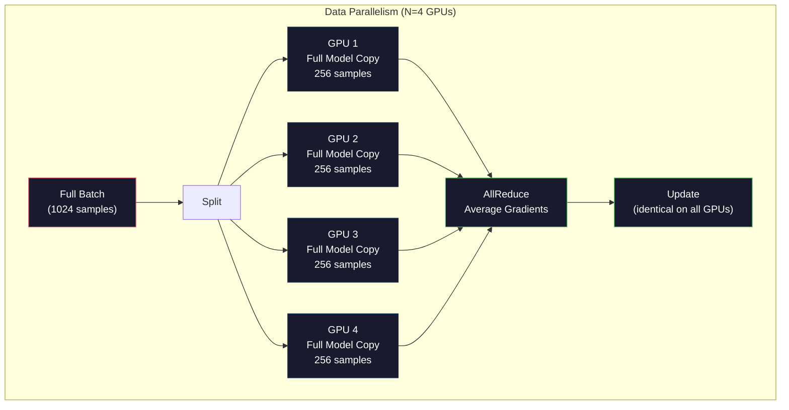
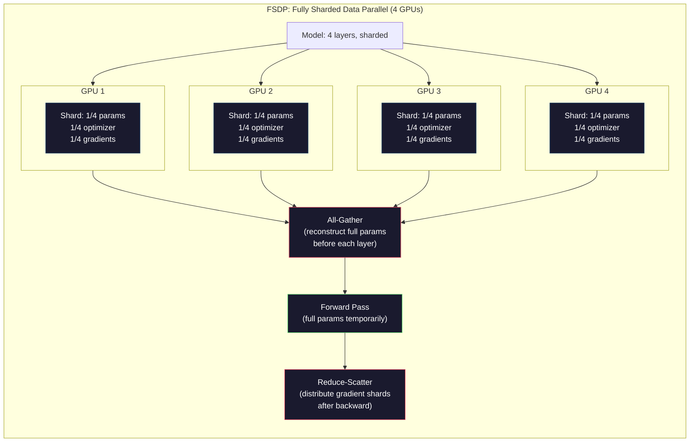
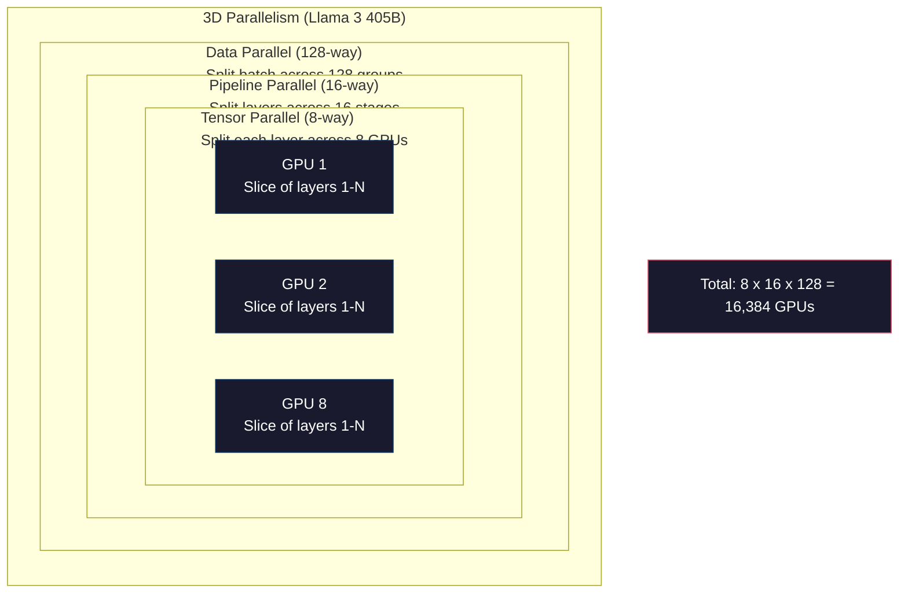

# 扩展（Scaling）：分布式训练、FSDP、DeepSpeed

> 你的 1.24 亿参数模型在单 GPU 上训练。现在试试 70 亿参数。模型放不进内存。数据在单台机器上需要数周。在大规模下，分布式训练（distributed training）不是可选项，而是唯一的出路。

**Type:** Build
**Languages:** Python
**Prerequisites:** Phase 10, Lesson 04（预训练迷你 GPT）
**Time:** ~120 minutes

## Learning Objectives

- 解释三种并行策略（数据并行 data parallelism、张量并行 tensor parallelism、流水线并行 pipeline parallelism），以及在给定模型和集群规模下各自何时是必需的
- 使用 PyTorch DDP 实现数据并行训练，并在多 GPU 间同步梯度
- 为给定模型规模计算内存预算（权重 + 优化器状态 + 梯度 + 激活值），确定最小硬件需求
- 配置 FSDP 或 DeepSpeed ZeRO 的分片级别（stage），将模型状态分片到多 GPU，使超过单 GPU 内存的模型能够训练

## The Problem

一个 70 亿参数（7B）的模型在 FP16 下仅权重就需要 14GB。Adam 优化器为每个参数存储两份额外的副本（一阶矩估计和二阶矩估计），这又是 28GB。反向传播期间的梯度再加 14GB。在存储一个激活值（activation）之前，你已经到了 56GB。

一块 NVIDIA A100 有 80GB 内存。

56GB 用了 80GB。剩下 24GB 给激活值——前向传播期间计算的中间值，必须在反向传播期间保持存活。对于一个 2048 token 的序列和 4096 维的模型，单层的激活值约使用 64MB。32 层则每个样本需要 2GB。batch size 为 8 时需要 16GB。你只有 24GB。batch size 为 12 就会爆内存。

现在试试 700 亿参数（70B）。仅权重：FP16 下 140GB。单 GPU 放不下。你至少需要 2 块 A100（2 × 80GB = 160GB）才能存下权重。加上优化器状态和梯度后，需要更多：最少 3+ GPU，实际根据分片策略通常需要 8-16 块。

Llama 3 405B 是在 16,384 块 NVIDIA H100 GPU 上训练的。这次训练运行估计花费了约 1 亿美元的计算成本。DeepSeek V3 通过巧妙的架构设计（Mixture of Experts 混合专家，意味着每个 token 只激活一小部分参数）和训练效率，用大约 560 万美元训练了一个可比的模型。

本课涵盖使大规模训练成为可能的四种策略：数据并行（data parallelism）、张量并行（tensor parallelism）、流水线并行（pipeline parallelism）和全分片数据并行（FSDP, Fully Sharded Data Parallel）。你将在接触到任何分布式训练框架之前，先在纯 Python 中模拟每一种策略，以理解其机制。

## The Concept

### 为什么必须分布式训练

以下是真实模型的内存计算。每个数字都是计算得出的，不是估算。

| 模型 | 参数量 | 权重 (FP16) | Adam 状态 | 梯度 (FP16) | 总计（不含激活值） |
|-------|--------|----------------|-------------|------------------|----------------------|
| GPT-2 Small | 124M | 248 MB | 992 MB | 248 MB | 1.5 GB |
| Llama 3 8B | 8B | 16 GB | 64 GB | 16 GB | 96 GB |
| Llama 3 70B | 70B | 140 GB | 560 GB | 140 GB | 840 GB |
| Llama 3 405B | 405B | 810 GB | 3,240 GB | 810 GB | 4,860 GB |

"Adam 状态"这一列是最大的内存消耗者。Adam 为每个参数存储一个运行均值（m）和一个运行方差（v），都在 FP32 下。对于一个 70B 模型，即 70B × 4 字节 × 2 = 560GB。仅优化器就需要 7 块 A100。

一块 H100 有 80GB。Llama 3 405B 至少需要 61 块 H100 才能存下权重、优化器和梯度。加上激活值后，数量还会进一步增长。Meta 使用 16,384 块 GPU 不是因为想用，而是因为必须用。

### 数据并行（Data Parallelism）

最简单的分布式策略。将整个模型复制到 N 块 GPU。将每个训练批次（batch）拆分为 N 等份。每块 GPU 在自己的数据分片（shard）上运行前向和反向传播。反向传播之后，在所有 GPU 上平均梯度（gradient averaging）。每块 GPU 用相同的平均梯度更新其权重副本，保持所有副本同步。

**优点：** 吞吐量线性扩展。N 块 GPU 每步处理 N 倍的数据。通信仅限于梯度平均，可以与计算重叠。

**缺点：** 每块 GPU 持有模型、优化器状态和梯度的完整副本。对于 70B 模型，每块 GPU 需要 840GB。数据并行完全不减少单 GPU 内存，只减少训练时间。

**数学：** 有效 batch size = 每 GPU batch size × N。对于 N=64 GPU，每 GPU batch size 为 16，则有效 batch size 为 1,024。Llama 3 使用了 1600 万 token 每步的有效 batch size。



### 张量并行（Tensor Parallelism）

将单个层拆分到多块 GPU 上。一次矩阵乘法被划分到多块 GPU 之间，每块计算结果的一部分。

考虑前馈网络中形状为 (8192, 8192) 的权重矩阵。采用 4 路张量并行时，每块 GPU 持有一个 (8192, 2048) 的分片。每块 GPU 将输入与其分片相乘，产生部分结果。这些部分结果通过 all-reduce 或 all-gather 组合，产生完整输出。

**优点：** 减少单 GPU 对模型权重的内存占用。一个 70B 模型在 8 块 GPU 上拆分，意味着每块 GPU 持有约 87.5 亿参数的权重。

**缺点：** 每层之后都需要快速的 GPU 间通信。每次矩阵乘法之后的 all-reduce 会增加延迟。这在有 NVLink（同一节点内 GPU 间 900 GB/s）的情况下工作良好，但在通过 InfiniBand 连接的跨节点场景（400 Gb/s，约 50 GB/s）下表现不佳。张量并行几乎总是限制在单个节点（8 GPU）内。

**实际应用：** Megatron-LM 开创了张量并行。Llama 3 405B 在每个节点内使用 8 路张量并行。

### 流水线并行（Pipeline Parallelism）

按层拆分模型。GPU 1 运行 1-8 层，GPU 2 运行 9-16 层，GPU 3 运行 17-24 层，GPU 4 运行 25-32 层。数据流经流水线：GPU 1 计算其层并将激活值发送给 GPU 2，GPU 2 计算其层并发送给 GPU 3，依此类推。

**优点：** GPU 间通信最少——仅需在层边界交换激活值，这相比于梯度或权重来说很小。跨节点工作良好，因为带宽要求低。

**缺点：** 流水线气泡（pipeline bubble）。当 GPU 4 正在计算微批次 1 的前向传播时，GPU 1、2 和 3 处于空闲状态（它们已经完成了自己部分的前向传播）。在反向传播期间，模式反转。使用朴素的流水线策略时，对于 N 个流水线阶段，GPU 利用率仅为 1/N。

**GPipe 和 PipeDream** 通过将批次拆分为微批次（micro-batch）来解决气泡问题。GPU 1 在完成微批次 1 的前向传播后立即开始处理微批次 2。这在不同流水线阶段之间重叠了计算。对于 M 个微批次和 N 个阶段，气泡比例降至 (N-1)/M。使用 M=16 微批次和 N=4 阶段，气泡为 3/16 = 18.75% 的空闲时间。

### FSDP：全分片数据并行（Fully Sharded Data Parallel）

FSDP 结合了数据并行的可扩展性和分片的内存效率。不是每块 GPU 持有模型的完整副本，而是每块 GPU 只持有 1/N 的参数、梯度和优化器状态。

在一层的前向传播之前，FSDP 运行 **all-gather** 从所有 GPU 收集完整参数到每块 GPU 的内存中。前向传播之后，每块 GPU 丢弃非本地参数。在反向传播期间，all-gather 再次运行以重建用于梯度计算的参数。反向传播之后，**reduce-scatter** 分发梯度分片，使每块 GPU 只存储 1/N 的梯度。

**70B 模型在 8 GPU 上的计算：**

| 组件 | 无 FSDP | 有 FSDP |
|-----------|-------------|-----------|
| 权重 (FP16) | 每GPU 140 GB | 每GPU 17.5 GB |
| Adam 状态 (FP32) | 每GPU 560 GB | 每GPU 70 GB |
| 梯度 (FP16) | 每GPU 140 GB | 每GPU 17.5 GB |
| **总计** | **每GPU 840 GB** | **每GPU 105 GB** |

没有 FSDP，70B 模型无法在单块 80GB GPU 上装下。FSDP 在 8 GPU 上，每块 GPU 使用 105GB——等等，这仍然装不下。你需要至少 16 GPU 才能降到每 GPU 80GB 以下，或者将 FSDP 与激活检查点（activation checkpointing，在反向传播期间重新计算激活值而不是存储它们）结合使用。

通信成本比普通数据并行高，因为每层之前都需要 all-gather。但内存节省使得以前不可能的训练运行成为可能。



### DeepSpeed ZeRO

DeepSpeed 的 ZeRO（Zero Redundancy Optimizer，零冗余优化器）在概念上与 FSDP 相同，但由微软独立开发。它定义了三个阶段，每个阶段的分片更加激进：

| 阶段 | 分片内容 | 内存节省 | 通信开销 |
|-------|--------|---------------|---------------|
| ZeRO-1 | 仅优化器状态 | ~4倍减少 | 与数据并行相同 |
| ZeRO-2 | + 梯度 | ~8倍减少 | 略微增加 |
| ZeRO-3 | + 参数 | ~N倍减少（N GPU） | 每层 all-gather |

ZeRO-3 等价于 FSDP。命名不同，机制相同。PyTorch 在 DeepSpeed 验证了这一概念后，添加了 FSDP 作为原生实现。

DeepSpeed 还引入了 ZeRO-Offload（将优化器状态卸载到 CPU 内存，更便宜且更大）和 ZeRO-Infinity（卸载到 NVMe SSD）。这些策略用计算速度换取内存容量——卸载操作更慢，但释放了 GPU 内存。

### 混合精度训练（Mixed Precision Training）

现代训练同时使用多种浮点格式：

- **前向传播**：FP16 或 BF16（16 位）。内存是 FP32 的一半，矩阵乘法在 tensor core 上快 2 倍。
- **主权重（master weight）**：FP32（32 位）。由优化器维护，用于权重更新时的数值精度。
- **损失缩放（loss scaling）**：在反向传播前将损失乘以一个大常数，防止 FP16 梯度下溢到零。在优化器步进前除以相同常数。

BF16（Brain Float 16）具有与 FP32 相同的指数范围（8 位指数），但精度降低（7 位尾数 vs FP32 的 23 位）。通常不需要损失缩放，因为它可以表示相同的数值范围。FP16 有 5 位指数和 10 位尾数——可以表示更细粒度的值，但在极端数值下会溢出/下溢。

Google 的 TPU 原生使用 BF16。NVIDIA A100 和 H100 同时支持 FP16 和 BF16。业界已基本转向 BF16，因为它消除了损失缩放的麻烦。

**7B 模型的内存比较：**

| 精度 | 权重 | 优化器 | 梯度 | 总计 |
|-----------|---------|-----------|-----------|-------|
| 全部 FP32 | 28 GB | 56 GB | 28 GB | 112 GB |
| 混合精度 (BF16 + FP32 master) | 14 GB | 56 GB | 14 GB | 84 GB |

混合精度在该模型上节省了 28GB。但优化器状态始终保持在 FP32——正是它占据了大部分内存。

### Megatron-LM 和 3D 并行

真实的大规模训练同时结合所有三种并行策略：

- **数据并行**跨节点组（扩展 batch size）
- **张量并行**在节点内（在 8 GPU 上拆分层）
- **流水线并行**跨节点（跨机器拆分不同层组）

Llama 3 405B 在 16,384 块 H100 上：
- 8 路张量并行，在每节点内（每节点 8 GPU）
- 16 路流水线并行，跨节点（16 个流水线阶段）
- 128 路数据并行，沿剩余维度（16,384 / 8 / 16 = 128）

这个 3D 分解（8 × 16 × 128 = 16,384）就是如何扩展到数千块 GPU。每块 GPU 看到不同的数据分片（数据并行），持有每层的一个切片（张量并行），并计算不同的一组层（流水线并行）。

DeepSeek V3 采取了不同的方法。他们的混合专家（Mixture of Experts）架构每个 token 只激活 671B 参数中的 37B。这意味着每块 GPU 只需要计算（并存储）活跃参数的激活值。他们在 2,048 块 H800 GPU 上训练——不到 Meta GPU 数量的 1/8——花费 $5.6M 对比 Meta 估计的 $100M。



```figure
paged-kv-cache
```

## Build It

### Step 1: 模拟数据并行

将批次拆分为多个模拟的 GPU。每个 GPU 在自己的分片上计算前向传播。平均"梯度"（我们将其模拟为损失值）。

```python
import numpy as np

def simulate_data_parallelism(data, num_gpus, model_fn):
    batch_size = len(data)
    shard_size = batch_size // num_gpus
    remainder = batch_size % num_gpus

    gpu_losses = []
    gpu_gradients = []

    offset = 0
    for gpu_id in range(num_gpus):
        extra = 1 if gpu_id < remainder else 0
        shard = data[offset:offset + shard_size + extra]
        offset += shard_size + extra

        loss, grad = model_fn(shard)
        gpu_losses.append(loss)
        gpu_gradients.append(grad)

    avg_loss = np.mean(gpu_losses)
    avg_gradient = np.mean(gpu_gradients, axis=0)

    return avg_loss, avg_gradient
```

all-reduce 操作（平均梯度）是数据并行中唯一的通信。实践中使用 NVIDIA GPU 上的 NCCL 库，它实现了环 all-reduce（ring all-reduce）：每块 GPU 将其 1/N 的梯度发送给邻居，从另一个邻居接收 1/N，经过 N-1 步后每块 GPU 都拥有完整的平均值。总通信量：2 × gradient_size × (N-1)/N，对于大 N 趋近于梯度大小的 2 倍。

### Step 2: 模拟张量并行

将权重矩阵拆分为多块 GPU。每块 GPU 计算部分矩阵乘法。组合结果。

```python
def simulate_tensor_parallelism(input_data, weight_matrix, num_gpus):
    d_in, d_out = weight_matrix.shape
    assert d_out % num_gpus == 0, f"d_out {d_out} not divisible by num_gpus {num_gpus}"
    shard_size = d_out // num_gpus

    partial_results = []
    for gpu_id in range(num_gpus):
        start = gpu_id * shard_size
        end = start + shard_size
        weight_shard = weight_matrix[:, start:end]

        partial = input_data @ weight_shard
        partial_results.append(partial)

    full_output = np.concatenate(partial_results, axis=-1)

    direct_output = input_data @ weight_matrix
    error = np.abs(full_output - direct_output).max()

    return full_output, error
```

误差应该恰好为零（或机器精度级别）。张量并行在数学上是精确的——它产生与在一块 GPU 上计算完整矩阵乘法完全相同的结果。拆分是沿输出维度的，因此每个 GPU 产生不同的列块，拼接后重建完整结果。

对于列并行（column-parallel）的线性层（拆分输出维度），进行拼接。对于行并行（row-parallel，拆分输入维度），进行求和。在 transformer 的前馈网络中，第一个线性层（扩展）使用列并行，第二个线性层（收缩）使用行并行。这避免了在两层之间进行 all-reduce。

### Step 3: 模拟流水线并行

将模型的层拆分到虚拟 GPU 上。展示气泡问题：早期阶段在后期阶段计算时空闲。

```python
def simulate_pipeline_parallelism(num_layers, num_stages, num_microbatches):
    layers_per_stage = num_layers // num_stages

    timeline = {}
    clock = 0

    for mb in range(num_microbatches):
        for stage in range(num_stages):
            start_time = max(
                timeline.get((stage, mb - 1, "fwd"), (0, 0))[1] if mb > 0 else 0,
                timeline.get((stage - 1, mb, "fwd"), (0, 0))[1] if stage > 0 else 0,
            )
            end_time = start_time + layers_per_stage
            timeline[(stage, mb, "fwd")] = (start_time, end_time)

    last_fwd_end = max(v[1] for v in timeline.values())

    for mb in range(num_microbatches - 1, -1, -1):
        for stage in range(num_stages - 1, -1, -1):
            deps = [last_fwd_end]
            if mb < num_microbatches - 1 and (stage, mb + 1, "bwd") in timeline:
                deps.append(timeline[(stage, mb + 1, "bwd")][1])
            if stage < num_stages - 1 and (stage + 1, mb, "bwd") in timeline:
                deps.append(timeline[(stage + 1, mb, "bwd")][1])
            start_time = max(deps)
            end_time = start_time + layers_per_stage
            timeline[(stage, mb, "bwd")] = (start_time, end_time)

    total_time = max(v[1] for v in timeline.values())
    compute_time = num_microbatches * num_stages * layers_per_stage * 2
    bubble_fraction = 1.0 - compute_time / (total_time * num_stages)

    return timeline, total_time, bubble_fraction
```

4 个阶段和 1 个微批次时，气泡比例为 75%——四分之三的 GPU 在任何时刻都空闲。使用 16 个微批次时，降至约 19%。消除气泡的代价是内存：你必须同时存储所有在途微批次的激活值。

### Step 4: 内存计算器

计算任何模型规模训练所需的精确内存。

```python
def memory_calculator(
    params_billions,
    precision_bytes=2,
    optimizer="adam",
    num_gpus=1,
    sharding="none",
    sequence_length=2048,
    batch_size_per_gpu=1,
    hidden_dim=None,
    num_layers=None,
):
    params = params_billions * 1e9

    weight_memory = params * precision_bytes

    if optimizer == "adam":
        optimizer_memory = params * 4 * 2
    elif optimizer == "sgd":
        optimizer_memory = params * 4
    else:
        optimizer_memory = 0

    gradient_memory = params * precision_bytes

    total_no_activation = weight_memory + optimizer_memory + gradient_memory

    if hidden_dim and num_layers:
        activation_per_layer = (
            sequence_length * batch_size_per_gpu * hidden_dim * precision_bytes * 4
        )
        activation_memory = activation_per_layer * num_layers
    else:
        activation_memory = params * precision_bytes * 0.5

    if sharding == "fsdp" or sharding == "zero3":
        weight_memory /= num_gpus
        optimizer_memory /= num_gpus
        gradient_memory /= num_gpus
    elif sharding == "zero2":
        optimizer_memory /= num_gpus
        gradient_memory /= num_gpus
    elif sharding == "zero1":
        optimizer_memory /= num_gpus

    per_gpu_total = weight_memory + optimizer_memory + gradient_memory + activation_memory

    return {
        "params_billions": params_billions,
        "weights_gb": weight_memory / 1e9,
        "optimizer_gb": optimizer_memory / 1e9,
        "gradients_gb": gradient_memory / 1e9,
        "activations_gb": activation_memory / 1e9,
        "per_gpu_total_gb": per_gpu_total / 1e9,
        "total_across_gpus_gb": per_gpu_total * num_gpus / 1e9,
        "fits_on_80gb": per_gpu_total / 1e9 <= 80,
        "num_gpus": num_gpus,
        "sharding": sharding,
    }
```

这个计算器回答了每个 ML 工程师都会问的问题："我需要多少 GPU？"输入模型规模，看它能否装下。调整分片策略，直到每 GPU 总量降至 80GB 以下。

### Step 5: 混合精度模拟

比较 FP32、FP16 和混合精度训练的内存使用。

```python
def mixed_precision_comparison(params_billions):
    params = params_billions * 1e9

    fp32_weights = params * 4
    fp32_optimizer = params * 4 * 2
    fp32_gradients = params * 4
    fp32_total = fp32_weights + fp32_optimizer + fp32_gradients

    fp16_weights = params * 2
    fp16_master = params * 4
    fp16_optimizer = params * 4 * 2
    fp16_gradients = params * 2
    fp16_total = fp16_weights + fp16_master + fp16_optimizer + fp16_gradients

    mixed_weights = params * 2
    mixed_optimizer = params * 4 * 2
    mixed_gradients = params * 2
    mixed_total = mixed_weights + mixed_optimizer + mixed_gradients

    return {
        "fp32_total_gb": fp32_total / 1e9,
        "fp16_with_master_gb": fp16_total / 1e9,
        "mixed_bf16_gb": mixed_total / 1e9,
        "savings_vs_fp32": 1 - mixed_total / fp32_total,
    }
```

大部分人最感惊讶的是：混合精度并不会将内存减半。优化器状态（Adam 的 m 和 v）无论精度如何都保持在 FP32。对于 7B 模型，FP32 训练使用 112GB，混合精度使用 84GB。节省了 25%，而非 50%。优化器占主导地位。

## Use It

### 运行所有模拟

```python
def run_all_demos():
    print("=" * 70)
    print("DATA PARALLELISM SIMULATION")
    print("=" * 70)

    np.random.seed(42)
    data = np.random.randn(64, 32)
    weight = np.random.randn(32, 16)

    def model_fn(batch):
        output = batch @ weight
        loss = np.mean(output ** 2)
        grad = 2 * batch.T @ (batch @ weight) / len(batch)
        return loss, grad

    for n_gpus in [1, 2, 4, 8]:
        loss, grad = simulate_data_parallelism(data, n_gpus, model_fn)
        print(f"  {n_gpus} GPUs: loss={loss:.4f}, grad_norm={np.linalg.norm(grad):.4f}")

    print()
    print("=" * 70)
    print("TENSOR PARALLELISM SIMULATION")
    print("=" * 70)

    x = np.random.randn(4, 8192)
    W = np.random.randn(8192, 8192)

    for n_gpus in [1, 2, 4, 8]:
        output, error = simulate_tensor_parallelism(x, W, n_gpus)
        print(f"  {n_gpus} GPUs: output_shape={output.shape}, max_error={error:.2e}")

    print()
    print("=" * 70)
    print("PIPELINE PARALLELISM SIMULATION")
    print("=" * 70)

    for n_mb in [1, 4, 8, 16, 32]:
        _, total_t, bubble = simulate_pipeline_parallelism(32, 4, n_mb)
        print(f"  {n_mb:2d} micro-batches: total_time={total_t:4d}, bubble={bubble:.1%}")

    print()
    print("=" * 70)
    print("MEMORY CALCULATOR")
    print("=" * 70)

    configs = [
        (7, "none", 1),
        (7, "fsdp", 8),
        (70, "none", 1),
        (70, "fsdp", 8),
        (70, "fsdp", 16),
        (405, "fsdp", 64),
        (405, "fsdp", 128),
    ]

    print(f"  {'Model':>8} {'Sharding':>8} {'GPUs':>5} {'Per-GPU':>10} {'Fits 80GB':>10}")
    print("  " + "-" * 50)
    for params, shard, gpus in configs:
        result = memory_calculator(params, num_gpus=gpus, sharding=shard)
        fits = "Yes" if result["fits_on_80gb"] else "No"
        print(f"  {params:>6}B {shard:>8} {gpus:>5} {result['per_gpu_total_gb']:>8.1f}GB {fits:>10}")

    print()
    print("=" * 70)
    print("MIXED PRECISION COMPARISON")
    print("=" * 70)

    for params_b in [7, 13, 70, 405]:
        result = mixed_precision_comparison(params_b)
        print(f"  {params_b}B: FP32={result['fp32_total_gb']:.0f}GB, "
              f"Mixed BF16={result['mixed_bf16_gb']:.0f}GB, "
              f"Savings={result['savings_vs_fp32']:.0%}")
```

## Ship It

本课产出 `outputs/prompt-distributed-training-planner.md`——一个接收模型规模和可用硬件，产出完整分布式训练计划的提示词：并行策略、内存预算、通信开销和预期吞吐量。

## Exercises

1. 修改内存计算器，加入激活检查点（activation checkpointing）。使用检查点时，只每隔 K 层存储激活值（典型 K=1，即重新计算所有）。展示内存-计算的权衡：检查点能节省多少内存，以及它减缓训练多少（完全检查点大约增加 33% 的计算量）？

2. 扩展流水线并行模拟，实现 PipeDream 使用的 1F1B（one forward, one backward，一个前向一个反向）调度。比较 4 个阶段和 8 个微批次下与朴素调度之间的气泡比例。1F1B 调度应该有更低的峰值内存，因为它更早开始反向传播。

3. 实现梯度累积（gradient accumulation）模拟器。不在每次微批次后 all-reduce，而是本地累积 K 步梯度，然后 all-reduce。展示这如何将通信量减少 K 倍，并产生完全相同的最终梯度（因而相同的训练效果）。

4. 构建成本估算器。给定模型规模、目标 token 数量、GPU 类型（A100 $2/hr, H100 $3.50/hr）和并行策略，估算总训练成本（美元）。与已知成本对照验证：Llama 3 405B 据报道约 $100M，DeepSeek V3 约 $5.6M。

5. 向内存计算器添加 ZeRO-Offload。假设每个节点 CPU 内存 512GB，NVMe 2TB。展示将优化器状态卸载到 CPU 如何让 70B 模型在 4 块 GPU 而非 16 块上训练，代价是优化器步进慢 30-50%。

## Key Terms

| 术语 | 人们说的 | 实际含义 |
|------|----------------|----------------------|
| Data parallelism（数据并行） | "把模型复制到每块GPU" | 每块 GPU 处理不同的数据分片；每步之后通过 all-reduce 平均梯度 |
| Tensor parallelism（张量并行） | "把一层拆分到多块GPU" | 分区权重矩阵，每块 GPU 计算矩阵乘法的一部分；需要快速的 NVLink 互连 |
| Pipeline parallelism（流水线并行） | "把层拆分到多块GPU" | 每块 GPU 运行不同的一组层；数据通过流水线流动，使用微批次减少气泡 |
| FSDP | "分片一切" | 全分片数据并行——每块 GPU 持有 1/N 的权重、梯度和优化器状态；计算前进行 all-gather |
| ZeRO | "DeepSpeed版的FSDP" | 零冗余优化器（Zero Redundancy Optimizer），分 3 个阶段：分片优化器（Stage 1）、+ 梯度（Stage 2）、+ 参数（Stage 3） |
| All-reduce | "在所有GPU间平均" | 集合操作，每块 GPU 最终拥有所有 GPU 输入的总和（或平均）——通常实现为环 all-reduce |
| All-gather | "从所有GPU收集" | 集合操作，每块 GPU 最终拥有所有 GPU 数据的拼接——FSDP 中用于重建完整参数 |
| Reduce-scatter | "求和并分发" | 集合操作，对数据进行规约（求和）并将不同块散播到不同 GPU——FSDP 中用于梯度分片 |
| Mixed precision（混合精度） | "用半精度训练" | 前向/反向用 FP16/BF16，优化器状态用 FP32——节省约 25% 内存，不是 50%，因为优化器占主导 |
| Pipeline bubble（流水线气泡） | "流水线中的空闲时间" | GPU 等待前一阶段数据的时间比例——通过使用更多微批次来减少 |

## Further Reading

- [Rajbhandari et al., 2020 -- "ZeRO: Memory Optimizations Toward Training Trillion Parameter Models"](https://arxiv.org/abs/1910.02054) -- DeepSpeed ZeRO 论文，定义了三个分片阶段
- [Shoeybi et al., 2020 -- "Megatron-LM: Training Multi-Billion Parameter Language Models Using Model Parallelism"](https://arxiv.org/abs/1909.08053) -- NVIDIA 用于 transformer 的张量并行
- [Narayanan et al., 2021 -- "Efficient Large-Scale Language Model Training on GPU Clusters Using Megatron-LM"](https://arxiv.org/abs/2104.04473) -- 结合数据、张量和流水线的 3D 并行
- [Zhao et al., 2023 -- "PyTorch FSDP: Experiences on Scaling Fully Sharded Data Parallel"](https://arxiv.org/abs/2304.11277) -- PyTorch 原生的 FSDP 实现
- [Llama 3 Technical Report](https://arxiv.org/abs/2407.21783) -- 16,384 GPU 训练及 3D 并行细节
- [DeepSeek-V3 Technical Report](https://arxiv.org/abs/2412.19437) -- 混合专家（MoE）架构如何将训练成本降低一个数量级
