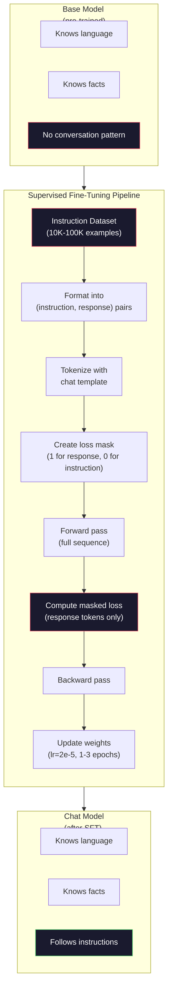

# 指令微调（Instruction Tuning / SFT）

> 一个基础模型（base model）预测下一个 token，仅此而已。它不会遵循指令、回答问题或拒绝有害请求。SFT 是连接 token 预测器与有用助手之间的桥梁。你对话过的每个模型——Claude、GPT、Llama Chat——都经历了这一步。

**Type:** Build
**Languages:** Python (with numpy)
**Prerequisites:** Phase 10, Lesson 04（预训练迷你 GPT）
**Time:** ~90 minutes

## Learning Objectives

- 实现监督微调（Supervised Fine-Tuning / SFT），将基础语言模型转化为遵循指令的助手
- 使用包含 system、user 和 assistant 角色的对话模板（chat template）格式化训练数据，并对非 assistant token 进行损失遮罩（loss masking）
- 解释为什么 SFT 是必要的：基础模型会续写文本而不是回答问题
- 通过比较基础模型与微调模型在保留指令集上的回答来评估 SFT 质量

## The Problem

你在第 04 课中训练了一个模型。给定一个序列，它可以预测下一个 token。输入"The transformer architecture"，它可能续写"has revolutionized natural language processing."。这对于一个下一 token 预测器来说已经很了不起了。

现在试试：输入"What is the capital of France?"。一个基础模型不会回答"Paris"，而是续写这个模式。它可能输出"What is the capital of Germany? What is the capital of Spain?"，因为它从包含问题列表的文档中学到了这些。或者它可能输出"is a question that many people ask"，因为这是一个合理的下一 token 续写。模型没有*回答*的概念，只知道*续写*。

这就是 GPT-3（基础模型，2020 年 6 月发布）和 ChatGPT（指令微调，2022 年 11 月发布）之间的差距。相同的架构，相同的预训练。区别在于 20,000 到 100,000 个精心制作的（指令, 回答）对，它们教会了模型遵循对话模式。

Stanford Alpaca 证明了不需要数百万条示例。2023 年 3 月，他们仅用 GPT-3.5 生成的 52,000 条指令-回答对微调了 Llama 7B。总成本：$600。结果是一个能够遵循指令、回答问题和进行对话的聊天机器人。不如 ChatGPT，但对于 $600 和几小时的训练来说，惊人地接近。

Meta 的 Llama 2 Chat 在初始 SFT 阶段只使用了约 27,000 条高质量示例。关键洞察：质量比数量更重要。由熟练标注员编写的 27,000 条示例胜过从互联网抓取的 100 万条噪声示例。

## The Concept

### SFT 实际做了什么

监督微调继续运行与预训练相同的训练循环——前向传播、计算损失、反向传播、更新权重——但使用不同类型的数据。不是原始文本，而是在结构化对话上训练：

```json
{
  "system": "You are a helpful assistant.",
  "user": "What is the capital of France?",
  "assistant": "The capital of France is Paris."
}
```

模型已经知道巴黎是法国的首都。这是它在维基百科、教科书和网页上的预训练中学到的。SFT 不教模型新的事实，而是教模型一种新的*行为*：当看到问题时，给出答案。当看到指令时，给出完成结果。当看到有害请求时，给出拒绝。

打个比方：预训练给模型知识，SFT 给模型教养。

### 数据格式

业界有三种主流格式。每种都编码了相同的信息——谁说了什么——只是使用不同的分隔符。

**Alpaca 格式**（Stanford, 2023 年 3 月）：

```json
{
  "instruction": "Summarize the following article in 3 sentences.",
  "input": "The European Central Bank raised interest rates...",
  "output": "The ECB increased rates by 25 basis points..."
}
```

简单且广泛使用。`input` 字段是可选的——很多指令不需要额外上下文。Stanford 以这种格式发布了 52,000 条示例，由 GPT-3.5 生成，花费 $600。这点燃了开源指令微调运动。

**ShareGPT 格式**（社区，2023 年）：

```json
{
  "conversations": [
    {"from": "system", "value": "You are a helpful assistant."},
    {"from": "human", "value": "What causes tides?"},
    {"from": "gpt", "value": "Tides are caused by the gravitational pull of the Moon..."},
    {"from": "human", "value": "How often do they occur?"},
    {"from": "gpt", "value": "Most coastal areas experience two high tides and two low tides per day..."}
  ]
}
```

支持多轮对话。`from` 字段按惯例使用 "human" 和 "gpt"，与实际的模型无关。Vicuna 是在 70K 条用户分享的 ChatGPT 对话（ShareGPT）上训练的。

**ChatML 格式**（OpenAI，被许多开源模型使用）：

```
<|im_start|>system
You are a helpful assistant.<|im_end|>
<|im_start|>user
What is the capital of France?<|im_end|>
<|im_start|>assistant
The capital of France is Paris.<|im_end|>
```

使用特殊 token（`<|im_start|>`、`<|im_end|>`）来分隔角色。这些 token 在微调期间被添加到分词器（tokenizer）的词汇表中。Qwen、Yi 和许多其他模型使用 ChatML。

三种格式完成的是同一件事：它们告诉模型"这是指令，这是回答，学习这种模式。"

### 为什么它能奏效

模型已经从预训练中学会了语言。它已经见过数十亿个问题后跟回答、指令后跟完成结果、以及人与人之间对话的示例。这些模式已经编码在权重中。

SFT 浓缩了这种潜在能力。模型不再需要从上下文判断该回答一个问题还是续写一篇文档，SFT 显式地在对话模式上训练。经过数千个示例后，模型学会了：当看到 assistant 角色标记时，给出有帮助的回答。

这就是 27,000 条示例就足够的原因。你不是在教模型英语，也不是在教它关于世界的事实。你在教它一种简单的行为：响应指令。知识已经在那里了。

### 遮罩损失（The Masked Loss）

这是 SFT 中最重要的技术细节，而大多数教程都略过不提。

在预训练期间，每个 token 都计算损失。模型学习预测序列中的每个下一 token。在 SFT 期间，仅在*回答* token 上计算损失。指令 token 用于提供上下文，但模型不会因"错误预测"它们而受到惩罚。

为什么？因为你不希望模型学会*生成*指令，而是希望它学会*响应*指令。如果在指令 token 上计算损失，你就是在训练模型预测"What is the capital of France?"，好像它是提问者一样。这会浪费梯度信号，并可能混淆模型的角色认知。

在实践中，创建一个损失遮罩（loss mask）：回答 token 为 1，指令 token 为 0。在平均之前，将每个 token 的损失乘以这个遮罩。

```
Tokens:    [SYS] You are helpful [USER] What is the capital? [ASST] Paris is the capital [EOS]
Loss mask:   0    0    0     0      0     0   0  0     0       1     1    1   1     1      1
```

只有 `[ASST]` 之后的 token 对损失有贡献。模型在前向传播期间看到完整对话（它需要指令来产生正确的回答），但只根据它预测回答的好坏来更新权重。

### 训练超参数（Training Hyperparameters）

SFT 使用的超参数与预训练有显著不同。你不是从头开始训练，而是在调整一个已经能正常工作的模型。

| 参数 | 预训练（Llama 2 7B） | SFT（Llama 2 Chat） |
|-----------|---------------------------|---------------------|
| 学习率 | 3e-4（峰值） | 2e-5 |
| 训练轮数（epoch） | 1（数据单次遍历） | 2 |
| Batch size | 4M tokens | 64 条示例 |
| 预热步数（warmup steps） | 2,000 | 0-100 |
| 权重衰减（weight decay） | 0.1 | 0.0-0.1 |
| 数据量 | 2T tokens | 27,000 条示例 |

SFT 的学习率低了 15 倍。这是关键。微调期间高学习率会破坏预训练学到的知识。模型会"遗忘"它已学到的内容，并过拟合到微调数据集上。这就是灾难性遗忘（catastrophic forgetting）。

两个 epoch 意味着模型每个训练示例看到两次。在小数据集上超过 3 个 epoch 会导致记忆化——模型开始逐字复述训练示例，而不是泛化。

### 灾难性遗忘（Catastrophic Forgetting）

微调可能会摧毁通用能力。在指令遵循数据上训练太久，模型就会失去编写代码、做数学运算或生成创意文本的能力。它会非常擅长训练数据的特定格式，但在其他一切方面都很糟糕。

三种缓解策略：

1. **低学习率。** 1e-5 到 5e-5。更小的更新意味着对预训练特征的破坏更少。

2. **短训练。** 1-3 个 epoch。在模型过拟合之前停止。

3. **混合预训练数据。** Llama 2 Chat 在 SFT 数据集中混入了小比例（2-5%）的原始预训练数据。这在学习新指令遵循行为的同时"提醒"了模型的通用能力。

### 真实数字

在单块 NVIDIA A100 80GB GPU 上用 10,000 条高质量指令对微调一个 7B 模型大约需要 1 小时。以下是计算过程：

- 10,000 条示例 × 平均 512 token = 512 万 token
- 2 个 epoch = 总共 1024 万 token
- A100 对 7B 模型微调的吞吐量：~3,000 token/秒
- 1024 万 / 3,000 = ~3,400 秒 = ~57 分钟

对于我们的迷你 GPT（4 层, 128 维），训练几乎是瞬间完成的。重点是理解机制，而不是规模。



## Build It

### Step 1: 指令数据集

创建一个合成的指令数据集。在生产环境中，Scale AI 和 Anthropic 等公司雇佣人工标注员来编写这些数据。我们将以编程方式创建它们来演示格式。

```python
import numpy as np

INSTRUCTION_DATA = [
    {
        "instruction": "What is the capital of France?",
        "response": "The capital of France is Paris."
    },
    {
        "instruction": "Explain gravity in one sentence.",
        "response": "Gravity is the force that attracts objects with mass toward each other."
    },
    {
        "instruction": "Write a haiku about the ocean.",
        "response": "Waves crash on the shore, salt and foam beneath the sun, endless blue expanse."
    },
    {
        "instruction": "What is 15 multiplied by 7?",
        "response": "15 multiplied by 7 is 105."
    },
    {
        "instruction": "Name three programming languages.",
        "response": "Three programming languages are Python, Rust, and TypeScript."
    },
    {
        "instruction": "Summarize photosynthesis.",
        "response": "Photosynthesis converts sunlight, water, and carbon dioxide into glucose and oxygen."
    },
    {
        "instruction": "What year did World War II end?",
        "response": "World War II ended in 1945."
    },
    {
        "instruction": "Define machine learning.",
        "response": "Machine learning is a field where algorithms learn patterns from data to make predictions."
    },
]
```

八个示例是很小的。Stanford Alpaca 使用了 52,000 条。但无论是 8 条还是 52,000 条，机制完全相同：分词、遮罩、仅在回答上计算损失。

### Step 2: 使用对话模板分词

将指令-回答对转换为带有特殊角色标记的 token 序列。标记告诉模型指令在哪里结束、回答在哪里开始。

```python
SPECIAL_TOKENS = {
    "INST_START": 253,
    "INST_END": 254,
    "RESP_START": 255,
}


def tokenize_instruction_pair(instruction, response, vocab_size=256):
    inst_tokens = list(instruction.encode("utf-8"))
    resp_tokens = list(response.encode("utf-8"))

    inst_tokens = [min(t, vocab_size - 4) for t in inst_tokens]
    resp_tokens = [min(t, vocab_size - 4) for t in resp_tokens]

    tokens = (
        [SPECIAL_TOKENS["INST_START"]]
        + inst_tokens
        + [SPECIAL_TOKENS["INST_END"]]
        + [SPECIAL_TOKENS["RESP_START"]]
        + resp_tokens
    )

    return tokens


def create_loss_mask(tokens):
    mask = np.zeros(len(tokens), dtype=np.float32)
    in_response = False

    for i, token in enumerate(tokens):
        if token == SPECIAL_TOKENS["RESP_START"]:
            in_response = True
            continue
        if in_response:
            mask[i] = 1.0

    return mask
```

损失遮罩中，指令 token 全部为 0，回答 token 全部为 1。`RESP_START` token 本身遮罩为 0，因为它是分隔符而非回答内容的一部分。

### Step 3: 遮罩交叉熵损失

标准的交叉熵，但乘以损失遮罩。只有回答 token 对梯度有贡献。

```python
def masked_cross_entropy_loss(logits, targets, loss_mask):
    batch, seq_len, vocab_size = logits.shape
    logits_flat = logits.reshape(-1, vocab_size)
    targets_flat = targets.reshape(-1)
    mask_flat = loss_mask.reshape(-1)

    max_logits = logits_flat.max(axis=-1, keepdims=True)
    log_softmax = logits_flat - max_logits - np.log(
        np.exp(logits_flat - max_logits).sum(axis=-1, keepdims=True)
    )

    per_token_loss = -log_softmax[np.arange(len(targets_flat)), targets_flat]

    masked_loss = per_token_loss * mask_flat
    num_response_tokens = mask_flat.sum()
    if num_response_tokens == 0:
        return 0.0
    loss = masked_loss.sum() / num_response_tokens

    return loss
```

分母是 `num_response_tokens`，而非 `seq_len`。如果除以总序列长度，较长的指令会稀释梯度信号。按回答 token 数除法可确保每条回答 token 的权重均等，不论指令长度如何。

### Step 4: SFT 训练循环

复用第 04 课中的 MiniGPT。训练循环看起来与预训练几乎相同，只不过多了指令格式化和遮罩损失。

```python
import sys
import os
sys.path.insert(0, os.path.join(os.path.dirname(__file__), "..", "..", "04-pre-training-mini-gpt", "code"))
from main import MiniGPT, LayerNorm, FeedForward, MultiHeadAttention, TransformerBlock, Embedding


def sft_train(model, dataset, num_epochs=2, lr=2e-5, seq_len=64):
    formatted_data = []
    for example in dataset:
        tokens = tokenize_instruction_pair(example["instruction"], example["response"])
        mask = create_loss_mask(tokens)
        formatted_data.append((tokens, mask))

    print(f"SFT Training: {len(formatted_data)} examples, {num_epochs} epochs, lr={lr}")
    print(f"Total tokens: {sum(len(t) for t, _ in formatted_data):,}")
    print()

    losses = []

    for epoch in range(num_epochs):
        epoch_loss = 0.0
        num_batches = 0

        indices = np.random.permutation(len(formatted_data))

        for idx in indices:
            tokens, mask = formatted_data[idx]

            if len(tokens) < 3:
                continue
            if len(tokens) > seq_len:
                tokens = tokens[:seq_len]
                mask = mask[:seq_len]

            input_ids = np.array(tokens[:-1]).reshape(1, -1)
            target_ids = np.array(tokens[1:]).reshape(1, -1)
            loss_mask = np.array(mask[1:]).reshape(1, -1)

            logits = model.forward(input_ids)
            loss = masked_cross_entropy_loss(logits, target_ids, loss_mask)

            batch_size, s_len, v_size = logits.shape
            probs = np.exp(logits - logits.max(axis=-1, keepdims=True))
            probs = probs / probs.sum(axis=-1, keepdims=True)
            dlogits = probs.copy()
            dlogits[np.arange(batch_size)[:, None], np.arange(s_len), target_ids] -= 1.0

            mask_expanded = loss_mask[:, :, np.newaxis]
            num_resp = loss_mask.sum()
            if num_resp > 0:
                dlogits = dlogits * mask_expanded / num_resp

            for block in model.blocks:
                block.ffn.W1 -= lr * np.random.randn(*block.ffn.W1.shape) * 0.01
                block.ffn.W2 -= lr * np.random.randn(*block.ffn.W2.shape) * 0.01
                block.ffn.b1 -= lr * np.random.randn(*block.ffn.b1.shape) * 0.01
                block.ffn.b2 -= lr * np.random.randn(*block.ffn.b2.shape) * 0.01

            epoch_loss += loss
            num_batches += 1
            losses.append(loss)

        avg_loss = epoch_loss / max(num_batches, 1)
        print(f"Epoch {epoch + 1}/{num_epochs} | Avg Loss: {avg_loss:.4f}")

    return model, losses
```

学习率为 2e-5，与 Llama 2 Chat 一致。将其与预训练中使用的 3e-4 相比——小了 15 倍。梯度被遮罩：指令 token 产生零梯度，只有回答 token 推动权重更新。

### Step 5: 比较基础模型与 SFT 模型

SFT 的全部意义在于行为改变。让我们通过检查模型如何响应指令格式的输入与原始文本续写来衡量这一点。

```python
def generate_response(model, prompt_tokens, max_new_tokens=50, temperature=0.8):
    tokens = list(prompt_tokens)
    seq_len = model.embedding.pos_embed.shape[0]

    for _ in range(max_new_tokens):
        context = np.array(tokens[-seq_len:]).reshape(1, -1)
        logits = model.forward(context)
        next_logits = logits[0, -1, :]

        next_logits = next_logits / max(temperature, 1e-8)
        probs = np.exp(next_logits - next_logits.max())
        probs = probs / probs.sum()
        probs = np.clip(probs, 1e-10, 1.0)
        probs = probs / probs.sum()

        next_token = np.random.choice(len(probs), p=probs)
        tokens.append(int(next_token))

    return tokens


def evaluate_instruction_following(model, instructions):
    print("Evaluating instruction following:")
    print("-" * 50)

    for instruction in instructions:
        tokens = (
            [SPECIAL_TOKENS["INST_START"]]
            + [min(t, 252) for t in list(instruction.encode("utf-8"))]
            + [SPECIAL_TOKENS["INST_END"]]
            + [SPECIAL_TOKENS["RESP_START"]]
        )

        output = generate_response(model, tokens, max_new_tokens=30, temperature=0.6)
        response_start = len(tokens)
        response_tokens = output[response_start:]
        response_bytes = bytes([t for t in response_tokens if t < 128])
        response_text = response_bytes.decode("utf-8", errors="replace")

        print(f"  Q: {instruction}")
        print(f"  A: {response_text[:80]}")
        print()
```

在一个只有 8 条示例的微型模型上，回答不会有实际意义。这是预料之中的。重要的是*结构*：模型学会了在回答标记之后产生输出，而不是继续生成更多指令。

### Step 6: 测量灾难性遗忘

比较 SFT 前后模型的下一 token 预测能力。如果 SFT 损害了通用能力，原始文本上的损失将增加。

```python
def measure_forgetting(model, test_text, seq_len=64):
    tokens = np.array(list(test_text.encode("utf-8")[:512]))

    total_loss = 0.0
    num_windows = 0

    for start in range(0, len(tokens) - seq_len - 1, seq_len):
        input_ids = tokens[start:start + seq_len].reshape(1, -1)
        target_ids = tokens[start + 1:start + seq_len + 1].reshape(1, -1)

        logits = model.forward(input_ids)

        batch, s_len, vocab_size = logits.shape
        logits_flat = logits.reshape(-1, vocab_size)
        targets_flat = target_ids.reshape(-1)

        max_logits = logits_flat.max(axis=-1, keepdims=True)
        log_softmax = logits_flat - max_logits - np.log(
            np.exp(logits_flat - max_logits).sum(axis=-1, keepdims=True)
        )

        loss = -log_softmax[np.arange(len(targets_flat)), targets_flat].mean()
        total_loss += loss
        num_windows += 1

    return total_loss / max(num_windows, 1)
```

在实际微调中，你会全程追踪这个指标。如果原始文本损失增加超过 10-15%，说明你的 SFT 太激进。降低学习率或减少 epoch 数。

## Use It

### 完整 SFT 流水线演示

```python
if __name__ == "__main__":
    np.random.seed(42)

    test_text = """The transformer architecture processes sequences through self-attention.
Each layer applies multi-head attention followed by a feedforward network.
Residual connections and layer normalization stabilize deep networks.
The model learns to predict the next token given all previous tokens."""

    print("=" * 70)
    print("INSTRUCTION TUNING (SFT) DEMO")
    print("=" * 70)
    print()

    model = MiniGPT(
        vocab_size=256, embed_dim=128, num_heads=4,
        num_layers=4, max_seq_len=128, ff_dim=512
    )
    print(f"Model: {model.count_parameters():,} parameters")
    print(f"Config: 4 layers, 4 heads, 128 dims (mini GPT from Lesson 04)")
    print()

    print("PRE-SFT: Measuring base model loss on raw text")
    base_loss = measure_forgetting(model, test_text)
    print(f"  Base model loss: {base_loss:.4f}")
    print()

    print("=" * 70)
    print("SFT TRAINING")
    print("=" * 70)

    model, losses = sft_train(
        model, INSTRUCTION_DATA, num_epochs=3, lr=2e-5, seq_len=128
    )

    print()
    print("POST-SFT: Measuring fine-tuned model loss on raw text")
    sft_loss = measure_forgetting(model, test_text)
    print(f"  SFT model loss: {sft_loss:.4f}")
    print(f"  Change: {((sft_loss - base_loss) / base_loss * 100):+.1f}%")
    if abs(sft_loss - base_loss) / base_loss < 0.15:
        print("  Minimal forgetting (< 15% change)")
    else:
        print("  Significant forgetting detected")
    print()

    print("=" * 70)
    print("INSTRUCTION FOLLOWING EVALUATION")
    print("=" * 70)
    print()

    test_instructions = [
        "What is the capital of France?",
        "Name a programming language.",
        "Define gravity.",
    ]
    evaluate_instruction_following(model, test_instructions)

    print("=" * 70)
    print("DATA FORMAT EXAMPLES")
    print("=" * 70)
    print()

    for i, example in enumerate(INSTRUCTION_DATA[:3]):
        tokens = tokenize_instruction_pair(example["instruction"], example["response"])
        mask = create_loss_mask(tokens)
        resp_count = int(mask.sum())
        total_count = len(tokens)
        print(f"  Example {i + 1}: {total_count} tokens, {resp_count} response tokens ({resp_count/total_count:.0%} of sequence)")
        print(f"    Instruction: {example['instruction']}")
        print(f"    Response: {example['response']}")
        print()

    print("=" * 70)
    print("TRAINING LOSS CURVE")
    print("=" * 70)
    print()

    if losses:
        window = max(1, len(losses) // 5)
        for i in range(0, len(losses), window):
            chunk = losses[i:i + window]
            avg = sum(chunk) / len(chunk)
            print(f"  Steps {i:3d}-{i + len(chunk) - 1:3d}: avg loss = {avg:.4f}")
```

## Ship It

本课产出 `outputs/prompt-sft-data-curator.md`——一个帮助你设计和策划 SFT 指令数据集的提示词。给定目标能力（代码生成、数学、对话），它会生成一个数据收集计划，包含格式规范、质量标准和多样性要求。

## Exercises

1. 添加系统提示词（system prompt）支持。修改 `tokenize_instruction_pair` 使其接受系统消息，并将其添加到指令之前。创建 5 个带有不同系统提示词的示例（"你是一个诗人"、"你是一个数学导师"），验证模型在训练期间能看到不同的系统提示词。

2. 实现数据混合（data mixing）。创建一个函数，接受一个 SFT 数据集和一个原始文本语料库，然后生成训练批次，其中 5% 的示例是原始文本（不遮罩），95% 是指令对（遮罩）。运行 3 个 epoch 并与纯 SFT 训练的遗忘指标进行比较。

3. 构建数据质量评分器。对每条指令-回答对，计算：(a) 回答的 token 长度，(b) 指令与回答比率，(c) 词汇多样性（唯一 token / 总 token）。过滤掉回答长度 < 10 token 或多样性 < 0.3 的示例。展示过滤如何影响最终损失。

4. 实现多轮对话训练。扩展分词逻辑以处理 3 轮对话（user-assistant-user-assistant-user-assistant）。损失遮罩应同时涵盖全部三轮 assistant 回答。通过打印某个示例的 token-遮罩对齐来验证遮罩是正确的。

5. 比较学习率。用 lr=1e-4、lr=2e-5 和 lr=1e-6 分别训练同一个模型三次。绘制损失曲线。lr=1e-4 的运行应显示快速初始下降但最终损失更高（过拟合）。lr=1e-6 的运行应几乎不动。lr=2e-5 的运行应是最佳点。

## Key Terms

| 术语 | 人们说的 | 实际含义 |
|------|----------------|----------------------|
| SFT | "在对话上微调" | 监督微调（Supervised Fine-Tuning）：在（指令, 回答）对上继续训练，仅在回答 token 上计算损失 |
| Instruction tuning（指令微调） | "教模型遵循指令" | 在明确的指令-回答对上训练，使基础模型学会对话模式，而非新知识 |
| Loss masking（损失遮罩） | "忽略提示词" | 将指令 token 的损失设为零，使梯度仅来自回答 token 的预测 |
| ChatML | "聊天标记语言" | 一种使用 `<\|im_start\|>` 和 `<\|im_end\|>` 分隔符在对话数据中标记说话者角色的 token 格式 |
| Alpaca format（Alpaca 格式） | "Stanford 的格式" | 带有 instruction/input/output 字段的 JSON 格式，用于 52K 条 GPT-3.5 生成的示例，花费 $600 |
| Catastrophic forgetting（灾难性遗忘） | "模型变笨了" | 微调破坏了预训练能力，因为梯度更新用任务特定模式覆盖了通用知识 |
| Weight tying（权重绑定） | "共享 embedding" | 使用相同矩阵用于输入 token embedding 和输出预测头，节省参数并改善连贯性 |
| Chat template（对话模板） | "你如何格式化提示词" | 为模型构建对话结构的特定 token 序列（角色标记、分隔符） |

## Further Reading

- [Ouyang et al., 2022 -- "Training language models to follow instructions with human feedback"（InstructGPT）](https://arxiv.org/abs/2203.02155) -- 引入了指令微调 + RLHF 的 OpenAI 论文
- [Taori et al., 2023 -- "Stanford Alpaca: An Instruction-following LLaMA Model"](https://github.com/tatsu-lab/stanford_alpaca) -- 52K 指令示例，花费 $600，证明了 SFT 在小数据集上有效
- [Touvron et al., 2023 -- "Llama 2: Open Foundation and Fine-Tuned Chat Models"](https://arxiv.org/abs/2307.09288) -- Meta 的 SFT + RLHF 流水线，使用 27K 高质量示例
- [Chiang et al., 2023 -- "Vicuna: An Open-Source Chatbot Impressing GPT-4"](https://lmsys.org/blog/2023-03-30-vicuna/) -- 在 70K ShareGPT 对话上训练
- [Zhou et al., 2023 -- "LIMA: Less Is More for Alignment"](https://arxiv.org/abs/2305.11206) -- 证明了 1,000 条精心策划的示例可以与远大数据集上的 SFT 匹敌
