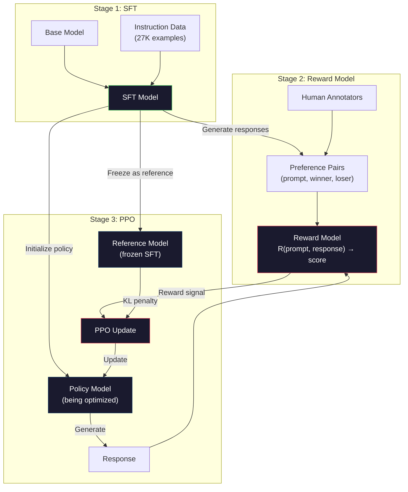
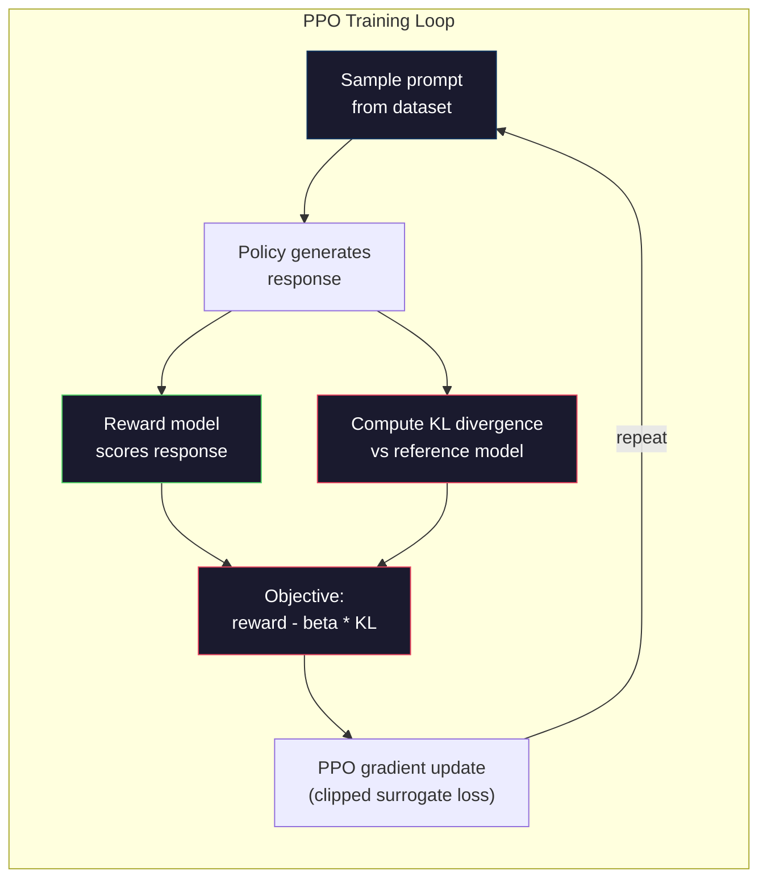

# RLHF：奖励模型 + PPO

> SFT 教会模型遵循指令，但它无法教会模型哪个回答更好。两个语法正确、事实准确的回答，其有用性可能天差地别。RLHF（基于人类反馈的强化学习）就是将人类判断编码进模型行为的方法。它让 Claude 乐于助人，让 GPT 彬彬有礼。

**Type:** Build
**Languages:** Python (with numpy)
**Prerequisites:** Phase 10, Lesson 06 (Instruction Tuning / SFT)
**Time:** ~90 minutes

## Learning Objectives

- 从人类偏好对（chosen vs rejected）构建一个对回答质量打分的奖励模型（Reward Model）
- 实现 PPO 训练循环，在奖励模型信号指导下优化语言模型策略，并加入 KL 惩罚（KL penalty）
- 解释为什么 RLHF 需要三个模型（SFT 模型、奖励模型、策略模型），以及 KL 约束如何防止奖励攻击（reward hacking）
- 通过比较偏好优化前后的回答质量，评估 RLHF 的效果

## 问题

向模型提问"解释量子计算"，它可能生成：

**回答 A：** "量子计算使用可以处于叠加态的量子比特（qubit），意味着它们可以同时是 0、1 或两者皆是。这使得量子计算机能够以指数级别快于经典计算机的速度处理某些计算。关键算法包括用于分解大数的 Shor 算法和用于搜索未排序数据库的 Grover 算法。"

**回答 B：** "量子计算是一种利用量子力学现象的计算方式。它最早于 20 世纪 80 年代被提出。Richard Feynman 提出量子系统可以通过量子计算机来模拟。自此该领域取得了显著发展。许多公司正在研究量子计算机。IBM、Google 等公司都取得了进展。Google 于 2019 年宣布实现量子霸权。"

两个回答在事实上都是正确的，语法都没问题，都遵循了指令。但回答 A 明显更好——更简洁、信息量更大、结构更清晰。人类每次都会选 A。

SFT（监督微调）无法捕捉这种区别。它用"正确"的回答训练模型，但没有机制去表达"这个回答比那个更好"。它将每个训练样本视为同等优质。如果 A 和 B 都出现在 SFT 数据集中，模型会同等程度地学习它们。

RLHF 解决了这个问题。它训练一个奖励模型来预测人类会偏好哪个回答，然后利用这个奖励信号推动语言模型生成更高质量的输出。InstructGPT（ChatGPT 的前身）使用 RLHF 大幅提升了 GPT-3 的有用性（helpfulness）、真实性（truthfulness）和安全性（harmlessness）。OpenAI 的内部评估人员在 85% 的情况下都更偏好 InstructGPT 的输出而非 GPT-3，尽管 InstructGPT 的参数量是 GPT-3 的 135 分之一（1.3B vs 175B）。

## 核心概念

### 三个阶段

RLHF 不是单次训练。它是一个由三个顺序阶段组成的流水线，每个阶段都建立在前一个阶段之上。

**第一阶段：SFT。** 用指令-回答对训练基座模型（参见第六课）。这让你得到一个能遵循指令的模型，但它不知道哪些回答更好。

**第二阶段：奖励模型。** 收集人类偏好数据：向标注者展示同一提示词（prompt）的两个回答，问"哪个更好？"训练一个模型来预测这些偏好。奖励模型以（提示词，回答）为输入，输出一个标量分数。

**第三阶段：PPO。** 用奖励模型为语言模型生成训练信号。语言模型生成回答，奖励模型对其打分，PPO 更新语言模型以生成得分更高的回答。KL 散度惩罚（KL divergence penalty）防止语言模型偏离 SFT 检查点太远。



### 奖励模型

奖励模型是一个被改造为评分器的语言模型。将 SFT 模型的最后一层——原本输出词汇表分布的 language modeling head——替换为一个标量输出头（scalar head），输出一个单一数值。最后一层之前的架构完全一致。

输入：提示词与回答拼接。输出：一个标量奖励分数。

训练数据是人类偏好对。对于每个提示词，标注者看到两个回答并选择更好的那个。这产生了训练三元组：（提示词，偏好回答，被拒绝回答）。

损失函数使用成对偏好的 Bradley-Terry 模型：

```
loss = -log(sigmoid(reward(preferred) - reward(rejected)))
```

这是关键公式。`sigmoid(reward(A) - reward(B))` 给出回答 A 优于回答 B 的概率。损失函数推动奖励模型为偏好回答分配更高的分数。

为什么用成对比较而不是绝对分数？因为人类在打绝对质量分方面表现很差（"这个回答是 7.3 还是 7.5 分（满分 10 分）？"），但在相对比较方面表现很好（"A 比 B 好吗？"）。Bradley-Terry 模型将相对比较转化为一致的绝对评分体系。

**InstructGPT 数据：** OpenAI 从 40 名外包人员那里收集了 33,000 个比较对。每个比较大约需要 5 分钟。这意味着奖励模型训练数据背后有 2,750 小时的人工劳动。

### PPO：近端策略优化

PPO 是一种强化学习算法。在 RLHF 中，"环境"是奖励模型，"智能体"是语言模型，"动作"是生成一个 token。

优化目标：

```
maximize: E[R(prompt, response)] - beta * KL(policy || reference)
```

第一项推动模型生成高奖励的回答。第二项（KL 散度惩罚）防止模型偏离 SFT 检查点太远。

为什么需要 KL 惩罚？没有它，模型会找到退化解（degenerate solutions）。奖励模型是在有限的人类偏好数据集上训练的，它有盲点。语言模型会利用这些盲点——找到在奖励模型上得分高但实际毫无意义的输出。经典案例：

- 重复"我很有用且无害！"在有用性/安全性奖励模型上得分很高
- 生成冗长、形式化但空洞的回答，匹配到"高质量"的模式
- 利用训练数据中恰好与高奖励相关的特定短语

KL 惩罚的意思是：你可以改进，但不能变成一个完全不同的模型。保持在 SFT 版本附近——那个版本本身已经是合理可信的。偏离太远，KL 代价就会压倒奖励。

**InstructGPT 数据：** PPO 训练使用 lr=1.5e-5，KL 系数 beta=0.02，256K 个 episode（提示词-回答对），每个 batch 做 4 轮 PPO。整个 RLHF 流水线在 GPU 集群上需要数天时间。



### PPO 目标函数详解

PPO 使用"截断替代损失"（clipped surrogate objective）来防止更新幅度过大。新策略与旧策略概率之比被限制在 [1 - epsilon, 1 + epsilon] 范围内，epsilon 通常取 0.2。

```
ratio = pi_new(action | state) / pi_old(action | state)
clipped_ratio = clip(ratio, 1 - epsilon, 1 + epsilon)
loss = -min(ratio * advantage, clipped_ratio * advantage)
```

优势函数（advantage function）估计当前回答与期望质量相比有多好。在 RLHF 中：

```
advantage = reward(prompt, response) - baseline
```

baseline 通常是近期回答的平均奖励。正优势意味着该回答优于平均水平；负优势意味着更差。PPO 增加高于平均水平的回答概率，降低低于平均水平的回答概率。

截断（clipping）防止灾难性更新。如果某个回答获得异常高的奖励，未截断的 ratio 可能非常大，导致模型急剧向该回答偏移。截断限制了更新幅度，保持训练稳定性。

### 奖励攻击（Reward Hacking）

RLHF 的阴暗面。语言模型优化的是奖励模型——而奖励模型只是人类偏好的不完美代理。随着语言模型越来越擅长最大化奖励，它开始利用奖励模型的弱点。

常见失败模式：

| 失败模式 | 现象 | 原因 |
|---------|-------------|-----|
| 冗长（Verbosity） | 模型生成越来越长的回答 | 人类标注者通常偏好更长、更详细的回答，所以奖励模型给长度打更高分 |
| 谄媚（Sycophancy） | 模型同意用户说的一切 | 标注者偏好与问题前提一致的回答 |
| 回避（Hedging） | 模型拒绝给出明确答案 | 回避性回答（"这是一个复杂的议题，有很多视角……"）很少被标为错误 |
| 格式游戏（Format gaming） | 模型过度使用项目符号和标题 | 格式化后的回答在标注者看来更"精致" |

缓解策略：更强的 KL 惩罚（防止模型偏离到足以利用弱点的程度）、在对抗样本上训练奖励模型（修复已知失败模式）、使用多个不同架构的奖励模型（同时攻击所有模型更难）。

### 真实 RLHF 流水线

| 模型 | 比较对数量 | 标注者人数 | 奖励模型大小 | PPO 步数 | KL 系数 |
|-------|-----------------|------------|---------|-----------|----------|
| InstructGPT | 33K | 40 | 6B | 256K | 0.02 |
| Llama 2 Chat | ~1M | 未公开 | 70B | 未公开 | 0.01 |
| Claude | 未公开 | 未公开 | 未公开 | 未公开 | 未公开 |
| Anthropic RLHF 论文 | 22K | 20 | 52B | 50K | 0.001 |

Anthropic 2022 年的论文使用了 22,000 个比较对训练了一个 52B 的奖励模型。更大的奖励模型产生更可靠的信号，使 PPO 训练更稳定。用小奖励模型训练大语言模型是有风险的——奖励模型没有足够能力捕捉好回答与坏回答之间的细微差别。

```figure
rlhf-pipeline
```

## 动手构建

### 第一步：合成偏好数据

在生产环境中，偏好数据由人类标注者创建。我们将创建合成数据对，其中"偏好"回答客观上更好（更简洁、更准确、更有用）。

```python
import numpy as np

PREFERENCE_DATA = [
    {
        "prompt": "What is the capital of France?",
        "preferred": "The capital of France is Paris.",
        "rejected": "France is a country in Europe. It has many cities. The capital is Paris. Paris is known for the Eiffel Tower.",
    },
    {
        "prompt": "Explain gravity in one sentence.",
        "preferred": "Gravity is the force that attracts objects with mass toward each other.",
        "rejected": "Gravity is something that makes things fall down when you drop them.",
    },
    {
        "prompt": "What is 15 times 7?",
        "preferred": "15 times 7 is 105.",
        "rejected": "Let me think about this. 15 times 7. Well, 10 times 7 is 70, and 5 times 7 is 35, so the answer might be around 105.",
    },
    {
        "prompt": "Name three programming languages.",
        "preferred": "Python, Rust, and TypeScript.",
        "rejected": "There are many programming languages. Some popular ones include various languages like Python and others.",
    },
    {
        "prompt": "What year did World War II end?",
        "preferred": "World War II ended in 1945.",
        "rejected": "World War II was a major global conflict. It involved many countries. The war ended in the mid-1940s, specifically in 1945.",
    },
    {
        "prompt": "Define machine learning.",
        "preferred": "Machine learning is a field where algorithms learn patterns from data to make predictions without being explicitly programmed.",
        "rejected": "Machine learning is a type of AI. AI stands for artificial intelligence. Machine learning uses data to learn.",
    },
]
```

偏好回答简洁直接。被拒绝回答展现了常见的失败模式：不必要的填充词、回避、冗余解释和不精确。这正是 SFT 无法捕捉但 RLHF 可以捕捉的区别。

### 第二步：奖励模型架构

奖励模型复用了 mini GPT 的 Transformer 架构，但将词汇表大小的输出头替换为单个标量投影。

```python
import sys
import os
sys.path.insert(0, os.path.join(os.path.dirname(__file__), "..", "..", "04-pre-training-mini-gpt", "code"))
from main import MiniGPT, LayerNorm, Embedding, TransformerBlock


class RewardModel:
    def __init__(self, vocab_size=256, embed_dim=128, num_heads=4,
                 num_layers=4, max_seq_len=128, ff_dim=512):
        self.embedding = Embedding(vocab_size, embed_dim, max_seq_len)
        self.blocks = [
            TransformerBlock(embed_dim, num_heads, ff_dim)
            for _ in range(num_layers)
        ]
        self.ln_f = LayerNorm(embed_dim)
        self.reward_head = np.random.randn(embed_dim) * 0.02

    def forward(self, token_ids):
        seq_len = token_ids.shape[-1]
        mask = np.triu(np.full((seq_len, seq_len), -1e9), k=1)

        x = self.embedding.forward(token_ids)
        for block in self.blocks:
            x = block.forward(x, mask)
        x = self.ln_f.forward(x)

        last_hidden = x[:, -1, :]
        reward = last_hidden @ self.reward_head

        return reward
```

奖励模型取**最后一个** token 位置的隐藏状态，并将其投影为标量。为什么是最后一个 token？因为因果注意力掩码（causal attention mask）意味着最后一个位置已经关注到了所有之前的 token。它拥有对完整（提示词，回答）序列最完整的表示。

### 第三步：Bradley-Terry 损失

使用 Bradley-Terry 成对损失在偏好对上训练奖励模型。

```python
def tokenize_for_reward(prompt, response, vocab_size=256):
    prompt_tokens = [min(t, vocab_size - 1) for t in list(prompt.encode("utf-8"))]
    response_tokens = [min(t, vocab_size - 1) for t in list(response.encode("utf-8"))]
    return prompt_tokens + [0] + response_tokens


def sigmoid(x):
    return np.where(
        x >= 0,
        1.0 / (1.0 + np.exp(-x)),
        np.exp(x) / (1.0 + np.exp(x))
    )


def bradley_terry_loss(reward_preferred, reward_rejected):
    diff = reward_preferred - reward_rejected
    loss = -np.log(sigmoid(diff) + 1e-8)
    return loss


def train_reward_model(rm, preference_data, num_epochs=10, lr=1e-4, max_seq_len=128):
    print(f"Training Reward Model: {len(preference_data)} preference pairs, {num_epochs} epochs")
    print()

    losses = []
    accuracies = []

    for epoch in range(num_epochs):
        epoch_loss = 0.0
        epoch_correct = 0
        num_pairs = 0

        indices = np.random.permutation(len(preference_data))

        for idx in indices:
            pair = preference_data[idx]

            preferred_tokens = tokenize_for_reward(pair["prompt"], pair["preferred"])
            rejected_tokens = tokenize_for_reward(pair["prompt"], pair["rejected"])

            preferred_tokens = preferred_tokens[:max_seq_len]
            rejected_tokens = rejected_tokens[:max_seq_len]

            preferred_ids = np.array(preferred_tokens).reshape(1, -1)
            rejected_ids = np.array(rejected_tokens).reshape(1, -1)

            r_preferred = rm.forward(preferred_ids)[0]
            r_rejected = rm.forward(rejected_ids)[0]

            loss = bradley_terry_loss(r_preferred, r_rejected)

            if r_preferred > r_rejected:
                epoch_correct += 1

            diff = r_preferred - r_rejected
            grad = sigmoid(diff) - 1.0

            rm.reward_head -= lr * grad * rm.ln_f.forward(
                rm.embedding.forward(preferred_ids)
            )[:, -1, :].flatten()

            epoch_loss += loss
            num_pairs += 1

        avg_loss = epoch_loss / max(num_pairs, 1)
        accuracy = epoch_correct / max(num_pairs, 1)
        losses.append(avg_loss)
        accuracies.append(accuracy)

        if epoch % 2 == 0:
            print(f"  Epoch {epoch + 1:3d} | Loss: {avg_loss:.4f} | Accuracy: {accuracy:.1%}")

    return rm, losses, accuracies
```

准确率（accuracy）指标很直观：奖励模型正确排序的偏好对比例。随机模型得 50%。在干净数据上训练良好的奖励模型应该超过 70%。InstructGPT 的奖励模型在留出比较对上的准确率约为 72%，这听起来不高但实际上很不错——许多偏好对即使对人类来说也是模棱两可的（标注者间一致性约为 73%）。

### 第四步：简化的 PPO 循环

完整的 PPO 很复杂。本实现抓住了核心机制：生成回答、打分、计算优势（advantage），并在 KL 惩罚下更新策略。

```python
def compute_kl_divergence(policy_logits, reference_logits):
    policy_probs = np.exp(policy_logits - policy_logits.max(axis=-1, keepdims=True))
    policy_probs = policy_probs / policy_probs.sum(axis=-1, keepdims=True)
    policy_probs = np.clip(policy_probs, 1e-10, 1.0)

    ref_probs = np.exp(reference_logits - reference_logits.max(axis=-1, keepdims=True))
    ref_probs = ref_probs / ref_probs.sum(axis=-1, keepdims=True)
    ref_probs = np.clip(ref_probs, 1e-10, 1.0)

    kl = np.sum(policy_probs * np.log(policy_probs / ref_probs), axis=-1)
    return kl.mean()


def generate_response(model, prompt_tokens, max_new_tokens=30, temperature=0.8, max_seq_len=128):
    tokens = list(prompt_tokens)

    for _ in range(max_new_tokens):
        context = np.array(tokens[-max_seq_len:]).reshape(1, -1)
        logits = model.forward(context)
        next_logits = logits[0, -1, :]

        next_logits = next_logits / max(temperature, 1e-8)
        probs = np.exp(next_logits - next_logits.max())
        probs = probs / probs.sum()
        probs = np.clip(probs, 1e-10, 1.0)
        probs = probs / probs.sum()

        next_token = np.random.choice(len(probs), p=probs)
        tokens.append(int(next_token))

    return tokens


def copy_model_weights(source, target):
    target.embedding.token_embed = source.embedding.token_embed.copy()
    target.embedding.pos_embed = source.embedding.pos_embed.copy()
    target.ln_f.gamma = source.ln_f.gamma.copy()
    target.ln_f.beta = source.ln_f.beta.copy()
    for s_block, t_block in zip(source.blocks, target.blocks):
        t_block.attn.W_q = s_block.attn.W_q.copy()
        t_block.attn.W_k = s_block.attn.W_k.copy()
        t_block.attn.W_v = s_block.attn.W_v.copy()
        t_block.attn.W_out = s_block.attn.W_out.copy()
        t_block.ffn.W1 = s_block.ffn.W1.copy()
        t_block.ffn.W2 = s_block.ffn.W2.copy()
        t_block.ffn.b1 = s_block.ffn.b1.copy()
        t_block.ffn.b2 = s_block.ffn.b2.copy()
        t_block.ln1.gamma = s_block.ln1.gamma.copy()
        t_block.ln1.beta = s_block.ln1.beta.copy()
        t_block.ln2.gamma = s_block.ln2.gamma.copy()
        t_block.ln2.beta = s_block.ln2.beta.copy()


def ppo_training(policy_model, reference_model, reward_model, prompts,
                 num_episodes=20, lr=1.5e-5, kl_coeff=0.02, max_seq_len=128):
    print(f"PPO Training: {num_episodes} episodes, lr={lr}, KL coeff={kl_coeff}")
    print()

    rewards_history = []
    kl_history = []

    for episode in range(num_episodes):
        prompt_text = prompts[episode % len(prompts)]
        prompt_tokens = [min(t, 252) for t in list(prompt_text.encode("utf-8"))]

        response_tokens = generate_response(
            policy_model, prompt_tokens,
            max_new_tokens=20, temperature=0.8, max_seq_len=max_seq_len
        )

        response_ids = np.array(response_tokens[:max_seq_len]).reshape(1, -1)
        reward = reward_model.forward(response_ids)[0]

        policy_logits = policy_model.forward(response_ids)
        ref_logits = reference_model.forward(response_ids)
        kl = compute_kl_divergence(policy_logits, ref_logits)

        total_reward = reward - kl_coeff * kl

        rewards_history.append(float(reward))
        kl_history.append(float(kl))

        for block in policy_model.blocks:
            update_scale = lr * total_reward
            block.ffn.W1 += update_scale * np.random.randn(*block.ffn.W1.shape) * 0.01
            block.ffn.W2 += update_scale * np.random.randn(*block.ffn.W2.shape) * 0.01

        if episode % 5 == 0:
            avg_reward = np.mean(rewards_history[-5:]) if rewards_history else 0
            avg_kl = np.mean(kl_history[-5:]) if kl_history else 0
            print(f"  Episode {episode:3d} | Reward: {reward:.4f} | KL: {kl:.4f} | "
                  f"Avg Reward: {avg_reward:.4f}")

    return policy_model, rewards_history, kl_history
```

核心循环：（1）采样一个提示词，（2）生成一个回答，（3）用奖励模型打分，（4）计算与冻结参考模型的 KL 散度，（5）计算调整后的奖励（奖励减去 KL 惩罚），（6）更新策略。KL 惩罚随着策略偏离参考模型而增长，自动防止奖励攻击。

### 第五步：奖励分数对比

RLHF 之后，策略模型的回答在奖励模型上的得分应该高于原始 SFT 模型的回答。

```python
def compare_models(sft_model, rlhf_model, reward_model, prompts, max_seq_len=128):
    print("Model Comparison (reward scores)")
    print("-" * 60)
    print(f"  {'Prompt':<35} {'SFT':>10} {'RLHF':>10}")
    print("  " + "-" * 55)

    sft_total = 0.0
    rlhf_total = 0.0

    for prompt in prompts:
        prompt_tokens = [min(t, 252) for t in list(prompt.encode("utf-8"))]

        sft_response = generate_response(
            sft_model, prompt_tokens,
            max_new_tokens=20, temperature=0.6, max_seq_len=max_seq_len
        )
        rlhf_response = generate_response(
            rlhf_model, prompt_tokens,
            max_new_tokens=20, temperature=0.6, max_seq_len=max_seq_len
        )

        sft_ids = np.array(sft_response[:max_seq_len]).reshape(1, -1)
        rlhf_ids = np.array(rlhf_response[:max_seq_len]).reshape(1, -1)

        sft_reward = reward_model.forward(sft_ids)[0]
        rlhf_reward = reward_model.forward(rlhf_ids)[0]

        sft_total += sft_reward
        rlhf_total += rlhf_reward

        truncated_prompt = prompt[:33] + ".." if len(prompt) > 35 else prompt
        print(f"  {truncated_prompt:<35} {sft_reward:>10.4f} {rlhf_reward:>10.4f}")

    n = len(prompts)
    print("  " + "-" * 55)
    print(f"  {'Average':<35} {sft_total/n:>10.4f} {rlhf_total/n:>10.4f}")

    return sft_total / n, rlhf_total / n
```

## 使用它

### 完整 RLHF 流水线演示

```python
if __name__ == "__main__":
    np.random.seed(42)

    print("=" * 70)
    print("RLHF PIPELINE: REWARD MODEL + PPO")
    print("=" * 70)
    print()

    print("STAGE 1: SFT Model (from Lesson 06)")
    print("-" * 40)
    sft_model = MiniGPT(
        vocab_size=256, embed_dim=128, num_heads=4,
        num_layers=4, max_seq_len=128, ff_dim=512
    )
    print(f"  Parameters: {sft_model.count_parameters():,}")
    print()

    print("STAGE 2: Train Reward Model")
    print("-" * 40)
    rm = RewardModel(
        vocab_size=256, embed_dim=128, num_heads=4,
        num_layers=4, max_seq_len=128, ff_dim=512
    )

    rm, rm_losses, rm_accuracies = train_reward_model(rm, PREFERENCE_DATA, num_epochs=10, lr=1e-4)
    print()

    print("Reward Model Evaluation:")
    print("-" * 40)
    correct = 0
    for pair in PREFERENCE_DATA:
        pref_tokens = tokenize_for_reward(pair["prompt"], pair["preferred"])[:128]
        rej_tokens = tokenize_for_reward(pair["prompt"], pair["rejected"])[:128]

        r_pref = rm.forward(np.array(pref_tokens).reshape(1, -1))[0]
        r_rej = rm.forward(np.array(rej_tokens).reshape(1, -1))[0]

        if r_pref > r_rej:
            correct += 1
        print(f"  Preferred: {r_pref:+.4f} | Rejected: {r_rej:+.4f} | {'Correct' if r_pref > r_rej else 'Wrong'}")

    print(f"\n  Accuracy: {correct}/{len(PREFERENCE_DATA)} = {correct/len(PREFERENCE_DATA):.1%}")
    print()

    print("STAGE 3: PPO Training")
    print("-" * 40)

    policy_model = MiniGPT(
        vocab_size=256, embed_dim=128, num_heads=4,
        num_layers=4, max_seq_len=128, ff_dim=512
    )
    reference_model = MiniGPT(
        vocab_size=256, embed_dim=128, num_heads=4,
        num_layers=4, max_seq_len=128, ff_dim=512
    )

    copy_model_weights(sft_model, policy_model)
    copy_model_weights(sft_model, reference_model)

    train_prompts = [pair["prompt"] for pair in PREFERENCE_DATA]

    policy_model, rewards, kls = ppo_training(
        policy_model, reference_model, rm,
        train_prompts, num_episodes=20, lr=1.5e-5, kl_coeff=0.02
    )
    print()

    print("=" * 70)
    print("COMPARISON: SFT vs RLHF")
    print("=" * 70)
    print()

    eval_prompts = [
        "What is the capital of France?",
        "Explain gravity.",
        "Name three programming languages.",
    ]

    sft_avg, rlhf_avg = compare_models(sft_model, policy_model, rm, eval_prompts)
    print()

    print("=" * 70)
    print("KL DIVERGENCE ANALYSIS")
    print("=" * 70)
    print()

    if kls:
        print(f"  Initial KL: {kls[0]:.4f}")
        print(f"  Final KL:   {kls[-1]:.4f}")
        print(f"  Max KL:     {max(kls):.4f}")
        kl_threshold = 0.1
        print(f"  KL > {kl_threshold}: {'Yes (model drifted significantly)' if max(kls) > kl_threshold else 'No (model stayed close to reference)'}")
```

## 交付成果

本课产出 `outputs/prompt-reward-model-designer.md`——一个用于设计奖励模型训练流水线的提示词（prompt）。给定目标行为（有用性、编程能力、安全性），它生成数据收集方案、标注者指南和奖励模型评估标准。

## 练习

1. 修改奖励模型，使用所有隐藏状态的均值而非仅最后一个位置。比较准确率。均值池化（mean pooling）方法给每个 token 同等的权重，而最后一个位置方法依赖因果注意力来聚合信息。在 6 个偏好对上测试，报告哪种方法准确率更高。

2. 实现奖励模型校准。训练后，将所有偏好对输入奖励模型并计算：(a) 偏好回答的平均奖励，(b) 被拒绝回答的平均奖励，(c) 差距（偏好减被拒绝）。一个校准良好的模型应有明显的差距。然后添加 4 个新的偏好对，检查该差距在未见数据上是否保持。

3. 模拟奖励攻击。创建一个给长回答打高分的奖励模型（reward = len(response) / 100）。用这个有缺陷的奖励模型运行 PPO，观察策略模型生成越来越长、重复的输出。然后添加 0.1 的 KL 惩罚，证明它可以防止退化的行为。

4. 实现多目标奖励。训练两个奖励模型——一个针对有用性，一个针对简洁性。将它们组合为 R = 0.7 * R_helpful + 0.3 * R_concise。展示组合目标能生成既有用又简洁的回答，避免单一有用性奖励的冗长陷阱。

5. 比较不同的 KL 系数。用 beta=0.001（太低，奖励攻击）、beta=0.02（标准）、beta=0.5（太高，学不到东西）运行 PPO。为每种配置绘制奖励曲线和 KL 曲线。beta=0.02 的运行应显示奖励稳步提升且 KL 有界。

## 关键术语

| 术语 | 人们的说法 | 实际含义 |
|------|----------------|----------------------|
| RLHF | "用人类反馈训练" | 基于人类反馈的强化学习（Reinforcement Learning from Human Feedback）：一个三阶段流水线（SFT、奖励模型、PPO），利用人类偏好信号优化语言模型输出 |
| 奖励模型（Reward model） | "一个给回答打分的模型" | 一个带有标量输出头的 Transformer，使用 Bradley-Terry 损失在成对人类偏好上训练 |
| Bradley-Terry | "那个比较模型" | 一个概率模型，其中 P(A > B) = sigmoid(score(A) - score(B))，将成对偏好转化为一体的评分函数 |
| PPO | "那个 RL 算法" | 近端策略优化（Proximal Policy Optimization）：更新策略以最大化奖励，同时截断更新幅度以防止不稳定 |
| KL 散度（KL divergence） | "两个分布有多不同" | 策略模型的 token 分布与参考模型分布之间的差异度量——用作惩罚以防止奖励攻击 |
| KL 惩罚（KL penalty） | "套在模型上的绳子" | Beta * KL(policy \|\| reference)，从奖励信号中减去——防止策略偏离 SFT 检查点太远 |
| 奖励攻击（Reward hacking） | "利用奖励机制的漏洞" | 策略通过利用奖励模型的弱点而非真正改进，找到退化但高奖励输出的情况 |
| 偏好对（Preference pair） | "哪个更好，A 还是 B？" | 由（提示词，偏好回答，被拒绝回答）组成的训练样本——RLHF 训练数据的基本单元 |
| 参考模型（Reference model） | "冻结的 SFT 检查点" | SFT 模型的副本，其权重永不改变——用作 KL 散度计算的锚点 |

## 进一步阅读

- [Ouyang et al., 2022 -- "Training language models to follow instructions with human feedback" (InstructGPT)](https://arxiv.org/abs/2203.02155) —— 使 RLHF 在大语言模型上实用的论文
- [Schulman et al., 2017 -- "Proximal Policy Optimization Algorithms"](https://arxiv.org/abs/1707.06347) —— OpenAI 的原始 PPO 论文
- [Bai et al., 2022 -- "Training a Helpful and Harmless Assistant with Reinforcement Learning from Human Feedback"](https://arxiv.org/abs/2204.05862) —— Anthropic 的 RLHF 论文，对奖励攻击和 KL 惩罚有详细分析
- [Stiennon et al., 2020 -- "Learning to summarize with human feedback"](https://arxiv.org/abs/2009.01325) —— RLHF 应用于摘要生成，展示了奖励模型可以捕捉细微的质量判断
- [Christiano et al., 2017 -- "Deep reinforcement learning from human preferences"](https://arxiv.org/abs/1706.03741) —— 从人类比较中学习奖励函数的基础性工作
