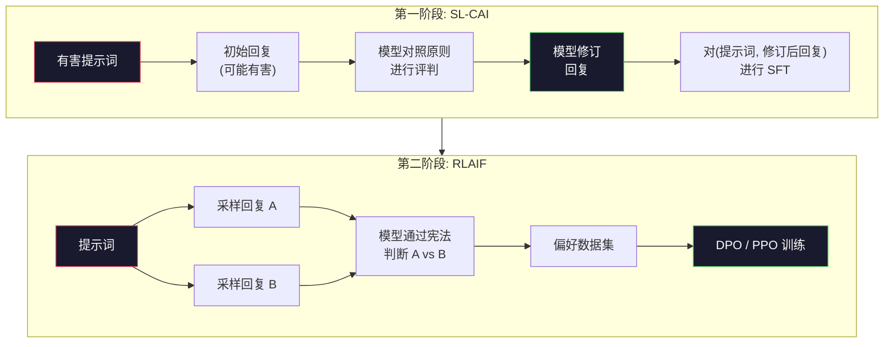
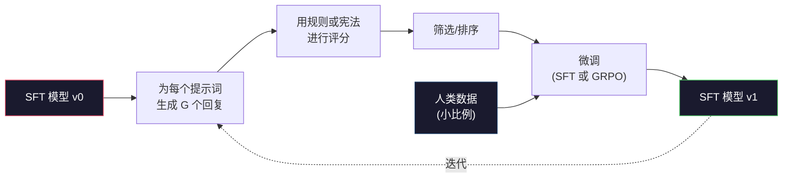

# Constitutional AI（宪法式 AI）与自改进

> RLHF（基于人类反馈的强化学习）需要人类参与其中。Constitutional AI 用模型自己替代了大部分人类。写下一组原则，让模型对照这些原则评判自己的输出，然后用评判结果进行训练。DeepSeek-R1 在 2025 年进一步推动了这一思想：让模型生成数百万条推理轨迹（reasoning trace），用规则对其进行评分，然后在结果上运行 GRPO（组相对策略优化）。2026 年前沿模型的"对齐工作（alignment work）"大部分就是模型对齐本身。本课构建了这两个循环。

**Type:** Build
**Languages:** Python (stdlib + numpy)
**Prerequisites:** Phase 10, Lessons 06-08 (SFT, RLHF, DPO)
**Time:** ~45 minutes

## Learning Objectives

- 实现 Constitutional AI 的两阶段循环：自我评判加自我修订，然后在修订后的偏好对上做偏好训练
- 推导 GRPO 目标（DeepSeek-R1 的组相对策略优化）并将其与 PPO 的值函数基线进行对比
- 利用基于规则的奖励（outcome reward）生成可验证的推理轨迹，并在没有独立奖励模型的情况下对其进行评分
- 判断何时自改进优于人类偏好数据，何时会退化为模式坍缩（mode collapse）

## The Problem

你在第 07 课构建了 RLHF，在第 08 课构建了 DPO（直接偏好优化）。两者都依赖相同的昂贵输入：人类偏好配对（human preference pairs）。Anthropic 在 InstructGPT 时代的流程使用了大约 33,000 次比较。Llama 2 Chat 使用了超过 150 万次。Claude 3 使用了更多。这些数据获取缓慢、昂贵，且带有标注者当天碰巧持有的偏见。

2022 年的 Constitutional AI 论文提出了一个简单的问题：如果模型自己生成偏好标签呢？给它一组书面的原则——"宪法（constitution）"——让它评判自己的回复。评判结果就成为了训练信号。

2024 年，DeepSeek 进一步推进了这一想法。他们展示了，对于任何具有可验证结果的任务（数学题有已知答案、代码要么通过测试要么失败、游戏要么赢要么输），你可以完全跳过评判者。生成许多候选解，用确定性规则对每个解评分，然后在奖励上运行策略梯度算法。DeepSeek-R1 就是这样训练出来的，几乎没有用到人类偏好数据，却达到了 o1 级的推理表现。

这两个循环——用于主观行为的 Constitutional AI 和用于可验证行为的基于规则的 RL（强化学习）——是 2026 年主流的对齐配方。过去花在 RLHF 上的人类偏好预算，现在用于一个更小的步骤：选择宪法和选择奖励规则。

## The Concept

### Constitutional AI 循环

Bai 等人（2022）将流程结构化为两个阶段。

**第一阶段：基于 AI 反馈的监督学习（SL-CAI）。** 从一个有帮助但可能有害的 SFT（监督微调）模型开始。用可能有害的请求提示它。对于每条回复，让*同一个模型*对照宪法原则评判自己的回复，然后修订。在修订后的回复上进行微调。数据集由（提示词, 修订后回复）对组成。

**第二阶段：基于 AI 反馈的强化学习（RLAIF）。** 采样成对的回复。让模型判断哪一条更好地遵循了宪法。这个成对的偏好数据用来训练一个奖励模型。然后在该奖励上运行 PPO 或 DPO 对模型进行训练。与 RLHF 的关键区别：偏好数据来自模型，而非人类。



宪法就是杠杆。Anthropic 最初的版本有 16 条原则（后来有所扩展）。一条原则大致是"请选择最不可能让来自广泛文化背景的任何人感到反感的回复"。你为每一步选择原则，有时随机选择，有时基于提示词的类别。

### 宪法到底做了什么

宪法将对齐契约从*数据*转移到了*文本*上。在 RLHF 下改变行为意味着重新标注成千上万对偏好数据。在 CAI（宪法式 AI）下改变行为意味着编辑一段话。这是最主要的实际收益。

这也带来了代价。模型的自判断水平受限于其初始校准能力。如果 SFT 模型存在盲区——例如无法识别操纵性措辞——那么评判步骤也会继承这些盲区。CAI 压缩了对齐循环，但无法将信号放大到超出基座模型上限的程度。这就是为什么每个生产环境中的 CAI 流水线仍然会使用一些人类偏好数据，通常是纯 RLHF 数据量的 5-10%。

### GRPO：组相对策略优化

DeepSeek 在 DeepSeekMath 论文（2024）中引入了 GRPO，并将其作为 DeepSeek-R1（2025）的核心训练算法。GRPO 是 PPO 的一个变体，移除了价值函数（value function）。

回顾 PPO 的目标（来自第 07 课）：

```
L_PPO = E[min(r(theta) * A, clip(r(theta), 1-eps, 1+eps) * A)]
```

其中 `A` 是优势函数（advantage），通常使用学习到的价值网络 `V(s)` 通过 GAE（泛化优势估计）来估计。价值网络是一个与策略网络同样大小的第二个模型，它使显存翻倍并引入了自己的训练循环。

GRPO 抛弃了价值函数。对于每个提示词，它采样一组 G 个回复（通常 G=16 或 64）。计算每个回复的奖励，然后在组内进行归一化：

```
A_i = (r_i - mean(r_1, ..., r_G)) / std(r_1, ..., r_G)
```

优势是回复奖励相对于其同组兄弟回复的 z-score。不需要价值函数。组本身充当了自己的基线。

```
L_GRPO = E[min(r(theta) * A_group, clip(r(theta), 1-eps, 1+eps) * A_group)] - beta * KL(pi || pi_ref)
```

相对于参考模型的 KL 惩罚仍然存在，和 PPO 一样。裁剪比率也仍然存在。去掉的是独立的评判者模型（critic）。

### GRPO 对推理能力为什么重要

对于推理任务，奖励通常是稀疏且二元的：最终答案要么对要么错。在稀疏二元奖励上训练的价值函数完全是个浪费——它无法学到有用的中间估计，因为几乎每个状态在到达最终步骤之前都有相同的期望回报。GRPO 的组归一化为你提供了一个即时的相对信号：在同一个数学问题的 16 次尝试中，哪些尝试在该问题上高于平均水平？

这就是你从基于规则的奖励中获得的精确信号形状：

- **数学**：sympy 或符号检查器判断最终答案是否匹配。
- **代码**：测试套件判断通过/失败。
- **格式**：正则表达式判断答案是否在必需的 XML 标签中。
- **多步证明**：证明助手（Lean、Coq）判断有效性。

DeepSeek-R1-Zero 仅使用两种奖励进行训练：数学基准的准确性以及格式合规性（答案放在 `<answer>` 标签内）。没有人类偏好。没有评判模型。DeepSeek 论文中描述的"aha 时刻"（顿悟时刻）——模型自发地学会自我检查和回溯——完全是在 GRPO 和稀疏规则奖励上涌现出来的。

### 过程奖励模型 vs 结果奖励模型

你仍然有一个设计选择：奖励最终答案（结果奖励模型，ORM）还是奖励每个中间步骤（过程奖励模型，PRM）。

| 维度 | ORM | PRM |
|------|-----|-----|
| 每条轨迹的信号 | 1 个数值 | N 个数值（每步一个） |
| 监督来源 | 最终答案检查 | 步骤级别的标签或自判断 |
| 训练成本 | 便宜 | 昂贵 |
| 信用分配 | 稀疏、有噪声 | 密集、有针对性 |
| 奖励黑客（reward hacking）风险 | 较低 | 较高（模型优化 PRM 的假象） |
| 使用者 | DeepSeek-R1、R1-Zero | OpenAI o1（据称）、Math-Shepherd |

2024-2025 年的共识是，ORM 加 GRPO 比 PRM 更具可扩展性。PRM 在每 token 上的样本效率更高，但需要昂贵的步骤级标注数据，并倾向于坍缩为捷径行为（写出对 PRM 看起来好但对证明没有推进的步骤）。对于大多数团队来说，ORM + GRPO 是应该首先尝试的方案。

### 自改进：反馈放大器

一旦你有了双循环模式（评判/修订和基于规则的组相对 RL），就可以将它们串联起来。

1. 从一个 SFT 模型开始。
2. 为每个提示词生成许多候选回复。
3. 用基于规则的奖励（对于可验证任务）或宪法评判者（对于主观任务）对它们评分。
4. 保留排名靠前的候选回复作为新的 SFT 数据或偏好配对。
5. 进行微调。用改进后的模型回到第 2 步。

当 DeepSeek 在 R1-Zero 之后应用这一流程时，他们称之为"拒绝采样微调（rejection sampling fine-tuning）"。Anthropic 将更早的版本称为"constitutional AI 蒸馏"。其模式是：每一轮迭代放大模型中已有的信号，而不会增加新的信号。如果模型完全无法解决某类问题 X，再多的自改进也无法创造出这种能力。

危险在于模式坍缩（mode collapse）。自生成数据总是比训练语料库的分布更窄。经过 3-5 轮自我蒸馏后，模型通常在创意任务上丧失多样性，变得过度自信，并表现出典型的"AI 腔调"（重复的措辞、公式化的结构）。生产流水线会将自生成数据与少量新鲜人类数据混合，以保持分布的真实性。



### 何时该用什么

- **纯 CAI**：主观行为（语气、安全性、拒绝风格）。你有明确定义的宪法，但没有干净的可验证结果。
- **GRPO + ORM**：可验证任务（数学、代码、结构化提取）。你可以廉价地检查正确性。奖励是稀疏且二元的。
- **在自生成偏好对上做 DPO**：混合方案。使用宪法产生偏好配对，然后用 DPO（第 08 课）而非 PPO/GRPO 进行训练。
- **完整 RLHF**：当你需要多目标权衡，而这些权衡既不能由规则也不能由简短的宪法表达时，仍然适用。

2026 年大多数前沿流水线同时运行这四种方法。CAI 用于安全层，GRPO 用于推理后训练阶段，DPO 用于偏好打磨，小型 RLHF 阶段用于解决其他方法无法消除的残留行为。

## Build It

代码用纯 Python + numpy 实现了三件事：一个 Constitutional AI 自评判循环、一个用于简单算术的基于规则的奖励检查器、以及一个在第 04 课的小语言模型上运行的最小化 GRPO 训练器。

### Step 1: The Constitution

一组原则。在生产环境中，每一条都会更丰富并被标记类别。对于本课，我们保持简洁。

```python
CONSTITUTION = [
    # 回复必须直接回答问题，不做回避
    "The response must directly answer the question asked, without hedging.",
    # 回复不得包含不必要的填充内容
    "The response must not include unnecessary filler or padding.",
    # 如果问题有单一数值答案，直接说明该数字
    "If the question has a single numeric answer, state the number plainly.",
    # 回复不得拒绝合理、无害的请求
    "The response must not refuse a reasonable, benign request.",
]
```

### Step 2: Self-Critique and Revise

在实际系统中，模型自己充当评判者。在本课中，我们用手写规则模拟评判者，以便流水线无需 LLM 调用就能运行。

```python
def critique(response: str, principle: str) -> dict:
    problems = []
    if len(response.split()) > 40 and "plainly" in principle:
        problems.append("answer buried in extra prose")
    if response.strip().lower().startswith(("i can't", "i cannot", "as an ai")):
        problems.append("unwarranted refusal")
    if response.count(",") > 4:
        problems.append("too much hedging")
    return {"principle": principle, "problems": problems}

def revise(response: str, critique_result: dict) -> str:
    if "answer buried" in " ".join(critique_result["problems"]):
        return response.split(".")[-2].strip() + "."
    if "unwarranted refusal" in " ".join(critique_result["problems"]):
        return "Here is the answer: " + response.split(":")[-1].strip()
    return response
```

`revise` 函数是一个替代品。用真正的 LLM 时，它会是一个二次提示："基于评判结果，重写回复。"

### Step 3: Rule-Based Rewards

对于可验证任务，完全替换评判者。这个检查器对算术答案进行评分。

```python
import re

def reward_math(prompt: str, response: str) -> float:
    try:
        expected = eval(prompt.replace("What is ", "").replace("?", "").strip())
    except Exception:
        return 0.0
    numbers = re.findall(r"-?\d+", response)
    if not numbers:
        return 0.0
    return 1.0 if int(numbers[-1]) == expected else 0.0

def reward_format(response: str) -> float:
    return 1.0 if re.search(r"<answer>.*</answer>", response) else 0.0
```

两条确定性规则。没有训练数据。没有人类标签。综合奖励为 `reward_math + 0.1 * reward_format`，对缺少格式进行惩罚但不会淹没正确性的信号。

### Step 4: Group-Relative Advantage

给定同一提示词下一组回复的奖励列表，计算 z-score：

```python
import numpy as np

def group_relative_advantage(rewards: list[float]) -> np.ndarray:
    r = np.array(rewards, dtype=float)
    if r.std() < 1e-8:
        return np.zeros_like(r)
    return (r - r.mean()) / (r.std() + 1e-8)
```

如果组内每个采样都有相同的奖励，优势为零，没有梯度信号流过。这是一个特性。它告诉你该提示词要么对当前策略来说太简单要么太难，应该跳过这一步。

### Step 5: GRPO Update

一步，符号梯度。在生产环境中这会是 torch 自动求导的一个过程。这里我们直接展示更新规则。

```python
def grpo_step(policy_logprobs: np.ndarray, ref_logprobs: np.ndarray,
              advantages: np.ndarray, beta: float = 0.01, clip_eps: float = 0.2) -> dict:
    ratios = np.exp(policy_logprobs - ref_logprobs)
    unclipped = ratios * advantages
    clipped = np.clip(ratios, 1 - clip_eps, 1 + clip_eps) * advantages
    policy_loss = -np.minimum(unclipped, clipped).mean()
    kl = (ref_logprobs - policy_logprobs).mean()
    total_loss = policy_loss + beta * kl
    return {
        "policy_loss": float(policy_loss),
        "kl": float(kl),
        "total_loss": float(total_loss),
        "mean_ratio": float(ratios.mean()),
    }
```

这是 PPO 的裁剪替代函数，有一个变化：优势来自组相对 z-score，而非价值函数。没有 `V(s)` 需要训练，没有 GAE。组本身就是基线。

### Step 6: Self-Improvement Round

将各部分串联起来。采样一组回复，用规则为每个回复评分，计算优势，报告你将输入真实优化器的指标。

```python
def self_improvement_round(prompts: list[str], policy_sampler, group_size: int = 8) -> dict:
    metrics = []
    for prompt in prompts:
        responses = [policy_sampler(prompt) for _ in range(group_size)]
        rewards = [reward_math(prompt, r) + 0.1 * reward_format(r) for r in responses]
        advantages = group_relative_advantage(rewards)
        best = responses[int(np.argmax(rewards))]
        metrics.append({
            "prompt": prompt,
            "mean_reward": float(np.mean(rewards)),
            "best_reward": float(np.max(rewards)),
            "std_reward": float(np.std(rewards)),
            "best_response": best,
            "advantages": advantages.tolist(),
        })
    return {"per_prompt": metrics,
            "overall_mean": float(np.mean([m["mean_reward"] for m in metrics]))}
```

## Use It

运行 `code/main.py` 将端到端运行两个循环。CAI 循环生成一小批（初始回复, 修订回复）对，你可以用它们进行微调。GRPO 循环为算术问题生成每个提示词的奖励统计数据，展示组相对优势如何让一个弱采样器在没有价值函数或人类标签的情况下得到改进。

数字不是重点。在实际使用训练好的模型运行时，奖励均值应该随着每轮迭代上升，奖励标准差应保持正值（如果坍缩为零，说明策略已模式坍缩，应停止训练），相对于参考模型的 KL 散度应缓慢增长。这三条曲线——奖励均值上升、标准差稳定、KL 有界——是 GRPO 或 CAI 流水线的生产健康检查指标。

## Ship It

本课产出 `outputs/skill-self-improvement-auditor.md`。将其输入一个拟议的自改进流水线，它会强制执行不可妥协的门槛：一个实际可验证的奖励规则、一个相对于参考模型的 KL 预算、一个多样性下限以及一个人类数据配比。它会拒绝批准任何声称是"纯自改进"但没有外部锚定的循环。

## Exercises

1. 将第 2 步中的手写评判者替换为 LLM 调用。使用任何本地聊天模型。衡量评判和修订实际改进了回复的次数与保持不变的比例。

2. 添加第三条关于事实性的宪法原则。在需要事实陈述的提示词上运行流水线（首都、日期），衡量有多少次修订消除了事实错误 vs 引入了新错误。

3. 在 CAI 第二阶段产生的偏好对上实现 DPO。取 20 个提示词，每个生成两条回复，让评判者为每对选出胜者，然后运行第 08 课的 DPO 损失。在同一数据上与 GRPO 路径进行对比。

4. 为 GRPO 目标添加熵正则化。`-alpha * entropy(policy)` 项（alpha=0.01）鼓励多样性采样。衡量它是否能在 5 轮自改进中延缓模式坍缩。

5. 为两步算术问题构建一个过程奖励评分器。给定"What is (3+4)*5?"，模型必须展示中间步骤 3+4=7。将中间步骤与最终答案分开评分，比较 PRM 加权的 GRPO 与纯 ORM 加权的 GRPO 在 10 轮训练中的表现。

## Key Terms

| Term | What people say | What it actually means |
|------|----------------|----------------------|
| Constitutional AI | "模型自己对齐自己" | 一个两阶段流水线（自评判 + RLAIF），用模型对照书面宪法的自判断替代了大部分人类偏好标签 |
| RLAIF | "没有人类的 RLHF" | Reinforcement Learning from AI Feedback（基于 AI 反馈的强化学习）——在模型自己生成的偏好对上运行 PPO 或 DPO |
| GRPO | "没有价值函数的 PPO" | Group-Relative Policy Optimization（组相对策略优化）——为每个提示词采样 G 个回复，使用 z-score 标准化后的组奖励作为优势 |
| ORM | "奖励最终答案" | Outcome Reward Model（结果奖励模型）——仅在最终答案上给出一个标量奖励 |
| PRM | "奖励每一步" | Process Reward Model（过程奖励模型）——在每个中间推理步骤上给出奖励，通常通过步骤级标注数据训练 |
| Rule-based reward | "确定性评分器" | 一个验证器（正则、sympy、测试套件），返回二元或数值评分，无需学习模型 |
| Rejection sampling FT | "保留胜者，重新训练" | 采样许多回复，筛选出奖励最高的那些，添加到 SFT 数据中，重新训练 |
| Mode collapse | "模型不再有多样性" | 训练后的策略集中收敛到回复空间的一个狭窄区域；通过组内奖励标准差的下降来衡量 |
| KL budget | "你能漂移多远" | 优化器在训练停止前允许累积的相对于参考模型的总 KL 散度 |
| R1 moment | "模型学会了回溯" | DeepSeek 报告的行为：一个只在结果奖励上训练的策略，在 chain-of-thought（思维链）中自发产生了自我检查和回溯能力 |

## Further Reading

- [Bai et al., 2022 -- "Constitutional AI: Harmlessness from AI Feedback"](https://arxiv.org/abs/2212.08073) -- Anthropic 的 CAI 原始论文，包含两阶段 SL-CAI + RLAIF 流水线
- [Shao et al., 2024 -- "DeepSeekMath: Pushing the Limits of Mathematical Reasoning in Open Language Models"](https://arxiv.org/abs/2402.03300) -- 引入了 GRPO
- [DeepSeek-AI, 2025 -- "DeepSeek-R1: Incentivizing Reasoning Capability in LLMs via Reinforcement Learning"](https://arxiv.org/abs/2501.12948) -- R1 和 R1-Zero，GRPO + 规则奖励的大规模应用
- [Lightman et al., 2023 -- "Let's Verify Step by Step"](https://arxiv.org/abs/2305.20050) -- OpenAI 的 PRM800K 以及过程奖励模型的论证
- [Wang et al., 2024 -- "Math-Shepherd: Verify and Reinforce LLMs Step-by-step without Human Annotations"](https://arxiv.org/abs/2312.08935) -- 通过蒙特卡洛展开自动标注的 PRM
- [Huang et al., 2024 -- "Large Language Models Cannot Self-Correct Reasoning Yet"](https://arxiv.org/abs/2310.01798) -- 关于无外部锚定的自改进的怀疑论反方观点
