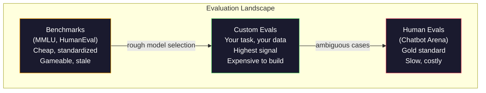
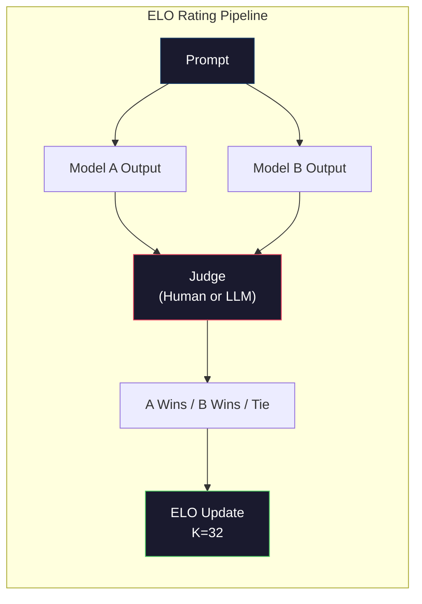

# 评估（Evaluation）：基准测试、自建评估、LM Harness

> 古德哈特定律（Goodhart's Law）：当一个指标成为目标时，它就不再是一个好的指标。每家前沿实验室都在博弈基准测试（benchmark）。MMLU 分数不断上升，而模型却仍然无法可靠地数出"strawberry"中有几个字母 R。唯一重要的评估是你自己的评估——在你的任务上，用你的数据。

**Type:** Build
**Languages:** Python
**Prerequisites:** Phase 10, Lessons 01-05 (LLMs from Scratch)
**Time:** ~90 minutes

## Learning Objectives

- 构建一个自定义评估工具（evaluation harness），对语言模型运行多项选择和开放式基准测试
- 解释为什么标准基准测试（MMLU、HumanEval）会饱和（saturate），无法区分前沿模型（frontier model）
- 实现特定任务的评估（task-specific evals），使用合适的指标：精确匹配（exact match）、F1、BLEU 和 LLM 评判（LLM-as-judge）评分
- 设计针对你特定用例的自定义评估套件（custom evaluation suite），而非仅依赖公开排行榜

## The Problem

MMLU 于 2020 年发布，包含 57 个学科的 15,908 道题。在三年内，前沿模型就使其饱和了。GPT-4 得分 86.4%。Claude 3 Opus 得分 86.8%。Llama 3 405B 得分 88.6%。排行榜压缩在 3 分的范围内，其中的差异只是统计噪声，而非真正的能力差距。

与此同时，这些模型却在十岁孩子都能轻松完成的任务上失败。Claude 3.5 Sonnet 在 MMLU 上得分 88.7%，但最初无法数出"strawberry"中的字母数——这个任务不需要任何世界知识，也不需要任何推理，只需要逐字符迭代。HumanEval 用 164 道题测试代码生成能力。模型得分 90% 以上，却仍然会生成在任何初级开发者都能发现的边界情况下崩溃的代码。

基准测试表现与现实可靠性之间的鸿沟，是 LLM 评估（evaluation）的核心问题。基准测试只能告诉你模型在基准测试上的表现，几乎无法告诉你该模型在你的特定任务、你的特定数据、你的特定故障模式下表现如何。如果你在构建客服机器人，MMLU 毫无意义。如果你在构建代码助手，HumanEval 只覆盖函数级生成——对于跨文件的调试、重构或解释代码，它没有任何参考意义。

你需要自定义评估（custom evals）。这不是因为基准测试毫无用处——它们对于粗略的模型选择是有用的——而是因为最终评估必须精确匹配你的部署条件。

## The Concept

### 评估格局（The Eval Landscape）

评估可分为三类，每类的成本和信号质量各不相同。

**基准测试（Benchmarks）** 是标准化的测试套件，如 MMLU、HumanEval、SWE-bench、MATH、ARC、HellaSwag。你在基准测试上运行模型并得到一个分数。优点：所有人都使用相同的测试，因此可以跨模型比较。缺点：模型和训练数据越来越多地污染（contaminate）这些基准测试。各实验室在包含基准测试题目的数据上训练模型。分数上升了，但能力未必提升。

**自定义评估（Custom evals）** 是你为特定用例构建的测试套件。你定义输入、期望输出和评分函数。法律文档摘要器用法律文档来评估。SQL 生成器用你的数据库模式来评估。构建成本高，但它们是唯一能够预测生产环境性能的评估方式。

**人工评估（Human evals）** 使用付费标注员（annotator）根据有用性、正确性、流畅性和安全性等标准来评判模型输出。这是开放式任务中自动化评分失效时的黄金标准。Chatbot Arena 已收集了超过 200 万条人工偏好投票，覆盖 100 多个模型。缺点是：成本（每条评判 $0.10-$2.00）和速度（数小时到数天）。



### 为什么基准测试会失效（Why Benchmarks Break）

三种机制导致基准测试分数不再反映真实能力。

**数据污染（Data contamination）。** 训练语料库抓取自互联网，基准测试题目也在互联网上。模型在训练过程中看到了答案。这不是传统意义上的作弊——各实验室并非有意包含基准测试数据，但网络级抓取几乎不可能排除这些数据。

**应试训练（Teaching to the test）。** 各实验室针对基准测试表现优化训练配比。如果训练配比中有 5% 是 MMLU 风格的多项选择题，模型就学会了这种格式和答案分布。MMLU 是四选一的多项选择题。模型学会了答案分布在 A/B/C/D 上大致均匀，这即使模型不知道答案时也有帮助。

**饱和（Saturation）。** 当每个前沿模型在基准测试上都得分 85-90% 时，基准测试就失去了区分能力。剩下的 10-15% 题目可能本身模糊不清、标注错误，或需要冷门的领域知识。从 MMLU 87% 提高到 89%，可能只是模型多记住了两道偏题，而不是变得更聪明。

### 困惑度（Perplexity）：快速健康检查

困惑度衡量模型对一段 token 序列有多"惊讶"。其形式化定义为指数化的平均负对数似然：

```
PPL = exp(-1/N * sum(log P(token_i | context)))
```

困惑度为 10 意味着模型在每个 token 位置上平均来说，如同在 10 个选项中均匀选择一样不确定。越低越好。GPT-2 在 WikiText-103 上的困惑度约为 30，GPT-3 约为 20，Llama 3 8B 约为 7。

困惑度对于在同一测试集上比较模型很有用，但它存在盲区。一个模型可以通过擅长预测常见模式而获得低困惑度，同时对罕见但重要的模式束手无策。它也无法反映指令遵循、推理或事实准确性。将其用作健全性检查（sanity check），而非最终裁决。

### LLM 评判（LLM-as-Judge）

使用一个强模型来评估一个较弱模型的输出。思路很简单：让 GPT-4o 或 Claude Sonnet 在 1-5 的尺度上对回答的正确性、有用性和安全性进行评分。使用 GPT-4o-mini 时，每次评判费用约为 $0.01，并且与人类评判的相关性出人意料地好——在大多数任务上约有 80% 的一致性。

评分提示词（scoring prompt）比模型本身更重要。一个模糊的提示词（"评价这个回答"）会产生噪声很大的分数。一个带有评分标准的结构化提示词（"如果答案事实正确且引用了来源则评 5 分，如果正确但未引用来源则评 4 分，如果部分正确则评 3 分……"）则能产生一致、可复现的分数。

失败模式：评判模型存在位置偏差（position bias，在成对比较中偏好第一个回答）、冗长偏差（verbosity bias，偏好更长的回答）以及自我偏好（self-preference，GPT-4 对 GPT-4 输出的评分高于等价的 Claude 输出）。缓解措施：随机化顺序、对长度进行归一化、使用与被评估模型不同的评判模型。

### 基于成对比较的 ELO 评分

Chatbot Arena 的方法。对于同一个提示词，展示来自两个不同模型的两个回答。由人类（或 LLM 评判者）选出更好的一个。通过数千次这样的比较，为每个模型计算 ELO 评分（ELO rating）——与国际象棋使用同一套系统。

ELO 的优势：相对排名比绝对评分更可靠，能优雅地处理平局，且比独立评分每个输出收敛所需的比较次数更少。截至 2026 年初，Chatbot Arena 排行榜显示 GPT-4o、Claude 3.5 Sonnet 和 Gemini 1.5 Pro 在顶部相差不到 20 个 ELO 分。



### 评估框架（Eval Frameworks）

**lm-evaluation-harness**（EleutherAI）：标准的开源评估框架，支持 200+ 基准测试。用一条命令即可对任何 Hugging Face 模型运行 MMLU、HellaSwag、ARC 等。被 Open LLM Leaderboard 使用。

**RAGAS**：专门用于 RAG 管道的评估框架。衡量忠实度（faithfulness，答案是否与检索到的上下文匹配？）、相关性（relevance，检索到的上下文是否与问题相关？）和答案正确性（answer correctness）。

**promptfoo**：用于提示工程（prompt engineering）的配置驱动评估工具。在 YAML 中定义测试用例，对多个模型运行，生成通过/失败报告。适用于提示词的回归测试——确保提示词变更不会破坏已有的测试用例。

### 构建自定义评估（Building Custom Evals）

对生产环境唯一有意义的评估。流程如下：

1. **定义任务。** 模型到底要做什么？要精确。"回答问题"太模糊。"给定一封客户投诉邮件，提取产品名称、问题类别和情绪"这是一个可以评估的任务。

2. **创建测试用例（test cases）。** 原型评估至少 50 个，生产环境 200+。每个测试用例是一个 (输入, 期望输出) 对。包含边界情况：空输入、对抗性输入、歧义输入、其他语言的输入。

3. **定义评分方式。** 结构化输出用精确匹配。文本相似度用 BLEU/ROUGE。开放式质量用 LLM 评判。提取类任务用 F1。结合多个指标并加权。

4. **自动化。** 每次评估用一条命令运行。没有手动步骤。以可支持跨时间比较的格式存储结果。

5. **长期追踪。** 孤立的评估分数毫无意义。你需要趋势线。上次提示词变更后分数提高了吗？切换模型后退化了吗？将评估与提示词一同进行版本管理。

| 评估类型 | 每次评判成本 | 与人类一致性 | 最适合场景 |
|-----------|------------------|----------------------|----------|
| 精确匹配 | ~$0 | 100%（适用时） | 结构化输出、分类 |
| BLEU/ROUGE | ~$0 | ~60% | 翻译、摘要 |
| LLM 评判 | ~$0.01 | ~80% | 开放式生成 |
| 人工评估 | $0.10-$2.00 | N/A（即真值标准） | 模糊不清、高风险任务 |

```figure
perplexity-loss
```

## Build It

### Step 1: 最小评估框架

定义核心抽象。一个评估用例（eval case）有输入、期望输出和一个可选的元数据字典。一个评分器（scorer）接受预测和参考值，返回 0 到 1 之间的分数。

```python
import json
from collections import Counter

class EvalCase:
    def __init__(self, input_text, expected, metadata=None):
        self.input_text = input_text
        self.expected = expected
        self.metadata = metadata or {}

class EvalSuite:
    def __init__(self, name, cases, scorers):
        self.name = name
        self.cases = cases
        self.scorers = scorers

    def run(self, model_fn):
        results = []
        for case in self.cases:
            prediction = model_fn(case.input_text)
            scores = {}
            for scorer_name, scorer_fn in self.scorers.items():
                scores[scorer_name] = scorer_fn(prediction, case.expected)
            results.append({
                "input": case.input_text,
                "expected": case.expected,
                "prediction": prediction,
                "scores": scores,
            })
        return results
```

### Step 2: 评分函数

构建精确匹配、token F1 和一个模拟的 LLM 评判评分器。

```python
def exact_match(prediction, expected):
    return 1.0 if prediction.strip().lower() == expected.strip().lower() else 0.0

def token_f1(prediction, expected):
    pred_tokens = set(prediction.lower().split())
    exp_tokens = set(expected.lower().split())
    if not pred_tokens or not exp_tokens:
        return 0.0
    common = pred_tokens & exp_tokens
    precision = len(common) / len(pred_tokens)
    recall = len(common) / len(exp_tokens)
    if precision + recall == 0:
        return 0.0
    return 2 * (precision * recall) / (precision + recall)

def llm_judge_simulated(prediction, expected):
    pred_words = set(prediction.lower().split())
    exp_words = set(expected.lower().split())
    if not exp_words:
        return 0.0
    overlap = len(pred_words & exp_words) / len(exp_words)
    length_penalty = min(1.0, len(prediction) / max(len(expected), 1))
    return round(overlap * 0.7 + length_penalty * 0.3, 3)
```

### Step 3: ELO 评分系统

基于成对比较实现 ELO 更新。这正是 Chatbot Arena 用于对模型排名的系统。

```python
class ELOTracker:
    def __init__(self, k=32, initial_rating=1500):
        self.ratings = {}
        self.k = k
        self.initial_rating = initial_rating
        self.history = []

    def _ensure_player(self, name):
        if name not in self.ratings:
            self.ratings[name] = self.initial_rating

    def expected_score(self, rating_a, rating_b):
        return 1 / (1 + 10 ** ((rating_b - rating_a) / 400))

    def record_match(self, player_a, player_b, outcome):
        self._ensure_player(player_a)
        self._ensure_player(player_b)

        ea = self.expected_score(self.ratings[player_a], self.ratings[player_b])
        eb = 1 - ea

        if outcome == "a":
            sa, sb = 1.0, 0.0
        elif outcome == "b":
            sa, sb = 0.0, 1.0
        else:
            sa, sb = 0.5, 0.5

        self.ratings[player_a] += self.k * (sa - ea)
        self.ratings[player_b] += self.k * (sb - eb)

        self.history.append({
            "a": player_a, "b": player_b,
            "outcome": outcome,
            "rating_a": round(self.ratings[player_a], 1),
            "rating_b": round(self.ratings[player_b], 1),
        })

    def leaderboard(self):
        return sorted(self.ratings.items(), key=lambda x: -x[1])
```

### Step 4: 困惑度计算（Perplexity Calculation）

使用 token 概率计算困惑度。在实际应用中你需要从模型的 logits 中获取这些概率。这里我们用概率分布来模拟。

```python
import numpy as np

def perplexity(log_probs):
    if not log_probs:
        return float("inf")
    avg_neg_log_prob = -np.mean(log_probs)
    return float(np.exp(avg_neg_log_prob))

def token_log_probs_simulated(text, model_quality=0.8):
    np.random.seed(hash(text) % 2**31)
    tokens = text.split()
    log_probs = []
    for i, token in enumerate(tokens):
        base_prob = model_quality
        if len(token) > 8:
            base_prob *= 0.6
        if i == 0:
            base_prob *= 0.7
        prob = np.clip(base_prob + np.random.normal(0, 0.1), 0.01, 0.99)
        log_probs.append(float(np.log(prob)))
    return log_probs
```

### Step 5: 汇总结果

计算一次评估运行的汇总统计量：均值、中位数、通过率（pass rate）阈值，以及每个指标的细目。

```python
def summarize_results(results, threshold=0.8):
    all_scores = {}
    for r in results:
        for metric, score in r["scores"].items():
            all_scores.setdefault(metric, []).append(score)

    summary = {}
    for metric, scores in all_scores.items():
        arr = np.array(scores)
        summary[metric] = {
            "mean": round(float(np.mean(arr)), 3),
            "median": round(float(np.median(arr)), 3),
            "std": round(float(np.std(arr)), 3),
            "min": round(float(np.min(arr)), 3),
            "max": round(float(np.max(arr)), 3),
            "pass_rate": round(float(np.mean(arr >= threshold)), 3),
            "n": len(scores),
        }
    return summary

def print_summary(summary, suite_name="Eval"):
    print(f"\n{'=' * 60}")
    print(f"  {suite_name} Summary")
    print(f"{'=' * 60}")
    for metric, stats in summary.items():
        print(f"\n  {metric}:")
        print(f"    Mean:      {stats['mean']:.3f}")
        print(f"    Median:    {stats['median']:.3f}")
        print(f"    Std:       {stats['std']:.3f}")
        print(f"    Range:     [{stats['min']:.3f}, {stats['max']:.3f}]")
        print(f"    Pass rate: {stats['pass_rate']:.1%} (threshold >= 0.8)")
        print(f"    N:         {stats['n']}")
```

### Step 6: 运行完整流水线

将所有组件串联起来。定义一个任务，创建测试用例，模拟两个模型，运行评估，通过成对比较计算 ELO，并打印排行榜。

```python
def demo_model_good(prompt):
    responses = {
        "What is the capital of France?": "Paris",
        "What is 2 + 2?": "4",
        "Who wrote Hamlet?": "William Shakespeare",
        "What language is PyTorch written in?": "Python and C++",
        "What is the boiling point of water?": "100 degrees Celsius",
    }
    return responses.get(prompt, "I don't know")

def demo_model_bad(prompt):
    responses = {
        "What is the capital of France?": "Paris is the capital city of France",
        "What is 2 + 2?": "The answer is four",
        "Who wrote Hamlet?": "Shakespeare",
        "What language is PyTorch written in?": "Python",
        "What is the boiling point of water?": "212 Fahrenheit",
    }
    return responses.get(prompt, "Unknown")

cases = [
    EvalCase("What is the capital of France?", "Paris"),
    EvalCase("What is 2 + 2?", "4"),
    EvalCase("Who wrote Hamlet?", "William Shakespeare"),
    EvalCase("What language is PyTorch written in?", "Python and C++"),
    EvalCase("What is the boiling point of water?", "100 degrees Celsius"),
]

suite = EvalSuite(
    name="General Knowledge",
    cases=cases,
    scorers={
        "exact_match": exact_match,
        "token_f1": token_f1,
        "llm_judge": llm_judge_simulated,
    },
)

results_good = suite.run(demo_model_good)
results_bad = suite.run(demo_model_bad)

print_summary(summarize_results(results_good), "Model A (concise)")
print_summary(summarize_results(results_bad), "Model B (verbose)")
```

"好"模型给出精确答案，"坏"模型给出冗长的转述。精确匹配严重惩罚了冗长模型，而 token F1 和 LLM 评判则更宽容。这说明为什么指标选择很重要：同一个模型，根据你如何评分，可能看起来非常优秀或非常糟糕。

### Step 7: ELO 锦标赛

在多轮中运行模型间的成对比较。

```python
elo = ELOTracker(k=32)

for case in cases:
    pred_a = demo_model_good(case.input_text)
    pred_b = demo_model_bad(case.input_text)

    score_a = token_f1(pred_a, case.expected)
    score_b = token_f1(pred_b, case.expected)

    if score_a > score_b:
        outcome = "a"
    elif score_b > score_a:
        outcome = "b"
    else:
        outcome = "tie"

    elo.record_match("model_a_concise", "model_b_verbose", outcome)

print("\nELO Leaderboard:")
for name, rating in elo.leaderboard():
    print(f"  {name}: {rating:.0f}")
```

### Step 8: 困惑度比较

比较不同"质量"级别模型的困惑度。

```python
test_text = "The quick brown fox jumps over the lazy dog in the garden"

for quality, label in [(0.9, "Strong model"), (0.7, "Medium model"), (0.4, "Weak model")]:
    log_probs = token_log_probs_simulated(test_text, model_quality=quality)
    ppl = perplexity(log_probs)
    print(f"  {label} (quality={quality}): perplexity = {ppl:.2f}")
```

## Use It

### lm-evaluation-harness (EleutherAI)

对任何模型运行基准测试的标准工具。

```python
# pip install lm-eval
# 命令行:
# lm_eval --model hf --model_args pretrained=meta-llama/Llama-3.1-8B --tasks mmlu --batch_size 8

# Python API:
# import lm_eval
# results = lm_eval.simple_evaluate(
#     model="hf",
#     model_args="pretrained=meta-llama/Llama-3.1-8B",
#     tasks=["mmlu", "hellaswag", "arc_easy"],
#     batch_size=8,
# )
# print(results["results"])
```

### promptfoo

用于提示工程的配置驱动评估工具。在 YAML 中定义测试并对多个提供商运行。

```yaml
# promptfoo.yaml
providers:
  - openai:gpt-4o-mini
  - anthropic:claude-3-haiku

prompts:
  - "Answer in one word: {{question}}"

tests:
  - vars:
      question: "What is the capital of France?"
    assert:
      - type: contains
        value: "Paris"
  - vars:
      question: "What is 2 + 2?"
    assert:
      - type: equals
        value: "4"
```

### RAGAS 用于 RAG 评估

```python
# pip install ragas
# from ragas import evaluate
# from ragas.metrics import faithfulness, answer_relevancy, context_precision
#
# result = evaluate(
#     dataset,
#     metrics=[faithfulness, answer_relevancy, context_precision],
# )
# print(result)
```

RAGAS 衡量通用评估遗漏的内容：模型的答案是否基于检索到的上下文，而不仅仅是答案在抽象意义上是否"正确"。

## Ship It

本课产出 `outputs/prompt-eval-designer.md`——一个可复用的提示词，用于为任何任务设计自定义评估套件。给它一个任务描述，它会生成测试用例、评分函数和通过/失败阈值建议。

本课还产出 `outputs/skill-llm-evaluation.md`——一个决策框架，用于根据任务类型、预算和延迟要求选择正确的评估策略。

## Exercises

1. 添加一个"一致性"评分器（consistency scorer）：将相同的输入通过模型运行 5 次，衡量输出匹配的频率。确定性输入上的不一致答案揭示了脆弱的提示词或过高的 temperature 设置。

2. 扩展 ELO 追踪器，支持多个评判函数（精确匹配、F1、LLM 评判）并加权。比较当精确匹配权重较大与 F1 权重较大时排行榜的变化。

3. 为特定任务构建评估套件：将邮件分类为 5 个类别。创建 100 个测试用例，包含多样化的示例和边界情况（可能属于多个类别的邮件、空邮件、其他语言的邮件）。测量不同"模型"（基于规则的、关键词匹配的、模拟 LLM）的表现如何。

4. 实现污染检测（contamination detection）：给定一组评估问题和训练语料库，检查评估问题（或近似转述）中有多少比例出现在训练数据中。研究人员正是用这种方法审计基准测试的有效性。

5. 构建一个"模型差异"（model diff）工具。给定两个模型版本的评估结果，高亮显示哪些特定测试用例改进了、哪些退化了、哪些保持不变。这是评估版的代码差异工具——对于理解某个改动是帮助还是损害至关重要。

## Key Terms

| 术语 | 人们说的 | 实际含义 |
|------|----------------|----------------------|
| MMLU | "那个基准测试" | 大规模多任务语言理解（Massive Multitask Language Understanding）——57 个学科的 15,908 道多项选择题，到 2025 年已饱和超过 88% |
| HumanEval | "代码评估" | OpenAI 发布的 164 道 Python 函数补全题目，仅测试孤立的函数生成 |
| SWE-bench | "真正的编程评估" | 来自 12 个 Python 仓库的 2,294 个 GitHub issue，衡量包括测试生成在内的端到端错误修复 |
| Perplexity | "模型有多困惑" | exp(-avg(log P(token_i given context)))——越低表示模型对实际 token 分配的概率越高 |
| ELO rating | "模型的国际象棋排名" | 根据成对胜负记录计算的相对技能评分，Chatbot Arena 用它对 100+ 模型进行排名 |
| LLM-as-judge | "用 AI 给 AI 打分" | 一个强模型按评分标准评价较弱模型的输出，与人类评判员一致性约 80%，每次评判成本约 $0.01 |
| Data contamination | "模型看到了考题" | 训练数据中包含基准测试题目，虚增分数但不提升真实能力 |
| Eval suite | "一堆测试" | 一组带版本管理的 (输入, 期望输出, 评分器) 三元组，用于衡量特定能力 |
| Pass rate | "正确率百分比" | 超过阈值的评估用例比例——比平均分数更具操作性，因为它衡量的是可靠性 |
| Chatbot Arena | "模型排名网站" | LMSYS 平台，收集 200 万+ 人类偏好投票，通过 ELO 评分产生最受信赖的 LLM 排行榜 |

## Further Reading

- [Hendrycks et al., 2021 -- "Measuring Massive Multitask Language Understanding"](https://arxiv.org/abs/2009.03300) -- MMLU 论文，尽管已饱和，仍是引用最多的 LLM 基准测试
- [Chen et al., 2021 -- "Evaluating Large Language Models Trained on Code"](https://arxiv.org/abs/2107.03374) -- OpenAI 的 HumanEval 论文，建立了代码生成评估方法论
- [Zheng et al., 2023 -- "Judging LLM-as-a-Judge"](https://arxiv.org/abs/2306.05685) -- 系统性分析使用 LLM 评估 LLM，包括位置偏差和冗长偏差的发现
- [LMSYS Chatbot Arena](https://chat.lmsys.org/) -- 众包模型比较平台，200 万+ 投票，最受信赖的真实世界 LLM 排名
