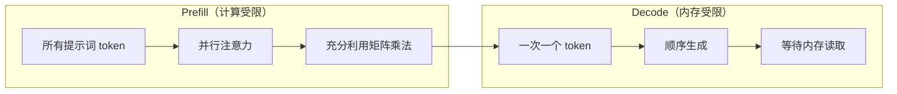
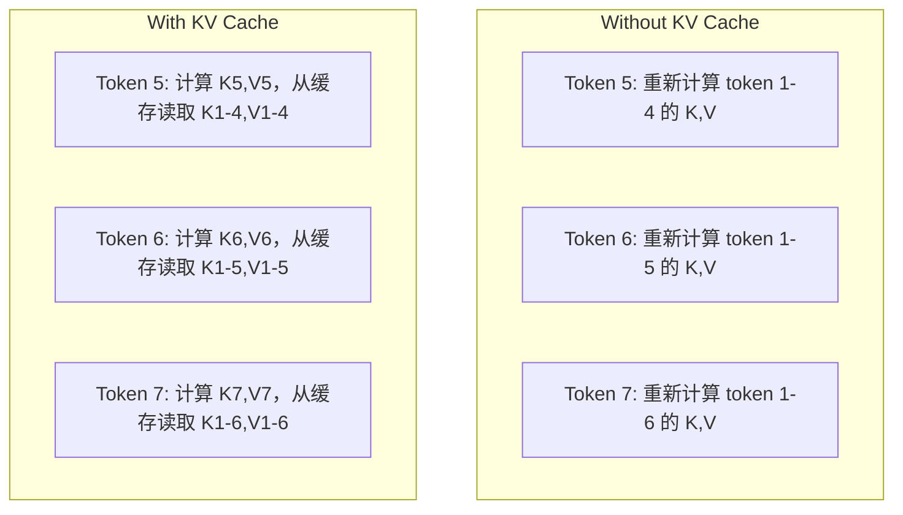
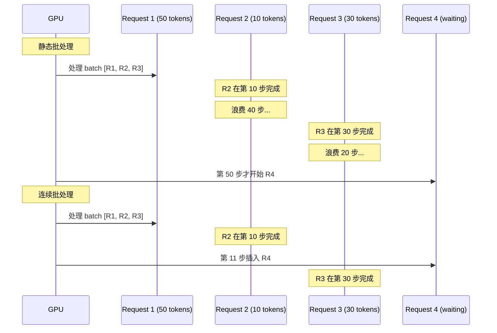
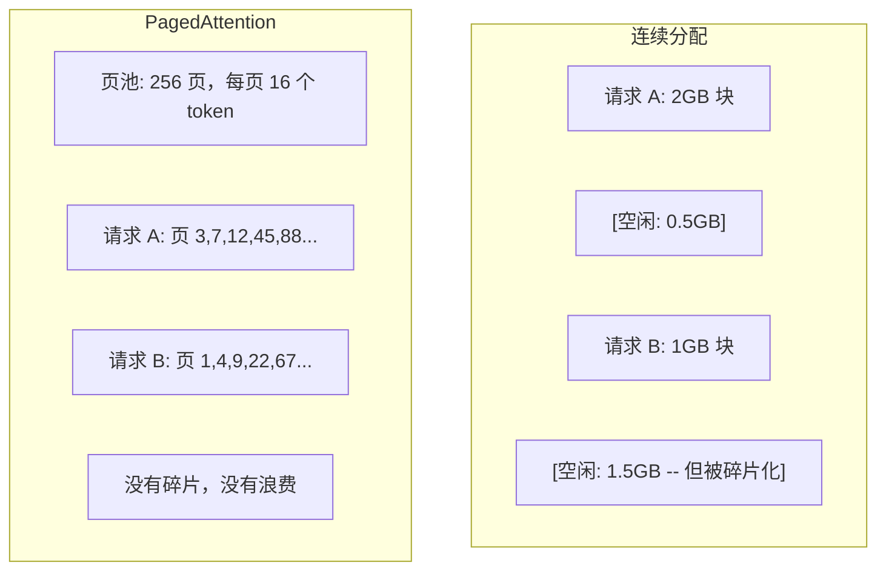
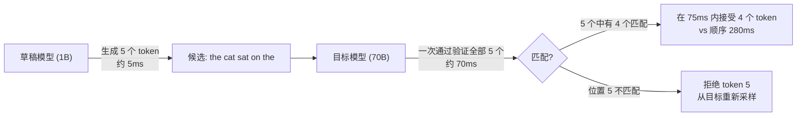

# 推理优化

> LLM 推理有两个阶段。Prefill（预填充）并行处理你的提示词——受限于计算。Decode（解码）一次生成一个 token——受限于内存。每一种优化技术都针对其中一个或两个阶段。

**Type:** Build
**Languages:** Python
**Prerequisites:** Phase 10, Lessons 01-08 (Transformer architecture, attention)
**Time:** ~120 minutes

## Learning Objectives

- 实现 KV 缓存（KV-cache），消除自回归 token 生成过程中的冗余计算
- 解释 LLM 推理的 prefill 与 decode 阶段，以及为何它们有不同的瓶颈（计算受限 vs 内存受限）
- 实现连续批处理（continuous batching）和 PagedAttention 概念，以在并发请求下最大化 GPU 利用率
- 比较推理优化技术（KV-cache、推测解码（speculative decoding）、Flash Attention）及其吞吐量/延迟权衡

## 问题

你在 4xA100 GPU 上部署了 Llama 3 70B。单个用户大约获得每秒 50 个 token。感觉很快。然后 100 个用户同时访问端点。吞吐量降到每人每秒 3 个 token。你每月 25,000 美元的 GPU 账单服务的回答比人打字还慢。

模型本身在 1 个用户和 100 个用户之间没有变化。同样的权重、同样的架构、同样的数学。变化的是你如何调度工作。朴素推理浪费了 90% 以上的可用 GPU 算力。一个等待第 47 个 token 的用户占着一整个 batch 槽位，而此时 GPU 内存总线在矩阵乘法之间闲置。与此同时，一个新用户的 2,000 token 提示词本可以用有用的计算填补这段空闲时间。

这不是一个扩展问题，而是一个调度问题。本课的技术——KV 缓存、连续批处理、PagedAttention、推测解码、前缀缓存——正是区分每月 25,000 美元推理账单和 5,000 美元服务同样流量的关键。

vLLM 在 4xA100-80GB 上服务 Llama 3 70B，低并发时每个用户约 50 token/秒，通过连续批处理和 PagedAttention 在 100 个并发请求下维持每人 15-25 TPS。没有这些优化，相同硬件在那种并发下只能服务 5 TPS/用户。同样的 GPU，同样的模型，4 倍的吞吐量。

## 核心概念

### Prefill 与 Decode

每个 LLM 推理请求有两个不同的阶段。

**Prefill** 处理整个输入提示词。所有 token 已知，因此注意力可以在整个序列上并行计算。这是一个大规模矩阵乘法——GPU 核心保持忙碌。瓶颈是计算：你的硬件每秒能交付多少 FLOPS。一块 A100 提供 312 TFLOPS（BF16）。70B 模型上 4,096 token 提示词的 prefill 在单块 A100 上大约需要 400ms。

**Decode** 一次生成一个输出 token。每个新 token 关注所有之前的 token，但每次前向传播只产生一个 token。权重矩阵的大小与 prefill 时相同，但你是在用单个向量而非矩阵与它们相乘。GPU 核心在微秒内完成计算，然后等待下一批权重从内存到达。瓶颈是内存带宽：你能多快地将模型权重从 HBM（高带宽内存）流式传输到计算单元。A100 有 2 TB/s 带宽。FP16 格式的 70B 模型为 140 GB。读取完整模型一次需要 70ms——这是单次 decode 步骤的底座。



**ops:byte 比率**（也称为算术强度，arithmetic intensity）捕捉了这种权衡。它衡量你每加载一字节内存所执行的操作数。

```
ops:byte 比率 = 每个 token 的 FLOPs / 从内存读取的字节数
```

在 batch 大小为 4,096 个 token 的 prefill 期间，你每加载一个权重执行约 4,096 次乘累加操作。比率很高——你是计算受限的。在 batch 大小为 1 的 decode 期间，你每加载一个权重执行约 1 次操作。比率很低——你是内存受限的。

核心洞察：*decode 是内存受限的，因为你读取整个模型只为了产生一个 token*。以下每种优化要么减少你读取的内容，要么增大每次读取处理的 token 批次，要么完全避免读取。

### KV 缓存（KV Cache）

在注意力计算中，每个 token 的 query 需要关注之前每个 token 的 key 和 value 向量。没有缓存时，生成 token N 需要重新计算前 N-1 个 token 的 key 和 value 投影。生成 token 2 时要投影 token 1，生成 token 3 时又要投影 token 1，生成 token 4 时再次投影 token 1。到第 1,000 个 token 时，你已经投影了 token 1 总共 999 次。

KV 缓存存储来自之前所有 token 的 key 和 value 投影。生成 token N 时，你只需计算 token N 的 key 和 value，然后将它们与缓存中 token 1 到 N-1 的 K/V 拼接起来。



**KV 缓存内存公式：**

```
KV cache 大小 = 2 * num_layers * num_kv_heads * head_dim * seq_len * bytes_per_param
```

对于 Llama 3 70B（80 层，8 个 KV 头带 GQA，head_dim=128，BF16）：

```
每 token: 2 * 80 * 8 * 128 * 2 bytes = 327,680 bytes = 320 KB
4,096 token 时: 320 KB * 4,096 = 1.28 GB
128K token 时: 320 KB * 131,072 = 40 GB
```

Llama 3 70B 的单次 128K 上下文对话消耗 40 GB 的 KV 缓存——半块 A100 的内存。100 个并发用户每人 4K token 时，仅 KV 缓存就需要 128 GB。这就是为什么 KV 缓存管理是推理优化的核心挑战。

### 连续批处理（Continuous Batching）

静态批处理（Static batching）等到一批 N 个请求到达后一起处理，并等到**所有**请求完成才接受新请求。如果一个请求需要 500 个 token，另一个需要 10 个，短请求在完成后会闲置 490 个 decode 步骤。

连续批处理（也称为迭代级批处理，iteration-level batching）在任何请求完成后立即将新请求插入批次中。批次在每个 decode 步骤都重新评估。一个在 10 个 token 后完成的请求立即被等待中的请求替换。



吞吐量改进取决于输出长度变化多大。长度一致时，连续批处理与静态批处理持平。长度可变时（常见情况），连续批处理可以提供 2-5 倍的更高吞吐量，因为 GPU 槽位从不闲置。

### PagedAttention

每个请求的 KV 缓存是一块连续的内存。随着请求到达和离开，内存会产生碎片——就像操作系统中的 RAM 碎片。一个 4K token 的请求需要 1.28 GB 连续内存。即使你有 2 GB 空闲总量，你可能没有 1.28 GB *连续的*空间。你要么浪费内存，要么拒绝请求。

PagedAttention（来自 vLLM）将操作系统风格的虚拟内存应用到 KV 缓存上。它不是为每个请求分配一个连续块，而是分配固定大小的"页"（通常每页 16 个 token）。页可以位于物理 GPU 内存中的任意位置。一个页表将每个请求的逻辑序列位置映射到物理页位置。



PagedAttention 还支持**写时复制**（copy-on-write）用于共享前缀。如果 50 个请求共享相同的系统提示词，该系统提示词的 KV 缓存页只存储一次，被所有 50 个请求引用。只有当请求开始分叉（不同的用户消息）时，它才获得自己的页。这对有共享系统提示词的应用大幅削减了内存使用。

vLLM 报告通过 PagedAttention 实现了接近零内存浪费（约 4%，而朴素分配约为 60-80%）。

### 推测解码（Speculative Decoding）

Decode 很慢因为它是顺序执行的——你生成一个 token，反馈回去，生成下一个。但如果能廉价地猜测接下来的 5 个 token，然后一次性验证它们呢？

推测解码使用一个小而快的**草稿模型**（draft model）生成 K 个候选 token。然后将所有 K 个候选 token 在**目标模型**（target model）的单次前向传播中处理（这看起来像 prefill——并行、计算受限、高效）。如果目标模型与草稿模型的预测一致，你在一次目标前向传播的时间内接受了全部 K 个 token。如果在位置 j 处不一致，你接受 token 1 到 j-1 并丢弃其余。



加速取决于**接受率**（acceptance rate）——草稿模型的预测与目标匹配的频率。对于 Llama 3 8B 为 Llama 3 70B 做草稿，在自然语言上 70-85% 的接受率是典型的。这意味着 2-3 倍的 decode 加速。

三种推测解码方法：

| 方法 | 草稿来源 | 接受率 | 额外开销 |
|--------|-------------|-----------------|----------|
| Draft-target (Leviathan et al.) | 单独的较小模型 | 70-85% | 草稿模型内存 |
| EAGLE (Li et al.) | 目标模型上的轻量头 | 75-90% | 约 1% 额外参数 |
| N-gram 查找 | Token n-gram 表 | 40-60% | 可忽略 |

**EAGLE** 在目标模型的隐藏状态之上训练一个小型的自回归头。它使用目标模型的倒数第二层特征预测下一个 token 的 embedding。因为它操作在目标模型自身的表示上（而不是单独模型的），它用最少额外内存获得更高接受率。EAGLE-2 增加了一个动态草稿树，根据上下文调整候选数量。

**N-gram 推测解码**维护一个当前上下文或预构建语料库中的 n-gram 延续表。如果草稿匹配同一对话中以前出现的内容（重复模式、代码、结构化输出），它触发时零神经网络开销。平均接受率较低，但每次推测的成本几乎为零。

推测解码是*数学上精确的*——输出分布与目标模型的分布完全相同。这不是近似。验证步骤确保每个被接受的 token 恰好具有目标模型本应分配的概率。

### 前缀缓存（Prefix Caching）

许多请求共享相同的前缀。聊天机器人的系统提示词。RAG 的上下文块。few-shot 示例集。没有前缀缓存，每个请求都从头重新计算这些共享 token 的 KV 缓存。

前缀缓存存储常见前缀的 KV 缓存并在请求之间复用。当新请求以已知前缀到达时，系统复制（或引用）缓存的 KV 条目，只计算唯一后缀的 KV。

对于一个在所有请求间共享的 2,000 token 系统提示词，前缀缓存每请求消除约 400ms 的 prefill。在每秒 100 个请求时，每秒节省 40 秒 GPU 计算——超过一块 GPU 的工作量。

SGLang 的 RadixAttention 使用基数树（radix tree / trie）来实现前缀缓存，按 token 内容索引前缀。任何匹配已存储前缀的请求免费获得其 KV 缓存。该树支持部分前缀匹配——如果你与缓存条目共享 2,000 个前缀 token 中的 1,500 个，就复用那 1,500 个，只需重新计算 500 个。

### 推理引擎

三大引擎主导生产级 LLM 服务：

| 引擎 | 关键创新 | 最适合 |
|--------|---------------|----------|
| vLLM | PagedAttention、连续批处理 | 通用服务，最高兼容性 |
| SGLang | RadixAttention（前缀缓存）、结构化生成 | 多轮聊天、约束解码 |
| TensorRT-LLM | NVIDIA 内核融合、FP8 量化 | NVIDIA 硬件上的最大单 GPU 吞吐量 |

**vLLM** 是默认起点。它支持最广泛的模型，可在任何 GPU 供应商（NVIDIA、AMD、Intel）上运行，并通过 PagedAttention + 连续批处理实现强劲吞吐量。兼容 OpenAI 的 API 意味着你可以将其直接替换为任何 OpenAI API 调用。

**SGLang** 建立在与 vLLM 相同的基础上，但增加了 RadixAttention 进行前缀缓存，以及一个用于结构化 LLM 程序的领域特定语言。如果你的工作负载涉及多轮对话、工具使用或约束解码（JSON 输出、正则引导生成），SGLang 通过前缀复用通常比 vLLM 表现好 2-5 倍。

**TensorRT-LLM** 将模型编译为优化的 NVIDIA GPU 内核。它融合了操作（注意力 + 线性 + 激活在一个内核中），在 H100 GPU 上使用 FP8，并与 NVIDIA Triton Inference Server 集成用于生产部署。它在 NVIDIA 硬件上实现最高的单 GPU 吞吐量，但需要更多设置且仅适用于 NVIDIA GPU。

Llama 3 70B 的真实数据（4xA100-80GB，BF16）：

| 指标 | vLLM | SGLang | TensorRT-LLM |
|--------|------|--------|---------------|
| 吞吐量（1 用户） | ~50 TPS | ~55 TPS | ~65 TPS |
| 吞吐量（100 用户） | ~2,500 总 TPS | ~3,200 总 TPS | ~3,000 总 TPS |
| 首 token 时间 | ~400ms | ~300ms（前缀命中） | ~350ms |
| 最大上下文 | 128K | 128K | 128K |

### Ops:Byte 分析框架

你无法优化你无法衡量的东西。ops:byte 比率告诉你你是计算受限还是内存受限，这决定哪些优化有意义。

```
计算天花板：GPU 的峰值 FLOPS
内存天花板：峰值带宽 * ops:byte 比率
```

当 ops:byte 低时（decode、小 batch），你触达内存带宽天花板。增加计算能力（更高时钟、更多核心）没有帮助。你需要减少内存读取（量化、KV 缓存压缩）或增大 batch 大小以将读取分摊到更多有效工作上。

当 ops:byte 高时（prefill、大 batch），你触达计算天花板。内存带宽优化没有帮助。你需要更快的 GPU、内核融合或降低精度以挤出更多 FLOPS。

| 场景 | ops:byte | 受限于 | 优化方式 |
|----------|----------|-------|---------------|
| Prefill, batch=1 | ~4,096 | 计算 | 内核融合、FP8 |
| Decode, batch=1 | ~1 | 内存 | 量化、KV 压缩 |
| Decode, batch=32 | ~32 | 内存 | 更大 batch、连续批处理 |
| Decode, batch=256 | ~256 | 过渡区 | 两者都重要 |
| Decode, batch=1024 | ~1,024 | 计算 | 内核融合、张量并行 |

A100 上的交叉点大约是 ops:byte = 156（312 TFLOPS / 2 TB/s）。低于 156 时，你是内存受限的。高于 156 时，你是计算受限的。连续批处理通过每次迭代打包更多 token 将 decode 推向这个交叉点。

```figure
context-window-slide
```

## 动手构建

### 第一步：从零构建 KV 缓存

我们构建一个多头 KV 缓存，存储每层、每头的 key 和 value 投影，并展示内存增长模式。

```python
import numpy as np

class KVCache:
    def __init__(self, num_layers, num_heads, head_dim, max_seq_len, dtype=np.float16):
        self.num_layers = num_layers
        self.num_heads = num_heads
        self.head_dim = head_dim
        self.max_seq_len = max_seq_len
        self.dtype = dtype

        self.k_cache = np.zeros(
            (num_layers, num_heads, max_seq_len, head_dim), dtype=dtype
        )
        self.v_cache = np.zeros(
            (num_layers, num_heads, max_seq_len, head_dim), dtype=dtype
        )
        self.seq_len = 0

    def update(self, layer_idx, new_keys, new_values):
        num_new = new_keys.shape[1]
        end = self.seq_len + num_new
        self.k_cache[layer_idx, :, self.seq_len:end, :] = new_keys
        self.v_cache[layer_idx, :, self.seq_len:end, :] = new_values
        return (
            self.k_cache[layer_idx, :, :end, :],
            self.v_cache[layer_idx, :, :end, :]
        )

    def advance(self, num_tokens):
        self.seq_len += num_tokens

    def memory_bytes(self):
        return self.k_cache.nbytes + self.v_cache.nbytes

    def used_bytes(self):
        per_token = 2 * self.num_layers * self.num_heads * self.head_dim * np.dtype(self.dtype).itemsize
        return per_token * self.seq_len
```

### 第二步：带 KV 缓存的注意力

一个简化的多头注意力机制，在 decode 步骤使用 KV 缓存。

```python
def scaled_dot_product_attention(query, keys, values):
    head_dim = query.shape[-1]
    scores = np.matmul(query, keys.transpose(0, 1, 3, 2)) / np.sqrt(head_dim)
    seq_len_q = scores.shape[-2]
    seq_len_k = scores.shape[-1]
    if seq_len_q > 1:
        mask = np.triu(np.ones((seq_len_q, seq_len_k), dtype=np.float32), k=seq_len_k - seq_len_q + 1)
        scores = scores + mask * (-1e9)
    max_scores = np.max(scores, axis=-1, keepdims=True)
    exp_scores = np.exp(scores - max_scores)
    attn_weights = exp_scores / np.sum(exp_scores, axis=-1, keepdims=True)
    return np.matmul(attn_weights, values)


class MultiHeadAttention:
    def __init__(self, d_model, num_heads):
        self.num_heads = num_heads
        self.head_dim = d_model // num_heads
        scale = np.sqrt(2.0 / d_model)
        self.W_q = np.random.randn(d_model, d_model).astype(np.float32) * scale
        self.W_k = np.random.randn(d_model, d_model).astype(np.float32) * scale
        self.W_v = np.random.randn(d_model, d_model).astype(np.float32) * scale
        self.W_o = np.random.randn(d_model, d_model).astype(np.float32) * scale

    def forward(self, x, kv_cache=None, layer_idx=0):
        batch, seq_len, d_model = x.shape
        Q = np.matmul(x, self.W_q).reshape(batch, seq_len, self.num_heads, self.head_dim).transpose(0, 2, 1, 3)
        K = np.matmul(x, self.W_k).reshape(batch, seq_len, self.num_heads, self.head_dim).transpose(0, 2, 1, 3)
        V = np.matmul(x, self.W_v).reshape(batch, seq_len, self.num_heads, self.head_dim).transpose(0, 2, 1, 3)

        if kv_cache is not None:
            K_full, V_full = kv_cache.update(layer_idx, K[0], V[0])
            K = K_full[np.newaxis, :, :, :]
            V = V_full[np.newaxis, :, :, :]
            if seq_len == 1:
                kv_cache.advance(1)

        attn_out = scaled_dot_product_attention(Q, K, V)
        attn_out = attn_out.transpose(0, 2, 1, 3).reshape(batch, -1, d_model)
        return np.matmul(attn_out, self.W_o)
```

### 第三步：连续批处理模拟器

模拟静态批处理和连续批处理之间的调度差异。

```python
import heapq

class Request:
    def __init__(self, request_id, prompt_tokens, output_tokens, arrival_step):
        self.request_id = request_id
        self.prompt_tokens = prompt_tokens
        self.output_tokens = output_tokens
        self.arrival_step = arrival_step
        self.tokens_generated = 0
        self.start_step = None
        self.end_step = None

    def is_done(self):
        return self.tokens_generated >= self.output_tokens


def simulate_static_batching(requests, batch_size):
    step = 0
    completed = []
    queue = list(requests)
    queue.sort(key=lambda r: r.arrival_step)

    while queue:
        batch = []
        while queue and len(batch) < batch_size:
            r = queue.pop(0)
            r.start_step = max(step, r.arrival_step)
            batch.append(r)

        if batch:
            step = max(step, max(r.start_step for r in batch))
            max_output = max(r.output_tokens for r in batch)
            for r in batch:
                r.tokens_generated = r.output_tokens
                r.end_step = step + max_output
            step += max_output
            completed.extend(batch)

    return completed


def simulate_continuous_batching(requests, batch_size):
    step = 0
    completed = []
    queue = sorted(requests, key=lambda r: r.arrival_step)
    queue_idx = 0
    active = []
    waiting = []

    while queue_idx < len(queue) or active or waiting:
        while queue_idx < len(queue) and queue[queue_idx].arrival_step <= step:
            waiting.append(queue[queue_idx])
            queue_idx += 1

        while waiting and len(active) < batch_size:
            r = waiting.pop(0)
            r.start_step = step
            active.append(r)

        if not active:
            if waiting:
                step += 1
                continue
            elif queue_idx < len(queue):
                step = queue[queue_idx].arrival_step
                continue
            else:
                break

        for r in active:
            r.tokens_generated += 1

        done = [r for r in active if r.is_done()]
        for r in done:
            r.end_step = step + 1
            completed.append(r)
        active = [r for r in active if not r.is_done()]

        step += 1

    return completed


def batching_stats(completed):
    latencies = [r.end_step - r.arrival_step for r in completed]
    total_time = max(r.end_step for r in completed) - min(r.arrival_step for r in completed)
    total_tokens = sum(r.output_tokens for r in completed)
    return {
        "avg_latency": np.mean(latencies),
        "p50_latency": np.median(latencies),
        "p99_latency": np.percentile(latencies, 99),
        "total_time": total_time,
        "throughput": total_tokens / total_time if total_time > 0 else 0,
    }
```

### 第四步：前缀缓存

一个基于 trie 的前缀缓存，存储共享前缀的 KV 条目。

```python
class TrieNode:
    def __init__(self):
        self.children = {}
        self.kv_data = None
        self.hit_count = 0


class PrefixCache:
    def __init__(self, max_entries=1000):
        self.root = TrieNode()
        self.max_entries = max_entries
        self.total_entries = 0
        self.hits = 0
        self.misses = 0

    def _walk(self, token_ids):
        node = self.root
        depth = 0
        for tid in token_ids:
            if tid not in node.children:
                break
            node = node.children[tid]
            depth += 1
        return node, depth

    def lookup(self, token_ids):
        node, depth = self._walk(token_ids)
        if depth > 0:
            self.hits += 1
            current = self.root
            for tid in token_ids[:depth]:
                current = current.children[tid]
                current.hit_count += 1
            kv_entries = []
            current = self.root
            for tid in token_ids[:depth]:
                current = current.children[tid]
                if current.kv_data is not None:
                    kv_entries.append(current.kv_data)
            return depth, kv_entries
        self.misses += 1
        return 0, []

    def insert(self, token_ids, kv_per_token):
        node = self.root
        for i, tid in enumerate(token_ids):
            if tid not in node.children:
                if self.total_entries >= self.max_entries:
                    return i
                node.children[tid] = TrieNode()
                self.total_entries += 1
            node = node.children[tid]
            if i < len(kv_per_token):
                node.kv_data = kv_per_token[i]
        return len(token_ids)

    def hit_rate(self):
        total = self.hits + self.misses
        return self.hits / total if total > 0 else 0.0
```

### 第五步：推测解码模拟器

我们用可配置的接受率模拟草稿-目标推测解码。

```python
class DraftModel:
    def __init__(self, vocab_size, acceptance_rate=0.8):
        self.vocab_size = vocab_size
        self.acceptance_rate = acceptance_rate

    def generate(self, context, num_tokens):
        tokens = np.random.randint(0, self.vocab_size, size=num_tokens)
        return tokens

    def get_probs(self, context, token):
        probs = np.random.dirichlet(np.ones(self.vocab_size))
        return probs


class TargetModel:
    def __init__(self, vocab_size):
        self.vocab_size = vocab_size

    def get_probs(self, context, tokens=None):
        if tokens is not None:
            return [np.random.dirichlet(np.ones(self.vocab_size)) for _ in tokens]
        return np.random.dirichlet(np.ones(self.vocab_size))


def speculative_decode(draft_model, target_model, context, num_speculative=5,
                       draft_cost=1.0, target_cost=10.0, verify_cost=12.0):
    total_tokens = 0
    total_cost = 0.0
    accepted_counts = []
    context = list(context)

    max_tokens = 100

    while total_tokens < max_tokens:
        draft_tokens = draft_model.generate(context, num_speculative)
        total_cost += draft_cost * num_speculative

        target_probs = target_model.get_probs(context, draft_tokens)
        total_cost += verify_cost

        accepted = 0
        for i, token in enumerate(draft_tokens):
            draft_p = draft_model.get_probs(context + list(draft_tokens[:i]), token)
            target_p = target_probs[i]

            r = np.random.random()
            acceptance_prob = min(1.0, target_p[token] / (draft_p[token] + 1e-10))

            if r < draft_model.acceptance_rate:
                accepted += 1
                context.append(token)
                total_tokens += 1
            else:
                new_token = np.random.choice(draft_model.vocab_size, p=target_p)
                context.append(new_token)
                total_tokens += 1
                break

        accepted_counts.append(accepted)

        if accepted == num_speculative:
            bonus_probs = target_model.get_probs(context)
            bonus_token = np.random.choice(draft_model.vocab_size, p=bonus_probs)
            context.append(bonus_token)
            total_tokens += 1

    sequential_cost = total_tokens * target_cost
    return {
        "total_tokens": total_tokens,
        "speculative_cost": total_cost,
        "sequential_cost": sequential_cost,
        "speedup": sequential_cost / total_cost if total_cost > 0 else 1.0,
        "avg_accepted": np.mean(accepted_counts),
        "acceptance_rate": np.mean(accepted_counts) / num_speculative,
    }


def compare_speculation_strategies(vocab_size=1000, num_trials=20):
    results = {}

    for name, acceptance_rate, spec_tokens in [
        ("Draft-target (8B->70B)", 0.78, 5),
        ("EAGLE", 0.85, 6),
        ("N-gram", 0.50, 4),
        ("No speculation", 0.0, 0),
    ]:
        if spec_tokens == 0:
            results[name] = {
                "speedup": 1.0,
                "acceptance_rate": 0.0,
                "avg_accepted": 0.0,
            }
            continue

        trial_results = []
        for _ in range(num_trials):
            draft = DraftModel(vocab_size, acceptance_rate=acceptance_rate)
            target = TargetModel(vocab_size)
            context = list(np.random.randint(0, vocab_size, size=10))
            result = speculative_decode(draft, target, context, num_speculative=spec_tokens)
            trial_results.append(result)

        results[name] = {
            "speedup": np.mean([r["speedup"] for r in trial_results]),
            "acceptance_rate": np.mean([r["acceptance_rate"] for r in trial_results]),
            "avg_accepted": np.mean([r["avg_accepted"] for r in trial_results]),
        }

    return results
```

### 第六步：KV 缓存内存分析器

为真实模型配置计算 KV 缓存内存需求。

```python
MODEL_CONFIGS = {
    "Llama-3-8B": {
        "num_layers": 32, "num_kv_heads": 8, "head_dim": 128,
        "model_params_b": 8, "gqa": True,
    },
    "Llama-3-70B": {
        "num_layers": 80, "num_kv_heads": 8, "head_dim": 128,
        "model_params_b": 70, "gqa": True,
    },
    "Llama-3-405B": {
        "num_layers": 126, "num_kv_heads": 8, "head_dim": 128,
        "model_params_b": 405, "gqa": True,
    },
    "Mistral-7B": {
        "num_layers": 32, "num_kv_heads": 8, "head_dim": 128,
        "model_params_b": 7, "gqa": True,
    },
    "GPT-4-est": {
        "num_layers": 120, "num_kv_heads": 96, "head_dim": 128,
        "model_params_b": 1800, "gqa": False,
    },
}


def kv_cache_memory(config, seq_len, dtype_bytes=2):
    per_token = 2 * config["num_layers"] * config["num_kv_heads"] * config["head_dim"] * dtype_bytes
    total = per_token * seq_len
    return {
        "per_token_bytes": per_token,
        "per_token_kb": per_token / 1024,
        "total_bytes": total,
        "total_mb": total / (1024 ** 2),
        "total_gb": total / (1024 ** 3),
    }


def memory_budget(config, gpu_memory_gb, model_dtype_bytes=2, kv_dtype_bytes=2):
    model_memory_gb = config["model_params_b"] * 1e9 * model_dtype_bytes / (1024 ** 3)
    overhead_gb = gpu_memory_gb * 0.1
    available_for_kv = gpu_memory_gb - model_memory_gb - overhead_gb

    if available_for_kv <= 0:
        return {"error": "Model does not fit in GPU memory", "model_memory_gb": model_memory_gb}

    per_token = 2 * config["num_layers"] * config["num_kv_heads"] * config["head_dim"] * kv_dtype_bytes
    max_tokens = int(available_for_kv * (1024 ** 3) / per_token)

    return {
        "gpu_memory_gb": gpu_memory_gb,
        "model_memory_gb": round(model_memory_gb, 1),
        "overhead_gb": round(overhead_gb, 1),
        "available_for_kv_gb": round(available_for_kv, 1),
        "max_total_tokens": max_tokens,
        "max_users_at_2k": max_tokens // 2048,
        "max_users_at_4k": max_tokens // 4096,
        "max_users_at_32k": max_tokens // 32768,
    }
```

## 使用它

使用 vLLM：

```python
from vllm import LLM, SamplingParams

llm = LLM(
    model="meta-llama/Llama-3-70B-Instruct",
    tensor_parallel_size=4,
    enable_prefix_caching=True,
    max_model_len=8192,
    gpu_memory_utilization=0.9,
)

params = SamplingParams(temperature=0.7, max_tokens=256)
outputs = llm.generate(["Explain inference optimization in one paragraph."], params)
```

使用 SGLang 进行前缀缓存 + 结构化输出：

```python
import sglang as sgl

@sgl.function
def classify(s, text):
    s += sgl.system("You are a classifier. Output JSON only.")
    s += sgl.user(f"Classify this text: {text}")
    s += sgl.assistant(sgl.gen("result", regex=r'\{"label": "(positive|negative|neutral)"\}'))

runtime = sgl.Runtime(model_path="meta-llama/Llama-3-70B-Instruct", tp_size=4)
sgl.set_default_backend(runtime)

results = classify.run_batch([
    {"text": "This product is amazing!"},
    {"text": "Terrible experience."},
    {"text": "It was okay I guess."},
])
```

使用 TensorRT-LLM：

```python
import tensorrt_llm
from tensorrt_llm.runtime import ModelRunner

runner = ModelRunner.from_dir("./llama-70b-trt-engine/", rank=0)

outputs = runner.generate(
    batch_input_ids=[tokenizer.encode("Explain KV caching.")],
    max_new_tokens=256,
    temperature=0.7,
)
```

## 交付成果

本课产出：
- `outputs/skill-inference-optimization.md` —— 一个用于诊断和优化 LLM 推理服务的技能指南

## 练习

1. 修改 KV 缓存分析器，比较 FP16 vs FP8 vs INT4 的 KV 缓存量化。对于 Llama 3 70B 在 4K 上下文下，计算在 4xA100-80GB 上每种格式的最大并发用户数。KV 量化到 INT4 应大致使容量增加 4 倍。

2. 扩展连续批处理模拟器以跟踪 GPU 利用率（每步填充的 batch 槽位比例）。对于 50 个输出长度服从帕累托分布（shape=1.5, scale=20）的请求，绘制静态批处理和连续批处理随时间变化的利用率。连续批处理应保持 >80% 的利用率。

3. 实现分组查询注意力（GQA）版本的 KV 缓存，其中 `num_kv_heads < num_query_heads`。Llama 3 70B 使用 64 个查询头但仅 8 个 KV 头。计算相比完整多头注意力的内存节省（KV 缓存大小减少 8 倍）。

4. 构建一个使用 LRU 驱逐策略的前缀缓存。设置 max_entries=500 并生成 1,000 个请求，其中 60% 共享 5 个常见前缀之一。衡量命中率并与无限制缓存进行比较。良好驱逐策略下，命中率应保持在 55% 以上。

5. 扩展推测解码模拟器以实现基于树的推测（EAGLE-2 风格）。不生成单链 K 个草稿 token，而是生成候选树（例如，在 3 个层级各有 2 个分支 = 8 个叶候选 token）。比较每轮验证接受的总 token 数与线性推测。

## 关键术语

| 术语 | 人们的说法 | 实际含义 |
|------|----------------|----------------------|
| Prefill | "处理提示词" | 并行计算所有输入 token 的注意力——计算受限，因为完整的矩阵乘法让 GPU 核心保持忙碌 |
| Decode | "生成 token" | 每次前向传播产生一个 token，每次都读取完整模型权重——内存受限，因为计算在下批权重到达之前就完成了 |
| KV 缓存（KV cache） | "缓存注意力状态" | 存储所有之前 token 的 key 和 value 投影，使其不会在每个 decode 步骤被重新计算——用内存换计算 |
| 连续批处理（Continuous batching） | "动态批处理" | 在任何请求完成后立即将新请求插入运行中的批次，每个 decode 迭代重新评估，而非等待整批完成 |
| PagedAttention | "KV 缓存的虚拟内存" | 以固定大小的页而非连续块分配 KV 缓存，消除内存碎片并启用共享前缀的写时复制 |
| 推测解码（Speculative decoding） | "草稿并验证" | 使用快速草稿模型提出多个 token，然后在一次目标模型前向传播中验证它们——数学上精确，2-3 倍加速 |
| EAGLE | "自推测解码" | 一种推测解码变体，在目标模型自身的隐藏状态上训练轻量级头，比单独草稿模型获得更高的接受率 |
| 前缀缓存（Prefix caching） | "复用系统提示词的 KV" | 存储常见前缀（系统提示词、few-shot 示例）的计算好的 KV 缓存条目，跨请求复用以跳过冗余 prefill |
| Ops:byte 比率 | "算术强度" | 计算操作量与内存读取字节数的比率——决定工作负载是计算受限（高比率）还是内存受限（低比率） |
| 首 token 时间（Time to first token） | "TTFT" | 从接收到请求到产生第一个输出 token 的延迟——在长提示词时由 prefill 时间主导 |

## 进一步阅读

- Kwon et al., "Efficient Memory Management for Large Language Model Serving with PagedAttention" (2023) —— 引入分页 KV 缓存管理的 vLLM 论文，现已成为推理服务的行业标准
- Leviathan et al., "Fast Inference from Transformers via Speculative Decoding" (2023) —— 证明草稿-验证推测能产生精确目标模型分布并实现 2-3 倍加速的基础性论文
- Li et al., "EAGLE: Speculative Sampling Requires Rethinking Feature Uncertainty" (2024) —— 通过在目标模型自身特征上训练头来获得更高接受率，而无需单独草稿模型
- Zheng et al., "SGLang: Efficient Execution of Structured Language Model Programs" (2024) —— 引入 RadixAttention 用于前缀缓存，以及一个为多调用 LLM 程序设计的编程模型
- Williams et al., "Roofline: An Insightful Visual Performance Model for Multicore Architectures" (2009) —— 原始的 roofline 论文，形式化了用于推理计算 vs 内存瓶颈的 ops:byte 框架
