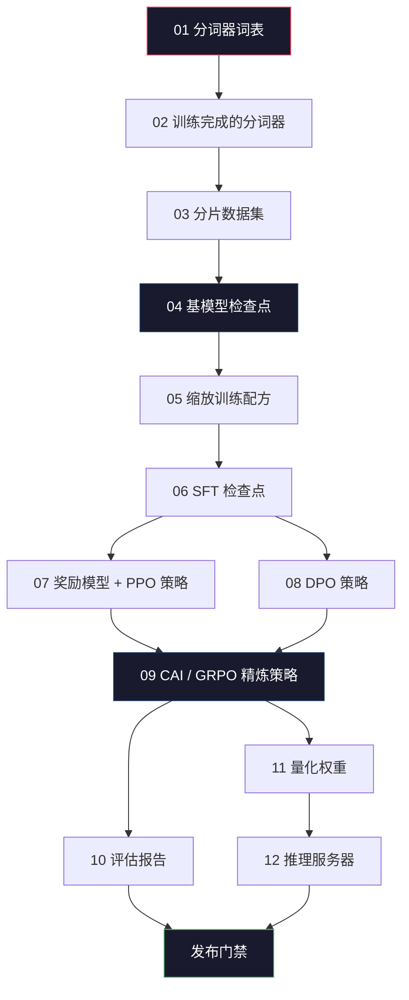
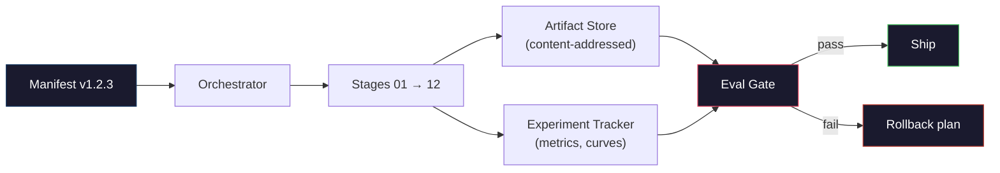

# 构建完整的 LLM 流水线（Pipeline）

> 第 01 到 12 课的内容都是单个流水线中的一个阶段。本节课是将这些阶段串联成一次完整端到端运行的脚手架：分词（tokenize）、预训练（pre-train）、规模缩放（scale）、SFT（监督微调）、对齐（align）、评估（evaluate）、量化（quantize）、部署（serve）。你不会在笔记本上训练一个 70B 的模型。你将产出编排层（orchestration layer）、清单文件（manifest）、评估门禁（eval gate）和回滚计划（rollback plan），这些正是 2026 年前沿团队用来决定什么可以发布的工具。这是收官之作。

**Type:** Build
**Languages:** Python (stdlib)
**Prerequisites:** All Phase 10 lessons 01-12
**Time:** ~120 minutes

## 学习目标

- 将前面十一节课（分词器、数据、预训练、缩放、SFT、RLHF、DPO、CAI、评估、量化、推理）组合成一个单一的、可复现的流水线规范
- 定义阶段间工件契约（artifact contract）：每个阶段消费什么、产出什么，以及下一个阶段如何验证输入
- 构建一个编排器（orchestrator）来追踪实验、对工件进行哈希校验，并根据评估阈值来控制发布决策
- 设计回滚计划：哪些工件重新运行成本低、哪些成本高，以及一个损坏的检查点（checkpoint）意味着什么

## 问题

前面的各节课各自都能运行。分词器训练好了。小型 GPT 预训练完成。SFT 数据集组装好了。奖励模型（reward model）训练完成。DPO 运行完毕。评估指标测量完毕。量化权重导出。推理服务器启动。每个都是一份 notebook，各有自己的约定、输出路径和随机种子。

一次前沿训练运行不是一份 notebook。Llama 3 405B 在约 54 天内消耗了 3000 万 H100 GPU 小时。DeepSeek-V3 使用了约 280 万 H800 小时。在这段时间里，一个损坏的检查点、一次数据污染（data contamination）、一个评估回退（eval regression）可能会让团队损失一周的实际时间和一个月的 GPU 预算。团队生存下来的方法就是靠流水线规范（pipeline hygiene）：每个阶段都有确定性输入、确定性输出、清单文件、哈希值和门禁。

这是收官之作。你不会在笔记本上端到端地运行流水线。你将编写协调各阶段的编排器、描述运行的清单文件、控制发布决策的验证器，以及让第三方能从一个文件重新运行你全部工作的重放计划（replay plan）。代码量很小，但规范的含金量很大。

这种模式从 100M 参数到 1T 参数都保持不变。相同的四个组件——清单、编排器、评估门禁、工件存储（artifact store）——运行着 Llama 3，也运行着你的业余 GPT。区别只在于每个阶段配置中的数字大小，而不是流水线的形状。

## 概念

### 十二个阶段

每个 Phase 10 的课程都是一个阶段。以下是完整的依赖关系图。



第 07 和 08 阶段可以并行运行。其余所有都是硬依赖。第 02 阶段（分词器）的变更会使所有下游工件失效。第 10 阶段（评估）的变更只影响发布决策。

### 清单文件（Manifest）

清单文件是一个完整描述一次运行的单文件，足以让人重放这次运行。流水线产出的任何东西都不应依赖清单之外的状态。字段虽然无聊但都是必须的。

```
pipeline_version: 1.2.3
seed: 42
git_commit: a1b2c3d4
stages:
  01_tokenizer:
    recipe: bpe_32k
    input_hash: sha256:...
    output_hash: sha256:...
    wall_clock_sec: 3600
    cost_usd: 12
```

第 N 阶段的输出哈希（output hash）是第 N+1 阶段的输入哈希（input hash）。任何偏差都会导致流水线停止。这是你及早发现数据损坏的方式。也是不同大洲的队友验证他们的重放结果与你是否产生了相同工件的方法。

实践中，团队使用一个小型 YAML schema 加上一个清单检查器（manifest checker），对上次成功运行做 diff。任何在预期字段（cost、wall clock）之外的差异都是危险信号。

### 工件类型（Artifact Typing）

每个阶段的输出都是一个有类型的工件。不是目录 blob，不是 pickle，而是一个具有已知 schema 的命名类型。

| 阶段 | 工件类型 | 关键字段 |
|-------|--------------|-----------|
| 01-02 | Tokenizer | vocab.json, merges.txt, config.json, hash |
| 03 | Dataset | shards[], row count, token count, dedup stats |
| 04-05 | Checkpoint | weights.safetensors, config.json, optimizer state, step count |
| 06 | SFT Model | checkpoint + SFT recipe + data mix |
| 07 | Reward Model | RM checkpoint + preference data hash |
| 08-09 | Policy | checkpoint + reference hash + beta + KL budget consumed |
| 10 | Eval Report | benchmark scores + regression diffs + eval data hash |
| 11 | Quantized Model | quantized weights + calibration data + accuracy delta vs FP16 |
| 12 | Server Spec | endpoint + model hash + config + observability hooks |

类型化可以防止最常见的失败模式：把第 08 阶段的输出当成第 06 阶段的输入，将一个经过 DPO 训练的模型通过 SFT 路径发布。将工件和阶段签名类型化后，这些错误会变成编译时错误，而非第五天才发现的错误。

### 评估门禁（Eval Gate）

"发布"不是"训练完成"。"发布"是"训练完成且通过评估门禁"。门禁在运行开始之前就已定义。

```
gates:
  mmlu:      >= baseline + 0.5   # 不能回退
  humaneval: >= baseline + 1.0
  truthfulqa: >= baseline         # 不能下降
  safety_refusal_rate: <= 0.05
  kl_from_reference: <= 25.0
  cost_total_usd: <= 50000
```

每个门禁都是一个数值阈值。没有"看起来不错"的门禁，没有主观签字。如果所有门禁都通过，工件被标记为可发布。如果任何门禁失败，运行将被挂起，等待指定审核人的显式覆盖，覆盖操作本身也会记录在清单中。

两个门禁能捕捉到大多数灾难。*回退门禁（regression gate）*（新模型在核心基准测试上必须至少与前一个模型持平）能捕获训练 bug。*KL 预算门禁（KL budget gate）*（对齐后的策略与参考模型之间的漂移不能超过 X）能捕获对齐过度。每个生产流水线都同时设有这两个门禁。

### 编排器（Orchestrator）

一小段代码，读取清单、调度阶段、追踪工件，并在任何契约被违反时停止。这不是 Airflow，不是 Kubeflow。为了流水线规范，你需要的是一段你亲手写的、无聊的代码。

编排器的职责很窄：

1. 从清单解析 DAG（有向无环图）。
2. 对每个阶段，检查预期的输出是否已经以正确的哈希值存在（如果存在则跳过）。
3. 运行阶段，捕获 stdout/stderr，测量 wall-clock 时间和成本。
4. 验证输出哈希是否与下游阶段预期的输入哈希匹配。
5. 失败时，写出包含具体失败阶段的部分清单并返回非零退出码。

这就大约是 200 行 Python 代码。看起来就像本节课 `code/main.py` 中的内容。在底层，真正的流水线使用 `torchrun` 或 `ray` 在集群上执行各个阶段，但编排器本身在单台机器上运行。

### 实验追踪与工件存储

两个外部系统支撑着流水线。

**实验追踪器（Experiment Tracker，如 wandb、neptune、mlflow）。** 记录每个阶段的损失曲线、评估指标和系统遥测。当你需要在三周后比较运行 A 和运行 B 时，你要看追踪器。团队几乎总是使用托管追踪器——自己写一个会浪费本应用于训练的时间。

**工件存储（Artifact Store，如 S3、R2、GCS）。** 用于检查点、数据集、分词器、评估报告的不可变对象存储。工件按哈希寻址，而非按文件名。一个像 `latest.pt` 这样的文件名是一个陷阱；`ckpt-7b-step-20000-sha256:abc123.safetensors` 则是一个契约。

编排器向两者写入数据。追踪器是给人类看图表的。工件存储是给下一个阶段查找输入的。

### 成本核算（Costing）

一次前沿运行附带一个美元数字。预算规范发生在两个环节。

**运行前估算。** 从清单中计算预期 FLOPs（对预训练：6 x 参数量 x token 数）、预期 GPU 小时数（FLOPs / 峰值吞吐量 / 利用率），以及按当前租赁率计算的美元成本。如果估算超出预算门禁，流水线拒绝启动。

**运行中追踪。** 阶段级别的 wall-clock 时间和成本被记录到清单中。每个阶段结束后检查剩余预算。如果某个阶段超时，下一阶段的预算门禁将使用新的剩余预算来评估。你不会等到 VC 打电话才知道花光了钱。

Llama 3 的报告成本为 6100 万美元。DeepSeek-V3 报告主预训练运行成本为 560 万美元。这个比例主要是硬件效率加上混合专家架构（MoE）——但具体的成本数字之所以可见，是因为两个团队都按阶段而非按整个运行来追踪。

### 可复现性（Reproducibility）与确定性（Determinism）

二者是不同概念。*可复现*意味着相同的清单加上相同的代码加上相同的基础设施，产生一个下游指标等效的检查点。*确定性*意味着逐比特相同的输出。

现代 LLM 训练是可复现但非确定性的。分布式训练的归约顺序（reduce-order）、GPU 内核的非确定性（cuBLAS、flash-attn）、混合精度舍入（mixed precision rounding）共同导致不同运行之间的浮点值在 1e-5 量级有差异。这对最终指标（它们基本不变）来说是可以接受的。但对尝试用比特级 diff 调试来说则是致命的。解决方法是以日志记录每个阶段的输入哈希、输出哈希和主要指标——如果这些都匹配，运行就算"复现"了，即使权重不是逐比特相同的。



### 回滚计划（Rollback Plan）

在运行开始之前，写下每个阶段失败时会发生什么。分为三类。

- **重运行成本低**（数小时）：分词器、评估、量化、推理服务器。直接重运行。
- **中等**（数天）：SFT、DPO、CAI。保留基模型，仅重运行对齐阶段。
- **昂贵**（数周和数百万美元）：预训练。这里的回滚计划不是"重运行"，而是"使用最后一个好的检查点，然后用修订后的数据重运行成本较低的下游阶段"。

由于阶段依赖关系是类型化和哈希化的，编排器可以自动计算回滚集合：让失败阶段及其所有后代失效。第 06 阶段（SFT）的失败会使 06、07、08、09、10、11、12 失效。第 11 阶段（量化）的失败只会使 11 和 12 失效。提前确认这一点，可以避免在团队凌晨四点精疲力竭时临时决定。

### 2026 年观察到的生产配方

大多数前沿团队都收敛于同一套骨架。

- 分词器：128k BPE，带 byte fallback。在一个小型、均衡的多语言切片上训练。
- 预训练：10-20T token，主要是网页加代码加合成数据。Muon 或 AdamW 优化器。FSDP2 或 DeepSpeed ZeRO-3。梯度检查点（gradient checkpointing）。BF16 权重，FP32 master。
- SFT：50 万到 200 万条指令对，混合人工和合成数据，严格去重评估集。
- 对齐：DPO 或 CAI + GRPO。仅当偏好信号对 DPO 来说过于多维时才使用 RLHF。
- 评估：MMLU-Pro、MATH、HumanEval+、GPQA、SWE-Bench Verified、LiveBench，外加一个公众永不可见的私密留出集。
- 量化：部署用 4-bit GPTQ 或 AWQ，安全评估用 8-bit（此时精度差异很重要）。
- 部署：vLLM、TensorRT-LLM 或自研方案。连续批处理（continuous batching）。推测解码（speculative decoding）。KV 缓存淘汰（KV cache eviction）。

数字每六个月就会变化。但骨架不变。

```figure
beam-search
```

## 动手构建（Build It）

本节课的代码是一个编排器和一个清单检查器，而不是十二个训练脚本。每个阶段用一个占位符（placeholder）来模拟，该占位符产出具有正确形状和哈希值的输出工件。在真实阶段上烧 GPU 钱之前，端到端运行编排器可以证明流水线的管道完全畅通。

完整实现见 `code/main.py`。关键组件：

- `Manifest` 数据类：pipeline version, seed, git commit, stages, gates。
- `Stage` 数据类：name, type, inputs (hashes), output (hash), wall clock, cost。
- `Orchestrator.run()`：解析 DAG，调度阶段，验证哈希，更新清单。
- `EvalGate.check()`：读取阈值，与最新评估报告对比，返回 pass/fail。
- `ArtifactStore`（内存存根）：按哈希 put/get，模拟 S3。
- `CostTracker`：按阶段和累计追踪成本，超出上限时停止。

`main.py` 中的流水线运行十二个占位符阶段，产生清单，并触发一个失败的评估门禁来展示一次被挂起的运行是什么样子。把每个占位符替换为对应课程中的真实训练脚本，你就得到了真正前线流水线所使用的骨架。

## 实际应用（Use It）

规范工作流有三个命令。

```
python code/main.py plan    # 验证清单，计算成本估算，打印 DAG
python code/main.py run     # 执行各阶段，写入 manifest.out.yaml
python code/main.py gate    # 读取 manifest.out.yaml，应用评估门禁，决定 ship 或 hold
```

每次先运行 `plan`。大多数流水线 bug 在 plan 阶段就会暴露——缺少门禁阈值、过期的哈希值、预算超支。运行 `plan` 是免费的。运行 `run` 是昂贵的。在便宜端捕获 bug 来省钱。

`gate` 的输出要么是 `SHIP` 要么是 `HOLD: <原因>`。一次挂起的运行不是失败，而是一个决策点。指定审核人要么覆盖（覆盖操作被记录），要么批准回滚。

## 交付产物（Ship It）

本节课生成 `outputs/skill-llm-pipeline-reviewer.md`。将提议的流水线清单输入其中，它会检查所有契约：阶段类型、哈希链、门禁、回滚计划、成本估算。它会拒绝批准一个缺少评估门禁、KL 预算无上限、或混合使用评估数据和训练数据的清单。

## 练习

1. 扩展编排器以支持第 07 和 08 阶段的并行执行。使用 stdlib 的 `concurrent.futures` 模块。确认最终清单记录了两个阶段的输出，且第 09 阶段的输入哈希是两个输出的确定性组合。

2. 添加一个"去污检查（contamination check）"门禁。给定评估数据集的哈希和训练数据分片，计算二者的重叠（精确字符串匹配或 13-gram 匹配）。如果重叠超过 0.1%，门禁失败。输入一个被污染的训练集，确认门禁挂起运行。

3. 从第一性原理实现一个成本估算器。对于第 04 阶段（预训练），按 6 x 参数量 x token 数估算 FLOPs，假设 H100 上 BF16 模式下 40% MFU（模型 FLOPs 利用率）对应 989 TFLOPs，按 $2.50/GPU-小时计算。报告一个在 2T token 上训练的 7B 模型的估算成本。与已发布的 Llama 2 数据进行对比。

4. 构建部分回滚。模拟第 09 阶段（CAI）失败，然后重运行第 09 到 12 阶段，同时保持 01-08 被缓存。编排器应通过哈希检测缓存工件并跳过它们。测量相比于完整重运行所节省的 wall-clock 时间。

5. 添加可观测性。为每个阶段发出 OpenTelemetry span，带有参数数量、所见 token、损失和成本的属性。将 span 通过管道发送到本地收集器。重点不是仪表盘，而是每个阶段的健康状况都可以通过单一 trace ID 追踪。

## 关键术语

| 术语 | 通俗说法 | 实际含义 |
|------|----------------|----------------------|
| Manifest | "配方文件" | 描述流水线版本、种子、逐阶段配置和门禁阈值的 YAML 或 JSON——足以重放一次运行 |
| Content-addressed | "按哈希而非按名称" | 工件以内容 SHA-256 存储，因此你永远不会混淆版本 A 和版本 B |
| Eval gate | "发布标准" | 在工件被标记为可发布之前必须通过的基准测试指标和安全分数的数值阈值 |
| KL budget | "对齐漂移了多少" | 对齐阶段中累计 KL(policy \|\| reference) 的上限，作为门禁强制执行 |
| MFU | "你用了多少 GPU" | 模型 FLOPs 利用率——实际达到的 FLOPs / 理论峰值。70B 规模典型为 40%，7B 下典型为 55% |
| Rollback plan | "出了问题时做什么" | 每个阶段失败时预先写好的行动集合：重运行、回退、用修订输入重新训练 |
| Orchestrator | "指挥" | 读取清单、调度阶段、验证哈希、在任何契约违反时停止的进程 |
| Artifact store | "权重的版本化 S3" | 不可变的内容寻址对象存储——检查点、数据集、评估报告的单一可信来源 |
| Reproducible | "重放时指标相同" | 不同比特级权重但等效的下游指标——分布式 LLM 训练的现实目标 |
| Cost gate | "你不能超过 X" | 运行前成本估算加上运行中追踪——如果估算超出预算，流水线拒绝启动 |

## 进一步阅读

- [Dubey et al., 2024 -- "The Llama 3 Herd of Models"](https://arxiv.org/abs/2407.21783) -- 关于前沿流水线的最详细公开描述，包括数据、训练、对齐和评估
- [DeepSeek-AI, 2024 -- "DeepSeek-V3 Technical Report"](https://arxiv.org/abs/2412.19437) -- 以 Llama 3 级别训练约 1/10 成本的效率优先流水线
- [Kaplan et al., 2020 -- "Scaling Laws for Neural Language Models"](https://arxiv.org/abs/2001.08361) -- 原始的计算-数据-参数量缩放关系
- [Hoffmann et al., 2022 -- "Training Compute-Optimal Large Language Models (Chinchilla)"](https://arxiv.org/abs/2203.15556) -- 对 Kaplan 修正，重新校准了现代数据预算
- [PyTorch FSDP2 文档](https://pytorch.org/docs/stable/fsdp.html) -- PyTorch 2.4+ 中取代 FSDP1 的分布式训练原语
- [Weights & Biases LLM Reports](https://wandb.ai/site/llms) -- 开源 LLM 运行的真实清单和实验追踪器输出，可用作可复制的模板
