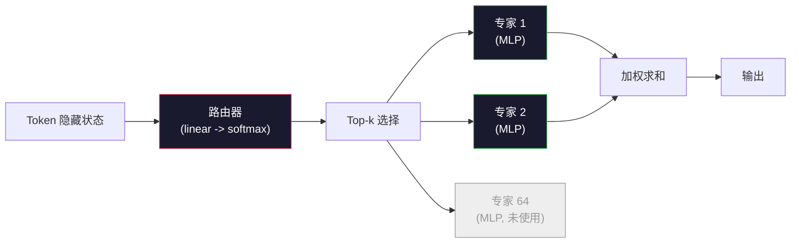

# 开放模型：架构详解

> 你在第 04 课从零构建了一个 GPT-2 Small。2026 年的前沿开放模型属于同一家族，但有五六处具体变化。用 RMSNorm 代替 LayerNorm，用 SwiGLU 代替 GELU，用 RoPE 代替学习位置编码，用 GQA 或 MLA 代替完整 MHA，大规模使用混合专家（MoE）。你已经掌握的数学知识涵盖了其中 95% 的内容。本节课并列阅读 Llama 3、DeepSeek-V3、Mixtral、Qwen 和 Gemma，并标出每种架构的确切分叉点。

**Type:** Learn
**Languages:** Python (stdlib)
**Prerequisites:** Phase 10, Lessons 04, 05, 12 (Pre-training, Scaling, Inference)
**Time:** ~45 minutes

## 学习目标

- 阅读 Llama 3、Mistral、Mixtral、Gemma 2、Qwen 2.5 和 DeepSeek-V3 的 config.json 并解释每个字段
- 说出每个模型相较于 GPT-2 Small 所做的具体架构变化，并从第一性原理说明原因
- 仅凭配置计算任何开放模型的参数量、KV 缓存大小和激活内存
- 根据延迟、内存和能力约束，为部署目标选择正确的开放模型

## 问题

在第 04 课中你写了 350 行 numpy 代码，得到了一个 GPT-2 形状的模型。Llama 3 405B 有一份 200 页的技术报告。你的直觉告诉你这是完全不同的野兽。但事实并非如此。那 200 页描述的是同一个对象，加上五六项有充分动机的修改，以及上千个关于扩展的实现细节。骨架——嵌入（embedding）、transformer 块、注意力（attention）、MLP、归一化（norm）、输出头（head）——没有改变。

本节课是一个 diff。对于每个主要的开放模型家族，我们精确列出了相较于 GPT-2 变化了什么、为什么、以及代价是什么。完成之后，你就能阅读一份新发布的模型卡（model card），并在头脑中将其映射回 GPT-2 基线。

实践回报是：当 Meta 发布 Llama 5 或 DeepSeek 发布 V4 时，你不需要一个全新的心智模型。你会查看配置，看看哪些已知的开关被拨动了，并知道下游影响是什么。2026 年的架构是一个有限的工具箱。每个新模型选择不同的子集。

## 概念

### 不变的核心

所有自回归开放模型共享以下：

- Token 嵌入矩阵（vocab_size x hidden_dim）。
- 堆叠 N 个解码器块：归一化、自注意力（self-attention）、残差（residual）、归一化、MLP、残差。
- 最终的归一化和投影到 vocab_size 的线性输出头（通常与嵌入矩阵共享权重）。
- 因果掩码（causal mask）、下一个 token 交叉熵损失（next-token cross-entropy loss）。

这就是形状。其余的只是旋钮。

### 确实会变化的六个旋钮

在所有 2024-2026 年前沿开放模型中，相同的六个设计选择被反复选用：

1. **归一化（Normalization）。** LayerNorm -> RMSNorm。
2. **位置编码（Positional encoding）。** 学习绝对位置 -> RoPE（加上变体：YaRN, NTK）。
3. **激活函数（Activation）。** GELU -> SwiGLU（或 GeGLU）。
4. **注意力头共享（Attention head sharing）。** MHA -> GQA -> MQA -> MLA。
5. **密集 vs 稀疏 MLP。** 密集 -> 混合专家（MoE）。
6. **Pre-norm 位置。** Pre-norm 保持，Post-norm 消失。

其他一切（学习率调度、数据混合、批次大小、上下文长度）都存在于训练配置中，而非架构中。六个旋钮。

### 旋钮 1：RMSNorm

LayerNorm 减去均值，除以标准差，缩放并平移。RMSNorm 只保留了缩放：

```
RMSNorm(x) = x / sqrt(mean(x^2) + eps) * gamma
```

没有均值减法，没有偏置。每个 token 少一次矩阵乘法。Zhang 和 Sennrich（2019）论证了它在机器翻译上匹配 LayerNorm 的性能，同时快 10%。每个现代开放模型都在使用它。

代价：无。收益：小幅吞吐量提升，更简单的代码。

### 旋钮 2：RoPE

学习位置嵌入在 GPT-2 中是一个 1024 槽的查找表。上下文位置 1025 就超出了表的范围。模型无法外推（extrapolate）到训练长度之外。

旋转位置嵌入（Rotary Position Embedding, RoPE，Su et al. 2021）通过在注意力点积之前按对旋转每个 Q 和 K 向量来注入位置信息。旋转角度是位置的确定性函数，因此无需学习任何东西，也没有消耗尽的限制。借助缩放技巧（NTK-aware interpolation, YaRN），在 8k 上下文上训练的模型可以在推理时扩展到 128k 且精度损失适度。

```
q_rotated = rotate(q, angle(pos))
k_rotated = rotate(k, angle(pos))
score = q_rotated . k_rotated
```

每个 Llama、Mistral、Qwen、DeepSeek 和 Gemma 都在使用 RoPE。Gemma 2 使用混合方案（大多数层用 RoPE，其他层使用 local sliding-window attention）。

### 旋钮 3：SwiGLU

GPT-2 的 MLP 是 `x -> gelu(xW1 + b1) -> (...)W2 + b2`。SwiGLU（Shazeer 2020）将激活函数替换为一个门控乘积：

```
SwiGLU(x) = (xW1) * sigmoid(xW1) * xV
```

两个投影并行进行，由 Swish 激活函数门控。经验上在每参数的困惑度（perplexity）上更强。Llama 2 采用后，所有人跟进。MLP 的隐藏大小通常设置为使总参数量与原始密集 MLP 匹配：如果 GPT-2 使用 `ff_dim = 4 * hidden`，SwiGLU 使用 `ff_dim = (2/3) * 4 * hidden = 8/3 * hidden`。

### 旋钮 4：注意力头共享

GPT-2 使用**多头注意力（Multi-Head Attention, MHA）**：每个头有自己的 Q、K、V 投影。

**多查询注意力（Multi-Query Attention, MQA，Shazeer 2019）**在所有头之间共享一个 K 和一个 V。将 KV 缓存缩小了 num_heads 倍，在典型模型上减少 12 到 32 倍。在困难基准测试上精度略有下降。

**分组查询注意力（Grouped-Query Attention, GQA，Ainslie et al. 2023）**是中间地带：G 组 Q 头共享一个 K 和一个 V。Llama 3 8B 使用 32 个 Q 头和 8 个 KV 头（G=8），所以与完整 MHA 相比 KV 缓存缩小 4 倍。

**多头潜在注意力（Multi-Head Latent Attention, MLA，DeepSeek 2024）**将 K 和 V 压缩到一个共享的低秩潜在变量（latent）中，然后按头投影回去。进一步减少 KV 缓存，同时保持每头的表达能力。DeepSeek-V2 和 V3 依赖此技术来实现其长上下文性能。

| 方案 | KV 头数 | KV 缓存 | 精度 |
|--------|----------|----------|----------|
| MHA    | num_heads | 完整 | 最优 |
| GQA    | num_groups（G < num_heads） | 缩小 num_heads / G 倍 | 接近 MHA |
| MQA    | 1 | 缩小 num_heads 倍 | 轻微下降 |
| MLA    | 潜在变量，按头解压 | 比 MQA 更小 | 接近 MHA |

对于约 13B 参数量以上的模型，GQA 或 MLA 几乎是必修课。在规模上使用完整 MHA 是一场 KV 缓存灾难。

### 旋钮 5：混合专家（MoE）

密集 MLP 对每个 token 激活所有参数。一个 MoE MLP 在每个块中有 K 个专家和一个路由器，为每个 token 选择 top-k 个专家（通常是 top-2）。只有那些专家的权重对该 token 执行前向传播。

```
router_logits = xW_r
indices, weights = top_k(router_logits, k=2)
output = sum_i weights[i] * expert[indices[i]](x)
```

吸引力在于：你可以有 64 个专家，每个 7B 大小（因此总参数量巨大），而每个 token 只运行其中 2 个（因此每个 token 的计算量匹配密集 7B 模型）。Mixtral 8x7B 有 47B 总参数但每个 token 只激活 13B。DeepSeek-V3 有 671B 总参数但每个 token 只激活 37B。



优点：相同计算量，更多参数，更好的容量。缺点：专家内存仍然需要存在于某处（因此部署比密集等同模型需要更多 VRAM），路由器的负载均衡（load-balancing）很难，对齐期间微调路由器本身也是一个独立研究领域。

### 旋钮 6：Pre-norm 保持不变

原始 transformer 在每个子层之后应用层归一化。GPT-2 之后的每个开放模型都将其放在每个子层*之前*。Pre-norm 严格来说在深度训练上更容易。没什么好争论的。

### 逐模型差异

以下是使一切具体化的表格。

| 模型 | 年份 | 总参数量 | 激活参数量 | Norm | 激活函数 | 位置编码 | 注意力 | MoE | 上下文长度 |
|-------|------|-------------|---------------|------|-----------|----------|-----------|-----|---------|
| GPT-2 Small | 2019 | 124M | 124M | LayerNorm | GELU | Learned | MHA（12 头） | 否 | 1k |
| Llama 3 8B | 2024 | 8B | 8B | RMSNorm | SwiGLU | RoPE | GQA（32/8） | 否 | 128k |
| Llama 3 70B | 2024 | 70B | 70B | RMSNorm | SwiGLU | RoPE | GQA（64/8） | 否 | 128k |
| Llama 3 405B | 2024 | 405B | 405B | RMSNorm | SwiGLU | RoPE | GQA（128/16） | 否 | 128k |
| Mistral 7B | 2023 | 7.2B | 7.2B | RMSNorm | SwiGLU | RoPE | GQA | 否 | 32k |
| Mixtral 8x7B | 2023 | 47B | 13B | RMSNorm | SwiGLU | RoPE | GQA | 是（8 专家，top-2） | 32k |
| Gemma 2 9B | 2024 | 9B | 9B | RMSNorm（pre+post） | GeGLU | RoPE + sliding | GQA | 否 | 8k |
| Qwen 2.5 72B | 2024 | 72B | 72B | RMSNorm | SwiGLU | RoPE（YaRN） | GQA（64/8） | 否 | 128k |
| DeepSeek V2 236B | 2024 | 236B | 21B | RMSNorm | SwiGLU | RoPE | MLA | 是（160 专家，top-6） | 128k |
| DeepSeek V3 | 2024 | 671B | 37B | RMSNorm | SwiGLU | RoPE | MLA | 是（256 专家，top-8） | 128k |

逐列扫描。RMSNorm 是通用的。SwiGLU 或其近亲 GeGLU 是通用的。RoPE 是通用的。GQA 在 7B 以上是通用的，除非被 MLA 替代。MoE 是高端上的差异化因素。

### 阅读 config.json

Llama 3 8B 配置：

```
{
  "hidden_size": 4096,
  "intermediate_size": 14336,
  "num_hidden_layers": 32,
  "num_attention_heads": 32,
  "num_key_value_heads": 8,
  "max_position_embeddings": 131072,
  "rope_theta": 500000.0,
  "rms_norm_eps": 1e-5,
  "vocab_size": 128256
}
```

每个字段都对应你已经实现过的东西。

- `hidden_size`：嵌入维度。
- `intermediate_size`：MLP 隐藏大小（3.5 倍 hidden——SwiGLU 数学）。
- `num_hidden_layers`：堆栈深度。
- `num_attention_heads`：Q 头数。
- `num_key_value_heads`：KV 头数（GQA）。
- `max_position_embeddings`：训练上下文长度。
- `rope_theta`：RoPE 基频（base frequency）。Meta 将其从默认的 10k 放大到 500k 以实现长上下文外推。
- `rms_norm_eps`：数值稳定性。
- `vocab_size`：token 数。

仅凭这些字段你就能计算总参数量、KV 缓存和峰值激活内存。确切公式见 `code/main.py`。

### 激活内存预算

在几十亿参数以上，激活值占据训练内存的主导地位。预训练的经验法则（使用梯度检查点）：

```
activation_mem ~ batch_size * seq_len * hidden_size * num_layers * bytes_per_element
```

对于 Llama 3 8B，batch=1, seq=8192, BF16, 32 层, hidden=4096：单激活值的占用大约为 8 GB（使用检查点），不使用检查点时约 40 GB。这就是 flash-attention 和 ring-attention 之所以重要的原因——它们重写了注意力计算使激活值可以装入内存。

### KV 缓存预算

推理时在最大上下文条件下：

```
kv_cache = 2 * num_layers * num_kv_heads * head_dim * max_seq_len * bytes_per_element
```

Llama 3 8B 在 128k 上下文, BF16, head_dim = hidden / num_heads = 128：
`2 * 32 * 8 * 128 * 131072 * 2 = 17.2 GB` 每序列。

8B 权重在 BF16 下为 16 GB。单序列 128k 上下文的 KV 缓存比权重还大。这就是驱动 GQA、MLA 和 KV 缓存量化研究的内存压力。

### 各模型适用场景

- **单 80GB GPU，无 MoE**：Llama 3 8B, Mistral 7B, Gemma 2 9B。易于部署，工具链广泛。
- **单节点（8x80GB），大容量**：Llama 3 70B, Qwen 2.5 72B。最高的密集开放模型能力。
- **最大开放能力，接受 MoE 复杂度**：DeepSeek V3, Mixtral 8x22B。每活跃 FLOP 的最佳能力。
- **长上下文需求**：Llama 3（128k 加 RoPE 缩放）, DeepSeek（MLA 优势）。
- **低延迟部署**：Gemma 2 9B（滑动窗口减少长上下文计算）。

```figure
rmsnorm-vs-layernorm
```

## 动手构建（Build It）

本节课的代码是一个计算器。给定任意 config.json，它会输出各组件参数量、最大上下文下的 KV 缓存、SwiGLU MLP 比率，以及关于架构（dense / GQA / MLA / MoE）的简短判断。

```python
config = {
    "hidden_size": 4096, "intermediate_size": 14336,
    "num_hidden_layers": 32, "num_attention_heads": 32,
    "num_key_value_heads": 8, "vocab_size": 128256,
    "max_position_embeddings": 131072,
}
```

脚本逐字段遍历架构，计算嵌入（embedding）、注意力（含 GQA 缩小因子）、MLP（含 SwiGLU 扩展因子）、层归一化、输出头等的参数量。然后在所述上下文长度下计算 KV 缓存并打印摘要。

实现见 `code/main.py`。

## 实际应用（Use It）

对脚本中内置的 Llama 3 8B、Mistral 7B、Mixtral 8x7B 和 DeepSeek V3 配置运行计算器。比较参数分解。注意 MoE 模型的总是参数量使密集模型相形见绌，但活跃参数量通常更小。注意 DeepSeek V3 的 KV 缓存比 Llama 3 405B 更小，尽管总参数量更大——这就是 MLA 在发挥作用。

然后插入你本地任何模型的配置，读取摘要，并决定它是否能装入你的 GPU。

## 交付产物（Ship It）

本节课生成 `outputs/skill-open-model-picker.md`。给定一个部署目标（GPU 类型、VRAM、上下文长度、延迟预算）和一个任务概况（聊天、代码、推理、长上下文），它推荐一个开放模型、一个来自第 11 课的量化方案，以及一个来自第 12 课的推理技术栈，并附带关于六个架构旋钮的明确推理。

## 练习

1. 从 HuggingFace 读取 Qwen 2.5 72B 的配置。从零计算总参数量。与 HF 报告的值对比，找出任何差异的来源（头维度舍入、KV 共享因子等）。

2. DeepSeek V3 使用 256 个专家和 top-8 路由。计算激活专家与总专家的比率，并与 Mixtral 8x7B 的 top-2（共 8）比较。从稀疏（25%）到更密集的稀疏（3%）的转变意味着关于每 FLOP 容量的什么结论？

3. 计算 Llama 3 405B 在 128k 上下文下 FP8 和 BF16 的 KV 缓存。FP8 是 BF16 数值的一半。在单个 8xH100 节点（每个 80GB = 共 640GB，减去权重内存）上可以服务多少并行序列？

4. Gemma 2 交替使用全注意力（full-attention）和滑动窗口注意力（sliding-window-attention）层。写出当一半层使用 4096-token 滑动窗口而非全上下文时的 KV 缓存数学。在 8k 总上下文下节省了多少内存？

5. 找一篇在本课编写之后发布的最新前沿开放模型。辨识它选择了六个旋钮中的哪些，以及是否引入了第七个旋钮。一旦新架构发布，课程内容就会显得过时——目标是在不重建心智模型的前提下更新你的表格。

## 关键术语

| 术语 | 通俗说法 | 实际含义 |
|------|----------------|----------------------|
| RMSNorm | "没有均值的 LayerNorm" | 仅用均方根值进行归一化，带可学习缩放——比 LayerNorm 更便宜且性能相当 |
| RoPE | "旋转位置编��" | 按依赖位置的角对每个 Q 和 K 向量进行二维对旋转——借助缩放技巧可外推到训练长度之外 |
| SwiGLU | "新的 MLP 激活函数" | 带 Swish 激活的门控线性单元：`(xW1) * sigmoid(xW1) * xV`——每个 2024+ 开放模型的标准选择 |
| GQA | "折中注意力方案" | 分组查询注意力：G 组 Q 头共享一个 K 和一个 V 头——缩小 KV 缓存而不承受 MQA 的精度损失 |
| MLA | "DeepSeek 的注意力方案" | 多头潜在注意力：将 K/V 压缩到共享低秩潜在变量，按头解压——大模型中 KV 缓存最小 |
| MoE | "稀疏专家" | 混合专家：每个块 N 个 MLP，路由器为每个 token 选取 top-k 专家——总参数量巨大，活跃参数量小 |
| Top-k routing | "每个 token 选择 k 个专家" | 路由器计算每个专家的分数并激活最高的 k 个——典型 k 为 2（Mixtral）到 8（DeepSeek） |
| YaRN | "拉伸 RoPE" | Yet another RoPE extension——插值旋转角度以在推理时将上下文从 8k 扩展到 128k+ |
| Sliding-window attention | "不关注全部内容" | 每个 token 只关注最近 W 个 token——将注意力成本限制在每 token O(W)，在 Gemma 2 和早期 Mistral 中使用 |
| Active params | "每个 token 实际运行的参数" | 对于 MoE 模型，每个 token 经历前向计算的参数量（远小于总参数量）——决定每 token FLOPs |

## 进一步阅读

- [Dubey et al., 2024 -- "The Llama 3 Herd of Models"](https://arxiv.org/abs/2407.21783) -- 密集 Llama 3 系列的架构和训练参考文档
- [DeepSeek-AI, 2024 -- "DeepSeek-V3 Technical Report"](https://arxiv.org/abs/2412.19437) -- MLA 加无辅助损失负载均衡加 671B MoE
- [Jiang et al., 2024 -- "Mixtral of Experts"](https://arxiv.org/abs/2401.04088) -- 经典的 MoE 开放模型论文
- [Su et al., 2021 -- "RoFormer: Enhanced Transformer with Rotary Position Embedding"](https://arxiv.org/abs/2104.09864) -- RoPE 论文
- [Shazeer, 2020 -- "GLU Variants Improve Transformer"](https://arxiv.org/abs/2002.05202) -- SwiGLU、GeGLU 及相关变体
- [Ainslie et al., 2023 -- "GQA: Training Generalized Multi-Query Transformer Models"](https://arxiv.org/abs/2305.13245) -- GQA 论文
- [Gemma 2 Team, 2024 -- "Gemma 2: Improving Open Language Models at a Practical Size"](https://arxiv.org/abs/2408.00118) -- 混合全注意力+滑动注意力，pre+post-norm
- [Qwen Team, 2024 -- "Qwen 2.5 Technical Report"](https://arxiv.org/abs/2412.15115) -- YaRN 上下文扩展和长上下文训练配方
