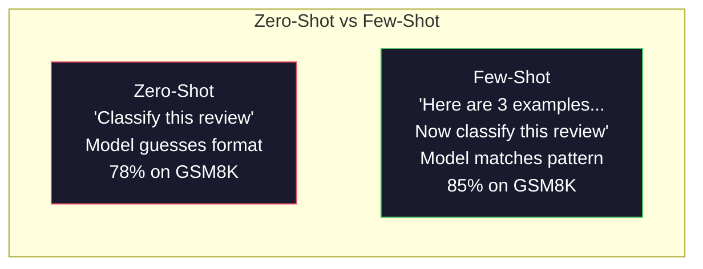
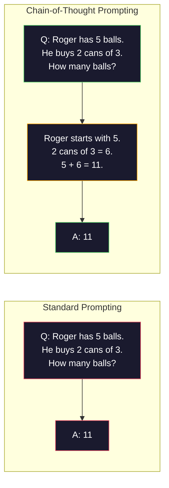
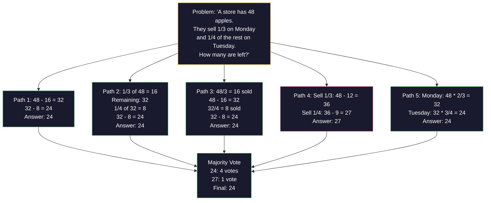
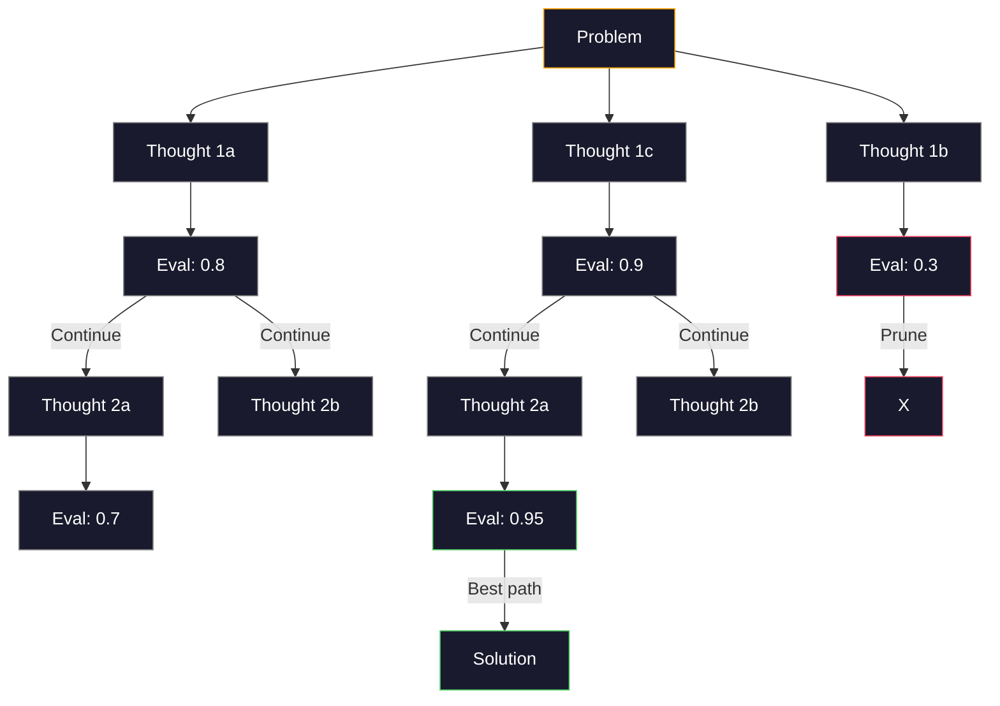
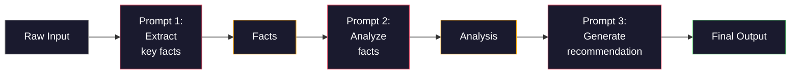

# 少样本、思维链与思维树

> 告诉模型该做什么是提示。教它如何思考才是工程。在同一个模型、同一个任务、同一份数据上，78% 和 91% 准确率之间的差距，不是更好的模型，而是更好的推理策略。

**类型：** 构建
**语言：** Python
**前置要求：** 第 11.01 课（提示工程）
**时间：** 约 45 分钟

## 学习目标

- 通过选择和格式化示例演示来最大化任务准确率，实现少样本提示（Few-Shot Prompting）
- 应用思维链（Chain-of-Thought, CoT）推理来提高多步问题（如数学应用题）的准确率
- 构建一个思维树（Tree-of-Thought）提示，探索多条推理路径并选择最佳路径
- 在标准基准上测量零样本 vs 少样本 vs CoT 的准确率提升

## 问题

你构建了一个数学辅导应用。你的提示是："解决这道应用题。"GPT-5 在 GSM8K（标准小学数学基准测试）上正确率达到 94%。你以为已经到顶了。其实没有——思维链仍然能再增加 3-4 个百分点。

加五个字——"让我们一步步思考"——准确率跳到 91%。加上几个已完成的示例，准确率达到了 95%。同一个模型，同样的温度，同样的 API 成本。唯一的区别是你给了模型一张草稿纸。

这不是 hack，这就是推理的工作原理。人类不会在一步中解决多步问题，transformer 也不会。当你强制模型生成中间 token 时，这些 token 成为下一个 token 上下文的一部分。每个推理步骤都为下一步提供输入。模型在"literally"计算通向答案的路径。

但"一步步思考"只是起点，不是终点。如果你采样五条推理路径并取多数投票呢？如果你让模型探索一个可能性树，评估并剪枝分支呢？如果你将推理与工具使用交织在一起呢？这些不是假设，而是公开发表的、有可测量改进的技术，你在本课中将构建所有这些技术。

## 概念

### 零样本 vs 少样本：当示例胜过指令

零样本提示只给模型任务，没有其他内容。少样本提示先给模型示例。

Wei et al. (2022) 在 8 个基准上进行了测量。对于简单任务（如情感分类），零样本和少样本的表现相差在 2% 以内。对于复杂任务（如多步算术和符号推理），少样本将准确率提高了 10-25%。

直观理解：示例是压缩的指令。与其描述输出格式，不如展示它。与其解释推理过程，不如演示它。模型在示例上进行模式匹配，比解释抽象指令更可靠。



**少样本胜出的场景：** 格式敏感任务、分类、结构化提取、特定领域术语、任何需要模型匹配特定模式的任务。

**零样本胜出的场景：** 简单事实性问题、创意任务（示例会约束创造力）、找到好示例比写好指令更困难的任务。

### 示例选择：相似胜过随机

并非所有示例都是平等的。选择与目标输入相似的示例，在分类任务上比随机选择高出 5-15%（Liu et al., 2022）。三个原则：

1. **语义相似性**：选择在嵌入空间中与输入最接近的示例
2. **标签多样性**：在示例中覆盖所有输出类别
3. **难度匹配**：匹配目标问题的复杂度水平

大多数任务的最佳示例数量是 3-5 个。低于 3 个，模型没有足够的信号来提取模式。超过 5 个，收益递减并浪费上下文窗口 token。对于有很多标签的分类，每个标签使用一个示例。

### 思维链：给模型一张草稿纸

思维链（CoT）提示由 Google Brain 的 Wei et al. (2022) 提出。核心思想很简单：不只要求模型给出答案，先要求它展示推理步骤。



这在机制上为什么有效？Transformer 生成的每个 token 都成为下一个 token 的上下文。没有 CoT 时，模型必须将所有推理压缩到单次前向传播的隐藏状态中。有了 CoT，模型将中间计算外化为 token。每个推理 token 扩展了有效的计算深度。

**GSM8K 基准测试（小学数学，8500 道题）：**

| 模型 | 零样本 | 零样本 CoT | 少样本 CoT |
|-------|-----------|---------------|--------------|
| GPT-4o | 78% | 91% | 95% |
| GPT-5 | 94% | 97% | 98% |
| o4-mini（推理型） | 97% | — | — |
| Claude Opus 4.7 | 93% | 97% | 98% |
| Gemini 3 Pro | 92% | 96% | 98% |
| Llama 4 70B | 80% | 89% | 94% |
| DeepSeek-V3.1 | 89% | 94% | 96% |

**关于推理型模型的说明。** OpenAI 的 o 系列（o3、o4-mini）和 DeepSeek-R1 等模型在输出答案之前在内部运行思维链。对推理型模型添加"让我们一步步思考"是多余的，有时甚至适得其反——它们已经做了。

两种 CoT 变体：

**零样本 CoT**：在提示后附加"让我们一步步思考"。不需要示例。Kojima et al. (2022) 证明这一句话就能提高算术、常识和符号推理任务的准确率。

**少样本 CoT**：提供包含推理步骤的示例。比零样本 CoT 更有效，因为模型看到了你期望的确切推理格式。

**CoT 有损的场景**：简单事实回忆（"法国的首都是什么？"）、单步分类、速度比准确率更重要的任务。CoT 每次查询增加 50-200 个推理 token 的开销。对于高吞吐量、低复杂度的任务，这是浪费的。

### 自洽性：采样多个，投票一次

Wang et al. (2023) 提出了自洽性（Self-Consistency）。核心洞察：单条 CoT 路径可能包含推理错误。但如果你采样 N 条独立的推理路径（使用 temperature > 0），并对最终答案进行多数投票，错误会相互抵消。



在原版 PaLM 540B 实验中，自洽性将 GSM8K 准确率从 56.5%（单条 CoT）提高到 N=40 时的 74.4%。在 GPT-5 上改进很小（97% 到 98%），因为基础准确率已经饱和。该技术在 60-85% 基础 CoT 准确率的模型上最亮眼——这是单路径错误频发但不系统的甜区。对于推理型模型（o 系列、R1），自洽性被内置的内部采样所覆盖。

权衡：N 个样本意味着 N 倍的 API 成本和延迟。实践中 N=5 能捕获大部分收益。N=3 是有意义投票的最小值。N > 10 在大多数任务上收益递减。

### 思维树：分支探索

Yao et al. (2023) 提出了思维树（Tree-of-Thought, ToT）。CoT 遵循一条线性推理路径，ToT 探索多个分支，并评估哪些最有前景再继续。



ToT 有三个组成部分：

1. **思维生成（Thought generation）**：生成多个候选下一步
2. **状态评估（State evaluation）**：对每个候选评分（可以使用 LLM 本身作为评估器）
3. **搜索算法**：在树中进行 BFS 或 DFS，剪枝低分分支

在 Game of 24 任务（用算术组合 4 个数字得到 24）上，GPT-4 标准提示解决了 7.3% 的问题。使用 CoT，只有 4.0%（CoT 在这里实际上有害，因为搜索空间很大）。使用 ToT，达到 74%。

ToT 很昂贵。树中的每个节点都需要一次 LLM 调用。分支因子为 3、深度为 3 的树最多需要 39 次 LLM 调用。只用于搜索空间大但可评估的问题——规划、解谜、有约束的创意问题解决。

### ReAct：思考 + 行动

Yao et al. (2022) 将推理轨迹与行动结合。模型在思考（生成推理）和行动（调用工具、搜索、计算）之间交替。

```mermaid
graph LR
    Q["Question:\nWhat is the\npopulation of the\ncountry where\nthe Eiffel Tower\nis located?"]
    T1["Thought: I need to\nfind which country\nhas the Eiffel Tower"]
    A1["Action: search\n'Eiffel Tower location'"]
    O1["Observation:\nParis, France"]
    T2["Thought: Now I need\nFrance's population"]
    A2["Action: search\n'France population 2024'"]
    O2["Observation:\n68.4 million"]
    T3["Thought: I have\nthe answer"]
    F["Answer:\n68.4 million"]

    Q --> T1 --> A1 --> O1 --> T2 --> A2 --> O2 --> T3 --> F

    style Q fill:#1a1a2e,stroke:#ffa500,color:#fff
    style T1 fill:#1a1a2e,stroke:#51cf66,color:#fff
    style A1 fill:#1a1a2e,stroke:#e94560,color:#fff
    style O1 fill:#1a1a2e,stroke:#808080,color:#fff
    style T2 fill:#1a1a2e,stroke:#51cf66,color:#fff
    style A2 fill:#1a1a2e,stroke:#e94560,color:#fff
    style O2 fill:#1a1a2e,stroke:#808080,color:#fff
    style T3 fill:#1a1a2e,stroke:#51cf66,color:#fff
    style F fill:#1a1a2e,stroke:#51cf66,color:#fff
```



ReAct 在知识密集型任务上优于纯 CoT，因为它可以将推理锚定在真实数据上。在 HotpotQA（多跳问答）上，GPT-4 上的 ReAct 精确匹配率为 35.1%，而仅用 CoT 时为 29.4%。真正强大的地方在于推理错误可以被观察结果修正——模型可以在执行过程中更新其计划。

ReAct 是现代 AI 代理的基础。每个代理框架（LangChain、CrewAI、AutoGen）都实现了某种变体的思维-行动-观察循环。你将在第 14 阶段构建完整的代理。本课涵盖提示模式。

### 结构化提示：XML 标签、分隔符、标题

随着提示变复杂，结构化可以防止模型混淆各部分。三种方法：

**XML 标签**（与 Claude 配合最佳，其他模型也良好）：

```
<context>
You are reviewing a pull request.
The codebase uses TypeScript and React.
</context>

<task>
Review the following diff for bugs, security issues, and style violations.
</task>

<diff>
{diff_content}
</diff>

<output_format>
List each issue with: file, line, severity (critical/warning/info), description.
</output_format>
```

**Markdown 标题**（通用）：

```
## Role
Senior security engineer at a fintech company.

## Task
Analyze this API endpoint for vulnerabilities.

## Input
{api_code}

## Rules
- Focus on OWASP Top 10
- Rate each finding: critical, high, medium, low
- Include remediation steps
```

**分隔符**（极简但有效）：

```
---INPUT---
{user_text}
---END INPUT---

---INSTRUCTIONS---
Summarize the above in 3 bullet points.
---END INSTRUCTIONS---
```

### 提示链：顺序分解

有些任务对单个提示来说太过复杂。提示链（Prompt Chaining）将其分解为步骤，一个提示的输出成为下一个提示的输入。



链式提示优于单提示的三个原因：

1. **每一步更简单**：模型处理一个专注的任务，而非同时处理所有事情
2. **中间输出可检查**：你可以在步骤之间验证和修正
3. **不同步骤可以使用不同模型**：用便宜的模型提取，用昂贵的模型推理

### 性能比较

| 技术 | 最适合 | GSM8K 准确率 (GPT-5) | API 调用 | Token 开销 | 复杂度 |
|-----------|----------|------------------------|-----------|----------------|------------|
| 零样本 | 简单任务 | 94% | 1 | 无 | 琐碎 |
| 少样本 | 格式匹配 | 96% | 1 | 200-500 tokens | 低 |
| 零样本 CoT | 快速推理提升 | 97% | 1 | 50-200 tokens | 琐碎 |
| 少样本 CoT | 最大单次调用准确率 | 98% | 1 | 300-600 tokens | 低 |
| 自洽性 (N=5) | 高风险推理 | 98.5% | 5 | 5x token 成本 | 中 |
| 推理型模型 (o4-mini) | CoT 直接替代 | 97% | 1 | 隐藏 (2-10x 内部) | 琐碎 |
| 思维树 | 搜索/规划问题 | N/A (Game of 24 上 74%) | 10-40+ | 10-40x token 成本 | 高 |
| ReAct | 知识锚定推理 | N/A (HotpotQA 上 35.1%) | 3-10+ | 可变 | 高 |
| 提示链 | 复杂多步任务 | 96% (pipeline) | 2-5 | 2-5x token 成本 | 中 |

正确的技术取决于三个因素：准确率要求、延迟预算和成本容忍度。对于大多数生产系统，少样本 CoT 配合 3 样本自洽性回退覆盖了 90% 的使用场景。

## 构建它

我们将构建一个数学问题求解器，将少样本提示、思维链推理和自洽性投票结合成一个单一的流水线。然后我们将为难题添加思维树。

完整实现在 `code/advanced_prompting.py` 中。以下是关键组件。

### 步骤 1：少样本示例存储

第一个组件管理少样本示例，并为给定问题选择最相关的示例。

```python
GSM8K_EXAMPLES = [
    {
        "question": "Janet's ducks lay 16 eggs per day. She eats three for breakfast every morning and bakes muffins for her friends every day with four. She sells every egg at the farmers' market for $2. How much does she make every day at the farmers' market?",
        "reasoning": "Janet's ducks lay 16 eggs per day. She eats 3 and bakes 4, using 3 + 4 = 7 eggs. So she has 16 - 7 = 9 eggs left. She sells each for $2, so she makes 9 * 2 = $18 per day.",
        "answer": "18"
    },
    ...
]
```

每个示例有三个部分：问题、推理链和最终答案。推理链是将常规少样本示例转变为 CoT 少样本示例的关键。

### 步骤 2：思维链提示构建器

提示构建器将系统消息、带推理链的少样本示例以及目标问题组装成单个提示。

```python
def build_cot_prompt(question, examples, num_examples=3):
    system = (
        "You are a math problem solver. "
        "For each problem, show your step-by-step reasoning, "
        "then give the final numerical answer on the last line "
        "in the format: 'The answer is [number]'."
    )

    example_text = ""
    for ex in examples[:num_examples]:
        example_text += f"Q: {ex['question']}\n"
        example_text += f"A: {ex['reasoning']} The answer is {ex['answer']}.\n\n"

    user = f"{example_text}Q: {question}\nA:"
    return system, user
```

格式约束（"The answer is [number]"）至关重要。没有它，自洽性无法跨样本提取和比较答案。

### 步骤 3：自洽性投票

采样 N 条推理路径并取多数答案。

```python
def self_consistency_solve(question, examples, client, model, n_samples=5):
    system, user = build_cot_prompt(question, examples)

    answers = []
    reasonings = []
    for _ in range(n_samples):
        response = client.chat.completions.create(
            model=model,
            messages=[
                {"role": "system", "content": system},
                {"role": "user", "content": user}
            ],
            temperature=0.7
        )
        text = response.choices[0].message.content
        reasonings.append(text)
        answer = extract_answer(text)
        if answer is not None:
            answers.append(answer)

    vote_counts = Counter(answers)
    best_answer = vote_counts.most_common(1)[0][0] if vote_counts else None
    confidence = vote_counts[best_answer] / len(answers) if best_answer else 0

    return best_answer, confidence, reasonings, vote_counts
```

温度 0.7 很重要。在 temperature=0.0 时，所有 N 个样本将完全相同，算法失效。你需要足够的随机性来产生多样化的推理路径，但不能多到模型产生胡言乱语。

### 步骤 4：思维树求解器

对于线性推理失败的问题，ToT 探索多种方法并评估哪个方向最有前景。

```python
def tree_of_thought_solve(question, client, model, breadth=3, depth=3):
    thoughts = generate_initial_thoughts(question, client, model, breadth)
    scored = [(t, evaluate_thought(t, question, client, model)) for t in thoughts]
    scored.sort(key=lambda x: x[1], reverse=True)

    for current_depth in range(1, depth):
        next_thoughts = []
        for thought, score in scored[:2]:
            extensions = extend_thought(thought, question, client, model, breadth)
            for ext in extensions:
                ext_score = evaluate_thought(ext, question, client, model)
                next_thoughts.append((ext, ext_score))
        scored = sorted(next_thoughts, key=lambda x: x[1], reverse=True)

    best_thought = scored[0][0] if scored else ""
    return extract_answer(best_thought), best_thought
```

评估器本身就是一个 LLM 调用。你问模型："在 0.0 到 1.0 的尺度上，这个推理路径对解决这个问题有多有前景？"这是 ToT 的关键洞察——模型评估自己的部分解决方案。

### 步骤 5：完整流水线

流水线将所有技术与递增策略结合。

```python
def solve_with_escalation(question, examples, client, model):
    system, user = build_cot_prompt(question, examples)
    single_response = call_llm(client, model, system, user, temperature=0.0)
    single_answer = extract_answer(single_response)

    sc_answer, confidence, _, _ = self_consistency_solve(
        question, examples, client, model, n_samples=5
    )

    if confidence >= 0.8:
        return sc_answer, "self_consistency", confidence

    tot_answer, _ = tree_of_thought_solve(question, client, model)
    return tot_answer, "tree_of_thought", None
```

递增逻辑：先尝试便宜的（单条 CoT）。如果自洽性置信度低于 0.8（少于 5 个样本中的 4 个一致），递增到 ToT。这平衡了成本和准确率——大多数问题用便宜方式解决，难题获得更多计算资源。

## 使用它

### 使用 LangChain

LangChain 提供内置的提示模板和输出解析支持，简化了少样本和 CoT 模式：

```python
from langchain_core.prompts import FewShotPromptTemplate, PromptTemplate
from langchain_openai import ChatOpenAI

example_prompt = PromptTemplate(
    input_variables=["question", "reasoning", "answer"],
    template="Q: {question}\nA: {reasoning} The answer is {answer}."
)

few_shot_prompt = FewShotPromptTemplate(
    examples=examples,
    example_prompt=example_prompt,
    suffix="Q: {input}\nA: Let's think step by step.",
    input_variables=["input"]
)

llm = ChatOpenAI(model="gpt-4o", temperature=0.7)
chain = few_shot_prompt | llm
result = chain.invoke({"input": "If a train travels 120 km in 2 hours..."})
```

LangChain 还提供 `ExampleSelector` 类用于语义相似性选择：

```python
from langchain_core.example_selectors import SemanticSimilarityExampleSelector
from langchain_openai import OpenAIEmbeddings

selector = SemanticSimilarityExampleSelector.from_examples(
    examples,
    OpenAIEmbeddings(),
    k=3
)
```

### 使用 DSPy

DSPy 将提示策略视为可优化的模块。你可以定义一个签名，让 DSPy 优化提示，而非手工编写 CoT 提示：

```python
import dspy

dspy.configure(lm=dspy.LM("openai/gpt-4o", temperature=0.7))

class MathSolver(dspy.Module):
    def __init__(self):
        self.solve = dspy.ChainOfThought("question -> answer")

    def forward(self, question):
        return self.solve(question=question)

solver = MathSolver()
result = solver(question="Janet's ducks lay 16 eggs per day...")
```

DSPy 的 `ChainOfThought` 自动添加推理轨迹。`dspy.majority` 实现自洽性：

```python
result = dspy.majority(
    [solver(question=q) for _ in range(5)],
    field="answer"
)
```

### 比较：从零构建 vs 框架

| 特性 | 从零构建（本课） | LangChain | DSPy |
|---------|--------------------------|-----------|------|
| 对提示格式的控制 | 完全 | 基于模板 | 自动 |
| 自洽性 | 手动投票 | 手动 | 内置 (`dspy.majority`) |
| 示例选择 | 自定义逻辑 | `ExampleSelector` | `dspy.BootstrapFewShot` |
| 思维树 | 自定义树搜索 | 社区链 | 非内置 |
| 提示优化 | 手动迭代 | 手动 | 自动编译 |
| 最适合 | 学习、自定义流水线 | 标准工作流 | 研究、优化 |

## 提交成果

本课产生两个制品。

**1. 推理链提示**（`outputs/prompt-reasoning-chain.md`）：一个可用于生产的少样本 CoT 配合自洽性的提示模板。插入你的示例和问题领域。

**2. CoT 模式选择技能**（`outputs/skill-cot-patterns.md`）：一个决策框架，根据任务类型、准确率要求和成本约束选择合适的推理技术。

## 练习

1. **测量差距**：取 10 道 GSM8K 题目。分别用零样本、少样本、零样本 CoT 和少样本 CoT 求解。记录每种方式的准确率。哪种技术在你的模型上提升最大？

2. **示例选择实验**：对同样的 10 道题，比较随机示例选择 vs 手工挑选的相似示例。测量准确率差异。示例质量什么时候比示例数量更重要？

3. **自洽性成本曲线**：对 20 道 GSM8K 题目运行自洽性，N=1、3、5、7、10。绘制准确率 vs 成本（总 token 数）图。你的模型的曲线拐点在哪里？

4. **构建 ReAct 循环**：用计算器工具扩展流水线。当模型生成数学表达式时，用 Python 的 `eval()`（在沙箱中）执行并将结果反馈。测量工具锚定推理是否优于纯 CoT。

5. **ToT 用于创意任务**：将思维树求解器改编用于创意写作任务："写一个既有趣又悲伤的六词故事。"使用 LLM 作为评估器。分支探索是否能产生比单次生成更好的创意输出？

## 关键术语

| 术语 | 人们怎么说 | 它实际上意味着什么 |
|------|----------------|----------------------|
| 少样本提示（Few-shot prompting） | "给它一些示例" | 在提示中包含输入-输出演示，锚定模型的输出格式和行为 |
| 思维链（Chain-of-Thought） | "让它一步步思考" | 引出中间推理 token，扩展模型在产生最终答案之前的有效计算 |
| 自洽性（Self-Consistency） | "运行多次" | 在 temperature > 0 下采样 N 条多样化推理路径，通过多数投票选择最常见的最终答案 |
| 思维树（Tree-of-Thought） | "让它探索选项" | 在推理分支上进行结构化搜索，评估每个部分解决方案，只扩展有前景的路径 |
| ReAct | "思考 + 工具使用" | 在思维-行动-观察循环中将推理轨迹与外部行动（搜索、计算、API 调用）交织 |
| 提示链（Prompt chaining） | "把任务分解成步骤" | 将复杂任务分解为顺序提示，每个输出作为下一个输入 |
| 零样本 CoT | "只需添加'一步步思考'" | 在没有任何示例的情况下附加推理触发短语，依靠模型潜在的推理能力 |

## 进一步阅读

- [Chain-of-Thought Prompting Elicits Reasoning in Large Language Models](https://arxiv.org/abs/2201.11903) —— Wei et al. 2022。Google Brain 的原始 CoT 论文。阅读第 2-3 节了解核心结果。
- [Self-Consistency Improves Chain of Thought Reasoning in Language Models](https://arxiv.org/abs/2203.11171) —— Wang et al. 2023。自洽性论文。表 1 有你需要的所有数字。
- [Tree of Thoughts: Deliberate Problem Solving with Large Language Models](https://arxiv.org/abs/2305.10601) —— Yao et al. 2023。ToT 论文。第 4 节的 Game of 24 结果是亮点。
- [ReAct: Synergizing Reasoning and Acting in Language Models](https://arxiv.org/abs/2210.03629) —— Yao et al. 2022。现代 AI 代理的基础。第 3 节解释了思维-行动-观察循环。
- [Large Language Models are Zero-Shot Reasoners](https://arxiv.org/abs/2205.11916) —— Kojima et al. 2022。"一步步思考"论文。对于其简单性来说出奇地有效。
- [DSPy: Compiling Declarative Language Model Calls into Self-Improving Pipelines](https://arxiv.org/abs/2310.03714) —— Khattab et al. 2023。将提示视为编译问题。如果你想超越手动提示工程，请阅读。
- [OpenAI —— 推理型模型指南](https://platform.openai.com/docs/guides/reasoning) —— 关于思维链何时变成内部按 token 计费的"推理"模式以及何时仍是提示级技巧的厂商指导。
- [Lightman et al., "Let's Verify Step by Step" (2023)](https://arxiv.org/abs/2305.20050) —— 过程奖励模型（PRM），对链中每一步评分；这是超越仅结果奖励的推理监督信号。
- [Snell et al., "Scaling LLM Test-Time Compute Optimally" (2024)](https://arxiv.org/abs/2408.03314) —— 对 CoT 长度、自洽性采样和 MCTS 的系统研究；当准确率比延迟更重要时，"一步步思考"的进阶。
