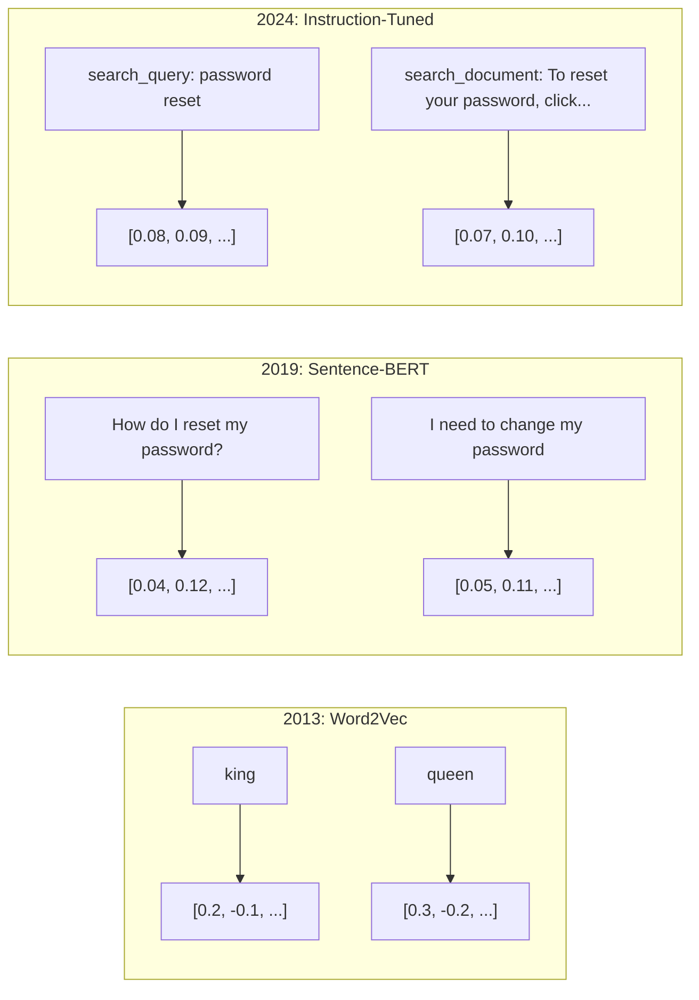
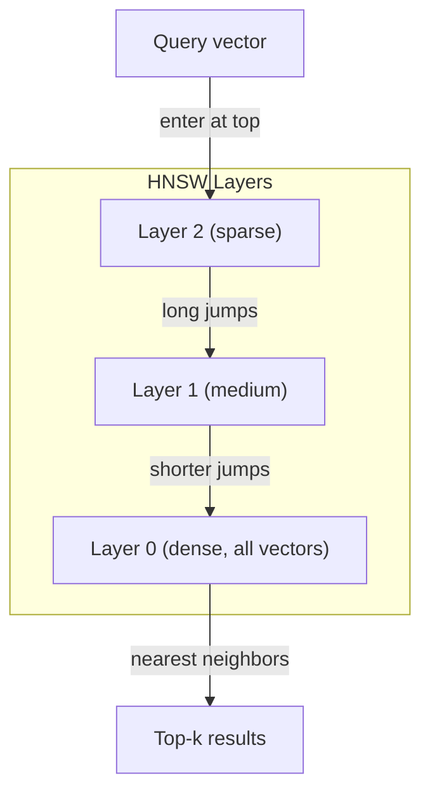

# 嵌入与向量表示

> 文本是离散的，数学是连续的。每次你让 LLM 寻找"相似"文档、比较含义或超越关键词进行搜索时，你都在依赖这两个世界之间的桥梁。这座桥梁就是嵌入（Embedding）。如果你不理解嵌入，你就不理解现代 AI。你只是在使用它。

**类型：** 构建
**语言：** Python
**前置要求：** 第 11 阶段，第 01 课（提示工程）
**时间：** 约 75 分钟
**相关：** 第 5 阶段 · 第 22 课（嵌入模型深入探讨）涵盖稠密 vs 稀疏 vs 多向量、Matryoshka 截断和逐轴模型选择。本课聚焦于生产流水线（向量数据库、HNSW、相似度数学）。在选择模型之前先阅读第 5 阶段 · 第 22 课。

## 学习目标

- 使用 API 提供商和开源模型生成文本嵌入（Embedding），并计算它们之间的余弦相似度
- 解释为什么嵌入解决了关键词搜索无法处理的词汇不匹配问题
- 构建一个语义搜索索引，通过含义而非精确关键词匹配检索文档
- 使用检索基准（precision@k、recall）评估嵌入质量，并为你的任务选择合适的嵌入模型

## 问题

你有 10,000 个支持工单。一位客户写道："我的支付没有成功。"你需要找到类似的历史工单。关键词搜索找到了包含"支付"和"没有成功"的工单。但它遗漏了"交易失败"、"扣款被拒绝"和"账单错误"。这些工单描述的是完全相同的的问题，但用的是完全不同的词语。

这就是词汇不匹配问题（vocabulary mismatch problem）。人类语言有数十种方式来表达相同的意思。关键词搜索将每个词视为没有含义的独立符号。它无法知道"被拒绝"和"没有成功"指的是同一个概念。

你需要一种文本表示方式，在其中含义而非拼写决定相似性。你需要一种将"我的支付没有成功"和"交易被拒绝"在某个数学空间中放得很近，同时将"我的付款准时到了"（尽管共享"付款"这个词）推得很远的方法。

这种表示就是嵌入。

## 概念

### 什么是嵌入？

嵌入是一个稠密浮点数向量，表示文本的含义。"稠密"这个词很重要——每个维度都携带信息，不同于稀疏表示（词袋模型、TF-IDF），后者大多数维度为零。

"The cat sat on the mat" 变成了类似 `[0.023, -0.041, 0.087, ..., 0.012]` 的东西——根据模型的不同，这是一个 768 到 3072 个数字的列表。这些数字编码了含义。你永远不会直接检查它们，你比较它们。

### Word2Vec 的突破

2013 年，Google 的 Tomas Mikolov 及其同事发表了 Word2Vec。核心洞察：训练一个神经网络从词的邻居预测词（或从词预测邻居），隐藏层的权重成为有意义的向量表示。

著名的结果：

```
king - man + woman = queen
```

词嵌入上的向量算术捕获了语义关系。从"man"到"woman"的方向大致与从"king"到"queen"的方向相同。这是该领域认识到几何可以编码含义的时刻。

Word2Vec 产生 300 维向量。每个词只有一个向量，不考虑上下文。"Bank"在"river bank（河岸）"和"bank account（银行账户）"中具有相同的嵌入。这一限制推动了接下来十年的研究。

### 从词到句子

词嵌入表示单个 token。生产系统需要嵌入整个句子、段落或文档。出现了四种方法：

**平均法（Averaging）**：取句子中所有词向量的均值。便宜、有损、对短文本来说出奇地不错。完全丢失了词序——"狗咬人"和"人咬狗"得到相同的嵌入。

**CLS token**：Transformer 模型（BERT, 2018）输出一个特殊的 [CLS] token 嵌入来表示整个输入。比平均法好，但 [CLS] token 是为下一句预测训练的，而非相似性。

**对比学习（Contrastive learning）**：显式训练模型将相似对推近，将不相似对推开。Sentence-BERT（Reimers & Gurevych, 2019）使用这种方法，成为现代嵌入模型的基础。给定"How do I reset my password?"和"I need to change my password"，模型学会这些应该具有几乎相同的向量。

**指令微调嵌入（Instruction-tuned embeddings）**：最新方法。E5 和 GTE 等模型接受一个任务前缀（"search_query:"、"search_document:"），告诉模型要生成什么类型的嵌入。这使一个模型服务于多个任务。



### 现代嵌入模型

市场已经稳定为少数几个生产级别的选项（截至 2026 年初的 MTEB 分数，MTEB v2）：

| 模型 | 提供商 | 维度 | MTEB | 上下文 | 成本/100 万 tokens |
|-------|----------|-----------|------|---------|------------------|
| Gemini Embedding 2 | Google | 3072（Matryoshka） | 67.7（检索） | 8192 | $0.15 |
| embed-v4 | Cohere | 1024（Matryoshka） | 65.2 | 128K | $0.12 |
| voyage-4 | Voyage AI | 1024/2048（Matryoshka） | 66.8 | 32K | $0.12 |
| text-embedding-3-large | OpenAI | 3072（Matryoshka） | 64.6 | 8192 | $0.13 |
| text-embedding-3-small | OpenAI | 1536（Matryoshka） | 62.3 | 8192 | $0.02 |
| BGE-M3 | BAAI | 1024（稠密+稀疏+ColBERT） | 63.0 多语言 | 8192 | 开源 |
| Qwen3-Embedding | 阿里巴巴 | 4096（Matryoshka） | 66.9 | 32K | 开源 |
| Nomic-embed-v2 | Nomic | 768（Matryoshka） | 63.1 | 8192 | 开源 |

MTEB（Massive Text Embedding Benchmark，大规模文本嵌入基准）v2 覆盖 100+ 个任务，涵盖检索、分类、聚类、重排序和摘要。越高越好。到 2026 年，开源模型（Qwen3-Embedding、BGE-M3）在大多数维度上已匹敌或超越闭源托管模型。Gemini Embedding 2 在纯检索上领先；Voyage/Cohere 在特定领域（金融、法律、代码）领先。在确定选择之前务必在自己的查询上做基准测试。

### 相似性度量

给定两个嵌入向量，有三种测量相似程度的方法：

**余弦相似度（Cosine similarity）**：两个向量之间角度的余弦值。范围从 -1（完全相反）到 1（完全相同方向）。忽略幅度——一个 10 词的句子和一个 500 词的文档如果指向相同方向可以得 1.0。这是 90% 用例的默认选择。

```
cosine_sim(a, b) = dot(a, b) / (||a|| * ||b||)
```

**点积（Dot product）**：两个向量的原始内积。当向量已归一化（单位长度）时与余弦相似度相同。计算更快。OpenAI 的嵌入是归一化的，所以点积和余弦给出相同的排序。

```
dot(a, b) = sum(a_i * b_i)
```

**欧几里得距离（Euclidean / L2 distance）**：向量空间中的直线距离。越小 = 越相似。对幅度差异敏感。当空间中绝对位置（而非仅方向）重要时使用。

```
L2(a, b) = sqrt(sum((a_i - b_i)^2))
```

何时使用哪种：

| 度量 | 何时使用 | 何时避免 |
|--------|----------|------------|
| 余弦相似度 | 比较不同长度的文本；大多数检索任务 | 幅度携带信息时 |
| 点积 | 嵌入已经归一化；最大化速度 | 向量幅度变化时 |
| 欧几里得距离 | 聚类；空间最近邻问题 | 比较长度差异极大的文档时 |

### 向量数据库与 HNSW

暴力相似度搜索将查询与每个存储的向量比较。在 100 万个向量的 1536 维空间中，每次查询需要 15 亿次乘法-加法操作。太慢了。

向量数据库通过近似最近邻（Approximate Nearest Neighbor, ANN）算法解决此问题。主导算法是 HNSW（Hierarchical Navigable Small World，层级可导航小世界）：

1. 构建一个多层向量图
2. 顶层是稀疏的——远距离聚类之间的长程连接
3. 底层是稠密的——邻近向量之间的细粒度连接
4. 搜索从顶层开始，贪婪下降以细化
5. 以 O(log n) 时间而非 O(n) 返回近似的 top-k 结果

HNSW 以小的准确率损失（通常 95-99% 召回率）换取巨大的速度提升。在 1000 万个向量中，暴力搜索需要秒级。HNSW 需要毫秒级。



生产选项：

| 数据库 | 类型 | 最适合 | 最大规模 |
|----------|------|----------|-----------|
| Pinecone | 托管 SaaS | 零运维生产 | 十亿级 |
| Weaviate | 开源 | 自托管、混合搜索 | 1 亿+ |
| Qdrant | 开源 | 高性能、过滤 | 1 亿+ |
| ChromaDB | 嵌入式 | 原型、本地开发 | 100 万 |
| pgvector | Postgres 扩展 | 已在使用 Postgres | 1000 万 |
| FAISS | 库 | 进程内、研究 | 10 亿+ |

### 分块策略

文档太长，无法作为单个向量嵌入。一份 50 页的 PDF 覆盖数十个主题——它的嵌入变成了所有内容的平均值，与任何具体内容都不相似。你将文档分割成块（chunks），分别嵌入每一个。

**固定大小分块（Fixed-size chunking）**：每 N 个 token 分割，带 M 个 token 的重叠。简单且可预测。当文档没有清晰结构时效果好。512 token 的块带 50 token 重叠：块 1 是 token 0-511，块 2 是 token 462-973。

**基于句子分块：**在句子边界处分割，将句子分组直到达到 token 限制。每个块至少包含一个完整句子。比固定大小更好，因为不会把一个意思切成两半。

**递归分块（Recursive chunking）**：先尝试在最大边界（章节标题）处分割。如果仍然太大，尝试段落边界。然后是句子边界。然后是字符限制。这是 LangChain 的 `RecursiveCharacterTextSplitter`，对混合格式语料库效果很好。

**语义分块（Semantic chunking）**：嵌入每个句子，然后将其嵌入相似的连续句子分组在一起。当嵌入相似度降至阈值以下时，开始新块。昂贵（需要单独嵌入每个句子），但产生最连贯的块。

| 策略 | 复杂度 | 质量 | 最适合 |
|----------|-----------|---------|----------|
| 固定大小 | 低 | 尚可 | 非结构化文本、日志 |
| 基于句子 | 低 | 好 | 文章、邮件 |
| 递归 | 中 | 好 | Markdown、HTML、混合文档 |
| 语义 | 高 | 最好 | 对检索质量要求极高的场景 |

大多数系统的甜区：256-512 token 的块带 50 token 重叠。

### 双编码器 vs 交叉编码器

双编码器（Bi-encoder）独立嵌入查询和文档，然后比较向量。快——你嵌入查询一次，与预先计算的文档嵌入比较。这是你用于检索的方式。

交叉编码器（Cross-encoder）将查询和文档作为单一输入，输出相关性分数。慢——它通过完整模型处理每个查询-文档对。但准确得多，因为它可以同时在查询和文档 token 之间进行注意力。

生产模式：双编码器检索 top-100 候选，交叉编码器重排序为 top-10。这就是检索-然后-重排序（retrieve-then-rerank）流水线。


重排序模型：Cohere Rerank 3.5（每 1000 次查询 $2）、BGE-reranker-v2（免费、开源）、Jina Reranker v2（免费、开源）。

### Matryoshka 嵌入

传统嵌入是全有或全无的。一个 1536 维的向量使用 1536 个浮点数。你不能在未重新训练的情况下截断到 256 维。

Matryoshka 表示学习（Kusupati et al., 2022）解决了这个问题。模型被训练为使得前 N 个维度捕获最重要的信息，就像俄罗斯套娃一样。将一个 1536 维的 Matryoshka 嵌入截断到 256 维会损失一些准确率，但仍保持功能。

OpenAI 的 text-embedding-3-small 和 text-embedding-3-large 通过 `dimensions` 参数支持 Matryoshka 截断。请求 256 维而非 1536 维将存储减少 6 倍，在 MTEB 基准上大约损失 3-5% 的准确率。

### 二值量化

一个以 float32 存储的 1536 维嵌入占 6,144 字节。乘以 1000 万文档：仅向量就 61 GB。

二值量化（Binary quantization）将每个浮点数转换为单个比特：正值变为 1，负值变为 0。存储从 6,144 字节降至 192 字节——减少 32 倍。相似度使用汉明距离（计算不同比特的数量）来计算，CPU 可在单条指令中完成。

检索召回率上的准确率损失约为 5-10%。常见模式：二值量化用于超过数百万向量的第一遍搜索，然后用全精度向量对 top-1000 重新评分。这以 32 倍更少的内存获得 95%+ 的全精度准确率。

```figure
cosine-similarity
```

## 构建它

我们从头构建一个语义搜索引擎。不使用向量数据库，不使用外部嵌入 API。纯 Python + numpy 进行数学计算。

### 步骤 1：文本分块

```python
def chunk_text(text, chunk_size=200, overlap=50):
    words = text.split()
    chunks = []
    start = 0
    while start < len(words):
        end = start + chunk_size
        chunk = " ".join(words[start:end])
        chunks.append(chunk)
        start += chunk_size - overlap
    return chunks


def chunk_by_sentences(text, max_chunk_tokens=200):
    sentences = text.replace("\n", " ").split(".")
    sentences = [s.strip() + "." for s in sentences if s.strip()]
    chunks = []
    current_chunk = []
    current_length = 0
    for sentence in sentences:
        sentence_length = len(sentence.split())
        if current_length + sentence_length > max_chunk_tokens and current_chunk:
            chunks.append(" ".join(current_chunk))
            current_chunk = []
            current_length = 0
        current_chunk.append(sentence)
        current_length += sentence_length
    if current_chunk:
        chunks.append(" ".join(current_chunk))
    return chunks
```

### 步骤 2：从零构建嵌入

我们使用带 L2 归一化的 TF-IDF 实现一个简单的稠密嵌入。这不是神经网络嵌入，但它遵循相同的契约：文本输入，固定大小向量输出，相似文本产生相似向量。

```python
import math
import numpy as np
from collections import Counter

class SimpleEmbedder:
    def __init__(self):
        self.vocab = []
        self.idf = []
        self.word_to_idx = {}

    def fit(self, documents):
        vocab_set = set()
        for doc in documents:
            vocab_set.update(doc.lower().split())
        self.vocab = sorted(vocab_set)
        self.word_to_idx = {w: i for i, w in enumerate(self.vocab)}
        n = len(documents)
        self.idf = np.zeros(len(self.vocab))
        for i, word in enumerate(self.vocab):
            doc_count = sum(1 for doc in documents if word in doc.lower().split())
            self.idf[i] = math.log((n + 1) / (doc_count + 1)) + 1

    def embed(self, text):
        words = text.lower().split()
        count = Counter(words)
        total = len(words) if words else 1
        vec = np.zeros(len(self.vocab))
        for word, freq in count.items():
            if word in self.word_to_idx:
                tf = freq / total
                vec[self.word_to_idx[word]] = tf * self.idf[self.word_to_idx[word]]
        norm = np.linalg.norm(vec)
        if norm > 0:
            vec = vec / norm
        return vec
```

### 步骤 3：相似性函数

```python
def cosine_similarity(a, b):
    dot = np.dot(a, b)
    norm_a = np.linalg.norm(a)
    norm_b = np.linalg.norm(b)
    if norm_a == 0 or norm_b == 0:
        return 0.0
    return float(dot / (norm_a * norm_b))


def dot_product(a, b):
    return float(np.dot(a, b))


def euclidean_distance(a, b):
    return float(np.linalg.norm(a - b))
```

### 步骤 4：带暴力搜索的向量索引

```python
class VectorIndex:
    def __init__(self):
        self.vectors = []
        self.texts = []
        self.metadata = []

    def add(self, vector, text, meta=None):
        self.vectors.append(vector)
        self.texts.append(text)
        self.metadata.append(meta or {})

    def search(self, query_vector, top_k=5, metric="cosine"):
        scores = []
        for i, vec in enumerate(self.vectors):
            if metric == "cosine":
                score = cosine_similarity(query_vector, vec)
            elif metric == "dot":
                score = dot_product(query_vector, vec)
            elif metric == "euclidean":
                score = -euclidean_distance(query_vector, vec)
            else:
                raise ValueError(f"Unknown metric: {metric}")
            scores.append((i, score))
        scores.sort(key=lambda x: x[1], reverse=True)
        results = []
        for idx, score in scores[:top_k]:
            results.append({
                "text": self.texts[idx],
                "score": score,
                "metadata": self.metadata[idx],
                "index": idx
            })
        return results

    def size(self):
        return len(self.vectors)
```

### 步骤 5：语义搜索引擎

```python
class SemanticSearchEngine:
    def __init__(self, chunk_size=200, overlap=50):
        self.embedder = SimpleEmbedder()
        self.index = VectorIndex()
        self.chunk_size = chunk_size
        self.overlap = overlap

    def index_documents(self, documents, source_names=None):
        all_chunks = []
        all_sources = []
        for i, doc in enumerate(documents):
            chunks = chunk_text(doc, self.chunk_size, self.overlap)
            all_chunks.extend(chunks)
            name = source_names[i] if source_names else f"doc_{i}"
            all_sources.extend([name] * len(chunks))
        self.embedder.fit(all_chunks)
        for chunk, source in zip(all_chunks, all_sources):
            vec = self.embedder.embed(chunk)
            self.index.add(vec, chunk, {"source": source})
        return len(all_chunks)

    def search(self, query, top_k=5, metric="cosine"):
        query_vec = self.embedder.embed(query)
        return self.index.search(query_vec, top_k, metric)

    def search_with_scores(self, query, top_k=5):
        results = self.search(query, top_k)
        return [
            {
                "text": r["text"][:200],
                "source": r["metadata"].get("source", "unknown"),
                "score": round(r["score"], 4)
            }
            for r in results
        ]
```

### 步骤 6：比较相似性度量

```python
def compare_metrics(engine, query, top_k=3):
    results = {}
    for metric in ["cosine", "dot", "euclidean"]:
        hits = engine.search(query, top_k=top_k, metric=metric)
        results[metric] = [
            {"score": round(h["score"], 4), "preview": h["text"][:80]}
            for h in hits
        ]
    return results
```

## 使用它

使用生产级嵌入 API 时，架构保持完全相同，只有嵌入器发生变化：

```python
from openai import OpenAI

client = OpenAI()

def openai_embed(texts, model="text-embedding-3-small", dimensions=None):
    kwargs = {"model": model, "input": texts}
    if dimensions:
        kwargs["dimensions"] = dimensions
    response = client.embeddings.create(**kwargs)
    return [item.embedding for item in response.data]
```

使用 OpenAI 的 Matryoshka 截断——相同模型，更少维度，更低存储：

```python
full = openai_embed(["semantic search query"], dimensions=1536)
compact = openai_embed(["semantic search query"], dimensions=256)
```

256 维向量使用 6 倍更少的存储。对于 1000 万个文档，这是 10 GB vs 61 GB。在标准基准上的准确率损失大约为 3-5%。

使用 Cohere 进行重排序：

```python
import cohere

co = cohere.ClientV2()

results = co.rerank(
    model="rerank-v3.5",
    query="What is the refund policy?",
    documents=["Full refund within 30 days...", "No refunds after 90 days..."],
    top_n=3
)
```

使用本地嵌入（无 API 依赖）：

```python
from sentence_transformers import SentenceTransformer

model = SentenceTransformer("BAAI/bge-small-en-v1.5")
embeddings = model.encode(["semantic search query", "another document"])
```

我们构建的 VectorIndex 类可以与以上任何一种配合使用。替换嵌入函数，保持搜索逻辑不变。

## 提交成果

本课产出：
- `outputs/prompt-embedding-advisor.md`——一个为特定用例选择嵌入模型和策略的提示
- `outputs/skill-embedding-patterns.md`——一个教授代理如何在生产中有效使用嵌入的技能

## 练习

1. **度量比较**：使用余弦相似度、点积和欧几里得距离对示例文档运行相同的 5 个查询。记录每种度量的 top-3 结果。哪些查询的度量结果不一致？为什么？

2. **分块大小实验**：分别用 50、100、200 和 500 个词的分块大小对示例文档建立索引。对每种大小运行 5 个查询并记录 top-1 相似度分数。绘制分块大小与检索质量的关系图。找出更大的分块开始损害性能的点。

3. **Matryoshka 模拟**：构建一个产生 500 维向量的 SimpleEmbedder。截断到 50、100、200 和 500 维。测量每次截断时检索召回率的退化。这模拟了 Matryoshka 行为，无需真实的训练技巧。

4. **二值量化**：从搜索引擎中获取嵌入，转换为二值（正数 = 1，负数 = 0），并实现汉明距离搜索。将 top-10 结果与全精度余弦相似度比较。测量重叠百分比。

5. **基于句子分块**：用 `chunk_by_sentences` 替换固定大小分块。运行相同的查询并比较检索分数。尊重句子边界是否改善了结果？

## 关键术语

| 术语 | 人们怎么说 | 它实际上意味着什么 |
|------|----------------|----------------------|
| 嵌入（Embedding） | "文本转数字" | 一个稠密向量，其中几何接近度编码了语义相似性 |
| Word2Vec | "原始嵌入" | 2013 年模型，通过预测上下文词学习词向量；证明了向量算术编码含义 |
| 余弦相似度 | "两个向量有多相似" | 向量之间角度的余弦值；1 = 相同方向，0 = 正交，-1 = 相反 |
| HNSW | "快速向量搜索" | 层级可导航小世界图——多层结构实现 O(log n) 近似最近邻搜索 |
| 双编码器（Bi-encoder） | "分别嵌入，快速比较" | 独立将查询和文档编码为向量；支持预计算和快速检索 |
| 交叉编码器（Cross-encoder） | "慢但准确的重排序器" | 将查询-文档对作为整体通过完整模型处理；准确率更高，无法预计算 |
| Matryoshka 嵌入 | "可截断向量" | 训练后嵌入的前 N 个维度捕获最重要信息，支持可变大小存储 |
| 二值量化（Binary quantization） | "1 比特嵌入" | 将浮点向量转换为二值（仅符号比特），通过汉明距离搜索实现 32 倍存储缩减 |
| 分块（Chunking） | "分割文档用于嵌入" | 将文档分解为 256-512 token 的片段，以便每个片段可以独立嵌入和检索 |
| 向量数据库 | "嵌入的搜索引擎" | 优化用于存储向量和执行大规模近似最近邻搜索的数据存储 |
| 对比学习（Contrastive learning） | "通过比较训练" | 将相似对的嵌入推近、将不相似对的嵌入推开的训练方法 |
| MTEB | "嵌入基准测试" | 大规模文本嵌入基准——56 个数据集，跨越 8 个任务；比较嵌入模型的标准 |

## 进一步阅读

- Mikolov et al., "Efficient Estimation of Word Representations in Vector Space" (2013) —— Word2Vec 论文，以 king-queen 类比开启了嵌入革命
- Reimers & Gurevych, "Sentence-BERT: Sentence Embeddings using Siamese BERT-Networks" (2019) —— 如何为句子级相似性训练双编码器，现代嵌入模型的基础
- Kusupati et al., "Matryoshka Representation Learning" (2022) —— OpenAI 为 text-embedding-3 采纳的可变维度嵌入技术
- Malkov & Yashunin, "Efficient and Robust Approximate Nearest Neighbor using Hierarchical Navigable Small World Graphs" (2018) —— HNSW 论文，大多数生产向量搜索的底层算法
- OpenAI 嵌入指南（platform.openai.com/docs/guides/embeddings） —— text-embedding-3 模型的实用参考，包括 Matryoshka 维度缩减
- MTEB 排行榜（huggingface.co/spaces/mteb/leaderboard） —— 实时基准，跨任务和语言比较所有嵌入模型
- [Muennighoff et al., "MTEB: Massive Text Embedding Benchmark" (EACL 2023)](https://arxiv.org/abs/2210.07316) —— 定义了排行榜报告的 8 个任务类别（分类、聚类、配对分类、重排序、检索、STS、摘要、双语挖掘）的基准；在信任任何单一 MTEB 分数之前阅读
- [Sentence Transformers 文档](https://www.sbert.net/) —— 双编码器 vs 交叉编码器、池化策略以及本课实现的摄取-分割-嵌入-存储 RAG 流水线的权威参考
