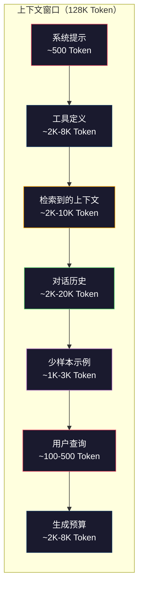
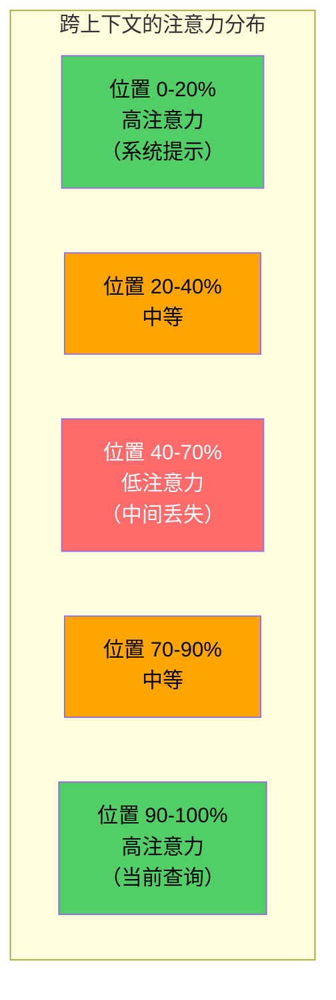
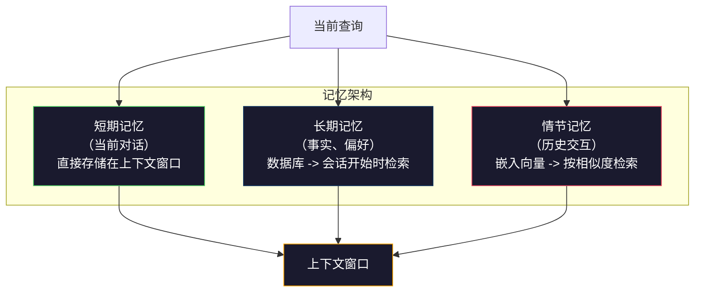

# 上下文工程：窗口、预算、记忆与检索

> 提示工程（Prompt Engineering）只是其中一部分。上下文工程（Context Engineering）才是全局。提示词是你输入的一段文本。上下文是进入模型窗口的所有内容：系统指令、检索到的文档、工具定义、对话历史、少样本示例，以及提示词本身。2026 年最优秀的 AI 工程师都是上下文工程师。他们决定什么该放进去、什么该留在外面、以什么顺序排列。

**类型：** 构建
**语言：** Python
**前置要求：** 第 10 阶段（从零构建 LLM）、第 11 阶段第 01-02 课
**时间：** ~90 分钟
**相关课程：** 第 11 阶段·第 15 课（提示缓存）——缓存友好的布局是上下文工程的延伸。第 5 阶段·第 28 课（长上下文评估）讲解如何使用 NIAH/RULER 衡量"中间丢失"问题。

## 学习目标

- 计算上下文窗口各组件（系统提示、工具、历史、检索文档、生成空间）的 Token 预算
- 实现上下文窗口管理策略：对话历史的截断（Truncation）、摘要（Summarization）和滑动窗口（Sliding Window）
- 对上下文组件进行优先级排序，使模型的注意力集中在最相关信息上
- 构建一个上下文组装器（Context Assembler），根据查询类型和可用窗口空间动态分配 Token

## 问题

Claude Opus 4.7 有 200K Token 的上下文窗口（Beta 版为 100 万）。GPT-5 有 400K。Gemini 3 Pro 有 200 万。Llama 4 声称有 1000 万。这些数字看起来很庞大——直到你把它们填满为止。

以下是一个编程助手的真实 Token 分配明细。系统提示：500 Token。50 个工具的工具定义：8,000 Token。检索到的文档：4,000 Token。对话历史（10 轮）：6,000 Token。当前用户查询：200 Token。生成预算（最大输出）：4,000 Token。合计：22,700 Token。这只占 128K 窗口的 18%。

但注意力并不随上下文长度线性扩展。一个拥有 128K Token 上下文的模型，其注意力成本是平方级别的（普通 Transformer 的复杂度为 O(n²)，不过大多数生产级模型使用高效注意力变体）。更重要的是，检索准确度会下降。"大海捞针"（Needle in a Haystack）测试表明，模型很难找到放在长上下文中间位置的信息。Liu 等人（2023）的研究表明，LLM 对长上下文开头和结尾处的信息检索准确度接近完美，但对放在中间位置（上下文的 40-70%）的信息，准确度会下降 10-20%。这种"中间丢失"（Lost-in-the-Middle）效应因模型而异，但影响所有当前架构。

实际经验是：拥有 200K Token 的可用空间并不意味着使用 200K Token 就是有效的。精心策划的 10K Token 上下文往往优于随意堆砌的 100K Token 上下文。上下文工程是一门在上下文窗口内最大化信噪比的学科。

你放进窗口中的每一个 Token，都会排挤掉一个可能携带更相关信息的 Token。每一个无关的工具定义、每一轮陈旧的对话、每一段不能回答问题的检索文本——每一项都会让模型在任务上表现得更差。

## 概念

### 上下文窗口是稀缺资源

把上下文窗口想象成内存（RAM），而非磁盘。它速度快、可直接访问，但容量有限。你无法装下所有东西，必须做出选择。



每个组件都在争夺空间。增加工具定义意味着减少对话历史的空间。增加检索上下文意味着减少少样本示例的空间。上下文工程就是分配这个预算以最大化任务表现的艺术。

### 中间丢失（Lost-in-the-Middle）

这是上下文工程中最重要的实证发现。模型对上下文开头和结尾的信息关注度更高，中间的信息则获得较低的注意力分数，更可能被忽略。

Liu 等人（2023）对此进行了系统测试。他们将一份相关文档放在 20 份不相关文档中的不同位置，并测量答案准确度。当相关文档位于第一位或最后一位时，准确度为 85-90%。当它位于中间（20 份中的第 10 位）时，准确度下降到 60-70%。

这直接产生了工程启示：

- 最重要的信息放在最前面（系统提示、关键指令）
- 当前查询和最相关的上下文放在最后面（近因效应有帮助）
- 将上下文中间部分视为最低优先级区域
- 如果必须在中间包含某些信息，在末尾重复一遍关键点



### 上下文组件

**系统提示**：设定角色、约束条件和行为规则。这部分放在最前面，且每次对话轮次保持不变。Claude Code 使用了大约 6,000 Token 的系统提示，包括工具定义和行为指令。保持简洁。系统提示中的每个词在每次 API 调用时都会被重复。

**工具定义**：每个工具会增加 50-200 Token（名称、描述、参数 schema）。50 个工具，每个 150 Token，在对话开始前就消耗了 7,500 Token。动态工具选择——仅包含与当前查询相关的工具——可以减少 60-80% 的工具 Token 消耗。

**检索到的上下文**：来自向量数据库的文档、搜索结果、文件内容。检索的质量直接决定回复的质量。糟糕的检索比不检索更糟——它用噪音填满窗口，并主动误导模型。

**对话历史**：每个之前的用户消息和助手回复。随对话长度线性增长。每轮 200 Token 的 50 轮对话就是 10,000 Token 历史。其中大部分与当前查询无关。

**少样本示例**：展示期望行为的输入/输出对。两到三个精心选择的示例通常比数千 Token 的指令更能提高输出质量，但它们也占用空间。

**生成预算**：为模型回复预留的 Token。如果你把窗口填满了，模型就没有回答的空间了。至少为生成预留 2,000-4,000 Token。

### 上下文压缩策略

**历史摘要**：不逐字保留所有历史轮次，而是定期对对话进行摘要。"我们讨论了 X，决定了 Y，用户想要 Z"用 100 Token 替代了消耗 2,000 Token 的 10 轮对话。当历史超过阈值（如 5,000 Token）时触发摘要。

**相关性过滤**：针对当前查询对每个检索文档进行评分，丢弃低于阈值的文档。如果你检索到 10 个块但只有 3 个相关，丢弃其余 7 个。3 个高度相关的块比 10 个平庸的块好。

**工具剪枝**：对用户查询意图进行分类，仅包含与该意图相关的工具。代码问题不需要日历工具。日程安排问题不需要文件系统工具。这可以将工具定义从 8,000 Token 减少到 1,000 Token。

**递归摘要**：对于非常长的文档，分阶段进行摘要。先总结每个章节，再总结摘要的摘要。一份 50 页的文档可以变成一个 500 Token 的摘要，捕获关键要点。

### 记忆系统

上下文工程涵盖三个时间跨度。

**短期记忆**：当前对话。直接存储在上下文窗口中。随每轮对话增长。通过摘要和截断进行管理。

**长期记忆**：跨对话持续存在的事实和偏好。"用户偏好 TypeScript。""项目使用 PostgreSQL。"存储在数据库中，在会话开始时检索。Claude Code 将其存储在 CLAUDE.md 文件中。ChatGPT 将其存储在其记忆功能中。

**情节记忆**：可能相关的特定历史交互。"上周二，我们在 auth 模块中调试了一个类似的问题。"以嵌入向量形式存储，在当前对话与过去情节匹配时进行检索。



### 动态上下文组装

核心洞察：不同的查询需要不同的上下文。静态的系统提示 + 静态的工具 + 静态的历史是浪费的。最好的系统会针对每个查询动态组装上下文。

1. 对查询意图进行分类
2. 选择相关工具（而非所有工具）
3. 检索相关文档（而非固定集合）
4. 包含相关历史轮次（而非所有历史）
5. 添加与任务类型匹配的少样本示例
6. 按重要性排序：关键信息在最前面，重要信息在最后面，可选信息在中间

这就是区分优秀 AI 应用和卓越 AI 应用的分水岭。模型是相同的，上下文才是差异化的关键。

## 构建

### 步骤 1：Token 计数

无法衡量就谈不上预算管理。构建一个简单的 Token 计数工具（使用空格分词做近似，因为精确计数取决于分词器）。

```python
import json
import numpy as np
from collections import OrderedDict

def count_tokens(text):
    if not text:
        return 0
    return int(len(text.split()) * 1.3)

def count_tokens_json(obj):
    return count_tokens(json.dumps(obj))
```

### 步骤 2：上下文预算管理器

核心抽象。预算管理器跟踪每个组件使用了多少 Token 并强制执行限制。

```python
class ContextBudget:
    def __init__(self, max_tokens=128000, generation_reserve=4000):
        self.max_tokens = max_tokens
        self.generation_reserve = generation_reserve
        self.available = max_tokens - generation_reserve
        self.allocations = OrderedDict()

    def allocate(self, component, content, max_tokens=None):
        tokens = count_tokens(content)
        if max_tokens and tokens > max_tokens:
            words = content.split()
            target_words = int(max_tokens / 1.3)
            content = " ".join(words[:target_words])
            tokens = count_tokens(content)

        used = sum(self.allocations.values())
        if used + tokens > self.available:
            allowed = self.available - used
            if allowed <= 0:
                return None, 0
            words = content.split()
            target_words = int(allowed / 1.3)
            content = " ".join(words[:target_words])
            tokens = count_tokens(content)

        self.allocations[component] = tokens
        return content, tokens

    def remaining(self):
        used = sum(self.allocations.values())
        return self.available - used

    def utilization(self):
        used = sum(self.allocations.values())
        return used / self.max_tokens

    def report(self):
        total_used = sum(self.allocations.values())
        lines = []
        lines.append(f"Context Budget Report ({self.max_tokens:,} token window)")
        lines.append("-" * 50)
        for component, tokens in self.allocations.items():
            pct = tokens / self.max_tokens * 100
            bar = "#" * int(pct / 2)
            lines.append(f"  {component:<25} {tokens:>6} tokens ({pct:>5.1f}%) {bar}")
        lines.append("-" * 50)
        lines.append(f"  {'Used':<25} {total_used:>6} tokens ({total_used/self.max_tokens*100:.1f}%)")
        lines.append(f"  {'Generation reserve':<25} {self.generation_reserve:>6} tokens")
        lines.append(f"  {'Remaining':<25} {self.remaining():>6} tokens")
        return "\n".join(lines)
```

### 步骤 3：中间丢失重排序

实现重排序策略：最重要的条目放在最前面和最后面，最不重要的放在中间。

```python
def reorder_lost_in_middle(items, scores):
    paired = sorted(zip(scores, items), reverse=True)
    sorted_items = [item for _, item in paired]

    if len(sorted_items) <= 2:
        return sorted_items

    first_half = sorted_items[::2]
    second_half = sorted_items[1::2]
    second_half.reverse()

    return first_half + second_half

def score_relevance(query, documents):
    query_words = set(query.lower().split())
    scores = []
    for doc in documents:
        doc_words = set(doc.lower().split())
        if not query_words:
            scores.append(0.0)
            continue
        overlap = len(query_words & doc_words) / len(query_words)
        scores.append(round(overlap, 3))
    return scores
```

### 步骤 4：对话历史压缩器

摘要旧的对话轮次以回收 Token 预算。

```python
class ConversationManager:
    def __init__(self, max_history_tokens=5000):
        self.turns = []
        self.summaries = []
        self.max_history_tokens = max_history_tokens

    def add_turn(self, role, content):
        self.turns.append({"role": role, "content": content})
        self._compress_if_needed()

    def _compress_if_needed(self):
        total = sum(count_tokens(t["content"]) for t in self.turns)
        if total <= self.max_history_tokens:
            return

        while total > self.max_history_tokens and len(self.turns) > 4:
            old_turns = self.turns[:2]
            summary = self._summarize_turns(old_turns)
            self.summaries.append(summary)
            self.turns = self.turns[2:]
            total = sum(count_tokens(t["content"]) for t in self.turns)

    def _summarize_turns(self, turns):
        parts = []
        for t in turns:
            content = t["content"]
            if len(content) > 100:
                content = content[:100] + "..."
            parts.append(f"{t['role']}: {content}")
        return "Previous: " + " | ".join(parts)

    def get_context(self):
        parts = []
        if self.summaries:
            parts.append("[Conversation Summary]")
            for s in self.summaries:
                parts.append(s)
        parts.append("[Recent Conversation]")
        for t in self.turns:
            parts.append(f"{t['role']}: {t['content']}")
        return "\n".join(parts)

    def token_count(self):
        return count_tokens(self.get_context())
```

### 步骤 5：动态工具选择器

仅包含与当前查询相关的工具。先分类意图，再进行过滤。

```python
TOOL_REGISTRY = {
    "read_file": {
        "description": "Read contents of a file",
        "tokens": 120,
        "categories": ["code", "files"],
    },
    "write_file": {
        "description": "Write content to a file",
        "tokens": 150,
        "categories": ["code", "files"],
    },
    "search_code": {
        "description": "Search for patterns in codebase",
        "tokens": 130,
        "categories": ["code"],
    },
    "run_command": {
        "description": "Execute a shell command",
        "tokens": 140,
        "categories": ["code", "system"],
    },
    "create_calendar_event": {
        "description": "Create a new calendar event",
        "tokens": 180,
        "categories": ["calendar"],
    },
    "list_emails": {
        "description": "List recent emails",
        "tokens": 160,
        "categories": ["email"],
    },
    "send_email": {
        "description": "Send an email message",
        "tokens": 200,
        "categories": ["email"],
    },
    "web_search": {
        "description": "Search the web for information",
        "tokens": 140,
        "categories": ["research"],
    },
    "query_database": {
        "description": "Run a SQL query on the database",
        "tokens": 170,
        "categories": ["code", "data"],
    },
    "generate_chart": {
        "description": "Generate a chart from data",
        "tokens": 190,
        "categories": ["data", "visualization"],
    },
}

def classify_intent(query):
    query_lower = query.lower()

    intent_keywords = {
        "code": ["code", "function", "bug", "error", "file", "implement", "refactor", "debug", "test"],
        "calendar": ["meeting", "schedule", "calendar", "appointment", "event"],
        "email": ["email", "mail", "send", "inbox", "message"],
        "research": ["search", "find", "what is", "how does", "explain", "look up"],
        "data": ["data", "query", "database", "chart", "graph", "analytics", "sql"],
    }

    scores = {}
    for intent, keywords in intent_keywords.items():
        score = sum(1 for kw in keywords if kw in query_lower)
        if score > 0:
            scores[intent] = score

    if not scores:
        return ["code"]

    max_score = max(scores.values())
    return [intent for intent, score in scores.items() if score >= max_score * 0.5]

def select_tools(query, token_budget=2000):
    intents = classify_intent(query)
    relevant = {}
    total_tokens = 0

    for name, tool in TOOL_REGISTRY.items():
        if any(cat in intents for cat in tool["categories"]):
            if total_tokens + tool["tokens"] <= token_budget:
                relevant[name] = tool
                total_tokens += tool["tokens"]

    return relevant, total_tokens
```

### 步骤 6：完整上下文组装流水线

将所有组件串联起来。给定一个查询，动态组装最优上下文。

```python
class ContextEngine:
    def __init__(self, max_tokens=128000, generation_reserve=4000):
        self.budget = ContextBudget(max_tokens, generation_reserve)
        self.conversation = ConversationManager(max_history_tokens=5000)
        self.system_prompt = (
            "You are a helpful AI assistant. You have access to tools for "
            "code editing, file management, web search, and data analysis. "
            "Use the appropriate tools for each task. Be concise and accurate."
        )
        self.knowledge_base = [
            "Python 3.12 introduced type parameter syntax for generic classes using bracket notation.",
            "The project uses PostgreSQL 16 with pgvector for embedding storage.",
            "Authentication is handled by Supabase Auth with JWT tokens.",
            "The frontend is built with Next.js 15 using the App Router.",
            "API rate limits are set to 100 requests per minute per user.",
            "The deployment pipeline uses GitHub Actions with Docker multi-stage builds.",
            "Test coverage must be above 80% for all new modules.",
            "The codebase follows the repository pattern for data access.",
        ]

    def assemble(self, query):
        self.budget = ContextBudget(self.budget.max_tokens, self.budget.generation_reserve)

        system_content, _ = self.budget.allocate("system_prompt", self.system_prompt, max_tokens=1000)

        tools, tool_tokens = select_tools(query, token_budget=2000)
        tool_text = json.dumps(list(tools.keys()))
        tool_content, _ = self.budget.allocate("tools", tool_text, max_tokens=2000)

        relevance = score_relevance(query, self.knowledge_base)
        threshold = 0.1
        relevant_docs = [
            doc for doc, score in zip(self.knowledge_base, relevance)
            if score >= threshold
        ]

        if relevant_docs:
            doc_scores = [s for s in relevance if s >= threshold]
            reordered = reorder_lost_in_middle(relevant_docs, doc_scores)
            doc_text = "\n".join(reordered)
            doc_content, _ = self.budget.allocate("retrieved_context", doc_text, max_tokens=3000)

        history_text = self.conversation.get_context()
        if history_text.strip():
            history_content, _ = self.budget.allocate("conversation_history", history_text, max_tokens=5000)

        query_content, _ = self.budget.allocate("user_query", query, max_tokens=500)

        return self.budget

    def chat(self, query):
        self.conversation.add_turn("user", query)
        budget = self.assemble(query)
        response = f"[Response to: {query[:50]}...]"
        self.conversation.add_turn("assistant", response)
        return budget


def run_demo():
    print("=" * 60)
    print("  Context Engineering Pipeline Demo")
    print("=" * 60)

    engine = ContextEngine(max_tokens=128000, generation_reserve=4000)

    print("\n--- Query 1: Code task ---")
    budget = engine.chat("Fix the bug in the authentication module where JWT tokens expire too early")
    print(budget.report())

    print("\n--- Query 2: Research task ---")
    budget = engine.chat("What is the best approach for implementing vector search in PostgreSQL?")
    print(budget.report())

    print("\n--- Query 3: After conversation history builds up ---")
    for i in range(8):
        engine.conversation.add_turn("user", f"Follow-up question number {i+1} about the implementation details of the system")
        engine.conversation.add_turn("assistant", f"Here is the response to follow-up {i+1} with technical details about the architecture")

    budget = engine.chat("Now implement the changes we discussed")
    print(budget.report())

    print("\n--- Tool Selection Examples ---")
    test_queries = [
        "Fix the bug in auth.py",
        "Schedule a meeting with the team for Tuesday",
        "Show me the database query performance stats",
        "Search for best practices on error handling",
    ]

    for q in test_queries:
        tools, tokens = select_tools(q)
        intents = classify_intent(q)
        print(f"\n  Query: {q}")
        print(f"  Intents: {intents}")
        print(f"  Tools: {list(tools.keys())} ({tokens} tokens)")

    print("\n--- Lost-in-the-Middle Reordering ---")
    docs = ["Doc A (most relevant)", "Doc B (somewhat relevant)", "Doc C (least relevant)",
            "Doc D (relevant)", "Doc E (moderately relevant)"]
    scores = [0.95, 0.60, 0.20, 0.80, 0.50]
    reordered = reorder_lost_in_middle(docs, scores)
    print(f"  Original order: {docs}")
    print(f"  Scores:         {scores}")
    print(f"  Reordered:      {reordered}")
    print(f"  (Most relevant at start and end, least relevant in middle)")
```

## 使用

### Claude Code 的上下文策略

Claude Code 采用分层方法管理上下文。系统提示包含行为规则和工具定义（约 6K Token）。当你打开一个文件时，其内容被注入到上下文。当你搜索时，结果被添加进去。旧的对话轮次被摘要处理。CLAUDE.md 提供跨会话持续存在的长期记忆。

关键的工程决策：Claude Code 不将你的整个代码库倾倒进上下文，而是按需检索相关文件。这就是实践中的上下文工程。

### Cursor 的动态上下文加载

Cursor 将你的整个代码库索引为嵌入向量。当你输入查询时，它使用向量相似度检索最相关的文件和代码块。只有这些部分进入上下文窗口。一个 50 万行的代码库被压缩为 5-10 个最相关的代码块。

这就是模式：嵌入一切，按需检索，只包含相关的内容。

### ChatGPT 记忆（Memory）

ChatGPT 将用户偏好和事实存储为长期记忆。每次对话开始时，相关记忆被检索并包含在系统提示中。"用户偏好 Python"只消耗 5 Token，但避免了跨对话重复指令所耗费的数百 Token。

### RAG 作为上下文工程

检索增强生成（Retrieval-Augmented Generation，简称 RAG）是形式化的上下文工程。与其将知识塞进模型权重（训练）或塞进系统提示（静态上下文），不如在查询时检索相关文档并将其注入上下文窗口。整个 RAG 流水线——切块（Chunking）、嵌入（Embedding）、检索（Retrieval）、重排序（Reranking）——都是为了解决一个问题：将正确的信息放入上下文窗口。

## 交付物

本课程产出 `outputs/prompt-context-optimizer.md`——一个可复用的提示词，用于审计上下文组装策略并推荐优化方案。向它提供你的系统提示、工具数量、平均历史长度和检索策略，它会识别 Token 浪费并提出改进建议。

还产出 `outputs/skill-context-engineering.md`——一个决策框架，基于任务类型、上下文窗口大小和延迟预算来设计上下文组装流水线。

## 练习

1. 向 `ContextBudget` 类添加一个"Token 浪费检测器"。它应标记使用超过预算 30% 的组件，并建议针对每种组件类型的压缩策略（摘要历史、剪枝工具、重新排序文档）。

2. 为检索到的上下文实现语义去重。如果两个检索到的文档相似度超过 80%（通过单词重叠或嵌入向量的余弦相似度衡量），仅保留评分更高的那个。测量这能回收多少 Token 预算。

3. 构建一个"上下文回放"工具。给定一个对话记录，通过 `ContextEngine` 回放它，可视化每轮对话中预算分配的变化。按时间绘制每个组件的 Token 使用情况。识别上下文开始被压缩的轮次。

4. 实现基于优先级的工具选择器。替代二元的包含/排除方式，为每个工具分配一个对当前查询的相关性分数。按相关性降序包含工具，直到工具预算耗尽。比较包含 5、10、20 和 50 个工具时的任务表现。

5. 构建一个多策略上下文压缩器。实现三种压缩策略（截断、摘要、关键句提取），并在 20 份文档上对它们进行基准测试。衡量压缩率与信息保留率之间的权衡（压缩版本是否仍然包含查询的答案？）。

## 关键术语

| 术语 | 人们的说法 | 实际含义 |
|------|----------|--------|
| 上下文窗口（Context Window） | "模型能读到多少" | 模型在单次前向传播中能处理的最大 Token 数（输入 + 输出）——GPT-5 为 400K，Claude Opus 4.7 为 200K（Beta 版 100 万），Gemini 3 Pro 为 200 万 |
| 上下文工程（Context Engineering） | "高级提示工程" | 决定什么内容进入上下文窗口、以什么顺序、以什么优先级的学科——涵盖检索、压缩、工具选择和记忆管理 |
| 中间丢失（Lost-in-the-Middle） | "模型会忘记中间的东西" | LLM 对上下文开头和结尾关注度更高的实证发现，位于中间位置的信息准确度会下降 10-20% |
| Token 预算（Token Budget） | "你还剩多少 Token" | 跨组件（系统提示、工具、历史、检索、生成）显式分配上下文窗口容量，并有每个组件的限制 |
| 动态上下文（Dynamic Context） | "动态加载内容" | 基于意图分类、相关工具选择和检索结果，为每个查询差异化组装上下文窗口 |
| 历史摘要（History Summarization） | "压缩对话" | 用简洁的摘要替代逐字逐句的旧对话轮次，在保留关键信息的同时降低 Token 成本 |
| 工具剪枝（Tool Pruning） | "只包含相关工具" | 对查询意图进行分类，仅包含匹配的工具定义，可减少 60-80% 的工具 Token 成本 |
| 长期记忆（Long-Term Memory） | "跨会话记住信息" | 存储在数据库中、在会话开始时检索的事实和偏好——CLAUDE.md、ChatGPT Memory 及类似系统 |
| 情节记忆（Episodic Memory） | "记住特定的过去事件" | 将过去的交互存储为嵌入向量，在当前查询与过去的对话相似时检索 |
| 生成预算（Generation Budget） | "留给回答的空间" | 为模型输出预留的 Token——如果上下文完全填满窗口，模型就没有空间来回复 |

## 进一步阅读

- [Liu et al., 2023 -- "Lost in the Middle: How Language Models Use Long Contexts"](https://arxiv.org/abs/2307.03172)——关于位置依赖注意力的权威研究，表明模型在长上下文的中间位置处理信息时存在困难
- [Anthropic's Contextual Retrieval blog post](https://www.anthropic.com/news/contextual-retrieval)——Anthropic 如何进行上下文感知的块检索，将检索失败率降低了 49%
- [Simon Willison's "Context Engineering"](https://simonwillison.net/2025/Jun/27/context-engineering/)——命名该学科并将其与提示工程区分开的博客文章
- [LangChain documentation on RAG](https://python.langchain.com/docs/tutorials/rag/)——检索增强生成作为上下文工程模式的实践实现
- [Greg Kamradt's Needle in a Haystack test](https://github.com/gkamradt/LLMTest_NeedleInAHaystack)——揭示所有主流模型存在位置依赖检索失败的基准测试
- [Pope et al., "Efficiently Scaling Transformer Inference" (2022)](https://arxiv.org/abs/2211.05102)——为什么上下文长度驱动内存和延迟，以及 KV Cache、MQA 和 GQA 如何改变预算计算
- [Agrawal et al., "SARATHI: Efficient LLM Inference by Piggybacking Decodes with Chunked Prefills" (2023)](https://arxiv.org/abs/2308.16369)——推理的两个阶段，使长提示在 TTFT 上昂贵但在 TPOT 上便宜；上下文打包权衡的底层原理
- [Ainslie et al., "GQA: Training Generalized Multi-Query Transformer Models from Multi-Head Checkpoints" (EMNLP 2023)](https://arxiv.org/abs/2305.13245)——分组查询注意力论文，在不损失质量的情况下将生产级解码器的 KV 内存减少了 8 倍
