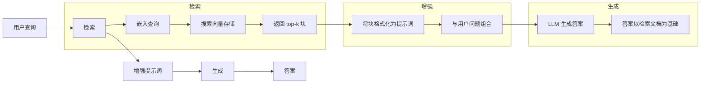
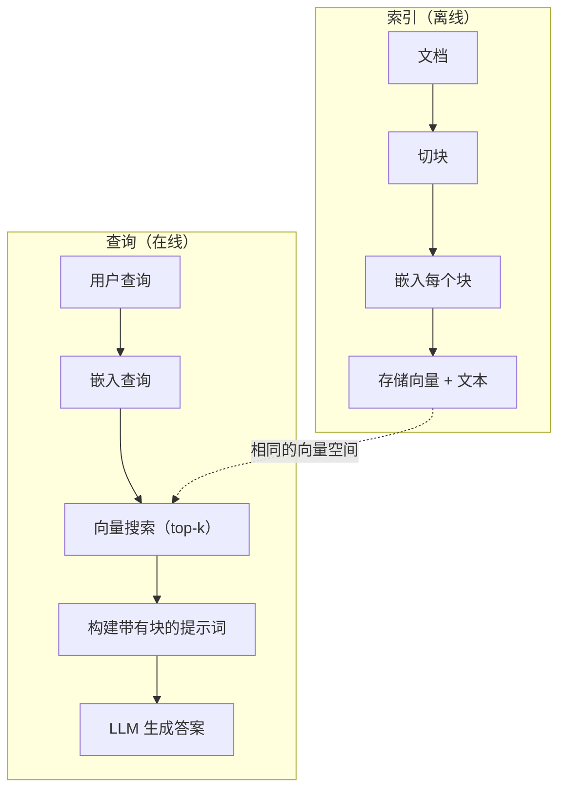

# RAG（检索增强生成）

> 你的 LLM 知道截止训练日期之前的一切。但它对你的公司文档、代码库或上周的会议记录一无所知。RAG 通过检索相关文档并将其填入提示词来解决这个问题。这是生产级 AI 中部署最广泛的模式。如果你从这门课程中只构建一样东西，那就构建一个 RAG 流水线。

**类型：** 构建
**语言：** Python
**前置要求：** 第 10 阶段（从零构建 LLM）、第 11 阶段第 01-05 课
**时间：** ~90 分钟
**相关课程：** 第 5 阶段·第 23 课（RAG 的切块策略）介绍六种切块算法以及各自适用场景。第 5 阶段·第 22 课（嵌入模型深入解析）讲解如何选择嵌入模型。第 11 阶段·第 7 课（进阶 RAG）介绍混合搜索、重排序和查询变换。

## 学习目标

- 构建完整的 RAG 流水线：文档加载、切块（Chunking）、嵌入（Embedding）、向量存储、检索和生成
- 使用向量数据库（ChromaDB、FAISS 或 Pinecone）实现语义搜索，并配置适当的索引
- 解释为何对知识密集型应用来说 RAG 优于微调（Fine-tuning）（成本、时效性、可溯源）
- 使用检索指标（精确率 Precision、召回率 Recall）和生成指标（忠实度 Faithfulness、相关性 Relevance）评估 RAG 质量

## 问题

你为公司构建了一个聊天机器人。客户问："企业计划的退款政策是什么？"LLM 给出了关于典型 SaaS 退款政策的通用回答。但真正的政策——深藏在 200 页的内部维基百科中——规定企业客户可享受 60 天的按比例退款窗口。LLM 从未见过这份文档。它无法知道自己没有接受过训练的知识。

微调是一种解决方案。用你的内部文档训练 LLM，然后部署更新后的模型。这确实有效，但存在严重问题。微调在算力上要花费数千美元。文档一旦变化，模型就会过时。你无法知道模型借鉴了哪个来源。如果公司下个月收购了另一个产品线，你得再次微调。

RAG 是另一种解决方案。保持模型不动。当问题到来时，在文档库中搜索相关段落，将它们粘贴到提示词中问题之前，让模型以这些段落为上下文作答。文档库可以在几分钟内更新。你可以准确知道检索了哪些文档。模型本身永不改变。这就是为什么 RAG 是生产环境中的主流模式：它更便宜、更新更及时、更可审计，并且适用于任何 LLM。

## 概念

### RAG 模式

整个模式可概括为四个步骤：



查询 -> 检索 -> 增强提示词 -> 生成。每个 RAG 系统都遵循这个模式。生产级 RAG 系统之间的差异在于每个步骤的细节：你如何切块、如何嵌入、如何搜索以及如何构建提示词。

### 为什么 RAG 优于微调

| 关注点 | 微调 | RAG |
|--------|------|----|
| 成本 | 每次训练运行 $1,000-$100,000+ | 每次查询 $0.01-$0.10（嵌入 + LLM） |
| 时效性 | 在重新训练之前都是过时的 | 通过重新索引文档，数分钟内更新 |
| 可审计性 | 无法追溯答案到来源 | 可以展示确切的检索段落 |
| 幻觉 | 仍然会自由产生幻觉 | 以检索到的文档为依据 |
| 数据隐私 | 训练数据被编入权重 | 文档保留在你的向量存储中 |

微调永久性地改变模型的权重。RAG 临时性地改变模型的上下文。对于大多数应用来说，临时上下文正是你想要的。

微调胜出的唯一场景：当你需要模型采用特定的风格、语气或推理模式，而这些无法仅通过提示词实现时。对于事实知识检索，RAG 每次都赢。

### 嵌入模型

嵌入模型将文本转换为密集向量。相似的文本在这个高维空间中产生彼此靠近的向量。"如何重置密码？"和"我需要更改我的密码"尽管共享的单词很少，但产生几乎相同的向量。"猫坐在垫子上"则产生一个非常不同的向量。

常用嵌入模型（2026 年阵容——完整分析见第 5 阶段·第 22 课）：

| 模型 | 维度 | 提供商 | 备注 |
|------|------|--------|------|
| text-embedding-3-small | 1536（Matryoshka） | OpenAI | 大多数用例的最佳性价比 |
| text-embedding-3-large | 3072（Matryoshka） | OpenAI | 更高准确度，可裁剪至 256/512/1024 |
| Gemini Embedding 2 | 3072（Matryoshka） | Google | MTEB 检索排名最高；8K 上下文 |
| voyage-4 | 1024/2048（Matryoshka） | Voyage AI | 领域变体（代码、金融、法律） |
| Cohere embed-v4 | 1024（Matryoshka） | Cohere | 较强多语言能力，128K 上下文 |
| BGE-M3 | 1024（稠密 + 稀疏 + ColBERT） | BAAI（开放权重） | 一个模型三种视图 |
| Qwen3-Embedding | 4096（Matryoshka） | Alibaba（开放权重） | 开放权重中检索得分最高 |
| all-MiniLM-L6-v2 | 384 | 开放权重（Sentence Transformers） | 原型开发基线 |

在本课程中，我们使用 TF-IDF 构建自己的简单嵌入。不是因为 TF-IDF 是生产系统使用的工具，而是因为它让概念变得具体：文本进去，向量出来，相似文本产生相似向量。

### 向量相似度

给定两个向量，如何衡量相似度？有三种选择：

**余弦相似度（Cosine Similarity）**：两个向量之间夹角的余弦值。范围从 -1（完全相反）到 1（完全相同）。忽略大小，只关注方向。这是 RAG 的默认选择。

```
余弦相似度(a, b) = dot(a, b) / (||a|| * ||b||)
```

**点积（Dot Product）**：原始内积。长度更大的向量得分更高。当大小携带信息时（更长的文档可能更相关）很有用。

```
点积(a, b) = sum(a_i * b_i)
```

**L2（欧几里得）距离**：向量空间中的直线距离。距离越小越相似。对大小差异敏感。

```
L2(a, b) = sqrt(sum((a_i - b_i)^2))
```

余弦相似度是标准。它通过大小归一化优雅地处理不同长度的文档。当人们说"向量搜索"时，几乎总是指余弦相似度。

### 切块策略

文档太长，无法作为单个向量嵌入。一份 50 页的 PDF 可能产生非常糟糕的嵌入，因为它包含几十个主题。相反，你需要将文档分割成块（Chunk），单独嵌入每个块。

**固定大小切块**：每 N 个 Token 切分一次。简单且可预测。一个 512 Token 的块加上 50 Token 的重叠意味着块 1 是 Token 0-511，块 2 是 Token 462-973，以此类推。重叠确保你不会在不走运的边界处断开一个句子。

**语义切块**：在自然边界处切分。段落、章节或 Markdown 标题。每个块是一个连贯的意义单元。实现更复杂，但检索效果更好。

**递归切块**：尝试在最大的边界处先切分（章节标题）。如果章节仍然太大，在段落边界处切分。如果段落仍然太大，在句子边界处切分。这是 LangChain 的 `RecursiveCharacterTextSplitter` 方法，在实践中效果很好。

块大小比人们想象的要重要得多：

- 太小（64-128 Token）：每个块缺乏上下文。"上季度增长了 15%"如果没有指出"它"指代什么，就没有意义。
- 太大（2048+ Token）：每个块涵盖多个主题，稀释了相关性。当你搜索收入数据时，你会得到一个 10% 是关于收入、90% 是关于员工的块。
- 最佳点（256-512 Token）：有足够的上下文自成一体，又足够集中以保持相关性。

大多数生产级 RAG 系统使用 256-512 Token 的块大小加上 50 Token 的重叠。Anthropic 的 RAG 指南推荐这个范围。

### 向量数据库

一旦有了嵌入向量，你需要一个地方来存储和搜索它们。选项包括：

| 数据库 | 类型 | 最适合 |
|--------|------|--------|
| FAISS | 库（进程内） | 原型开发、小到中等数据集 |
| Chroma | 轻量级数据库 | 本地开发、小规模部署 |
| Pinecone | 托管服务 | 无需运维开销的生产环境 |
| Weaviate | 开源数据库 | 自托管生产环境 |
| pgvector | Postgres 扩展 | 已使用 Postgres 的场景 |
| Qdrant | 开源数据库 | 高性能自托管 |

本课程中，我们构建一个简单的内存向量存储。它在列表中存储向量并进行暴力余弦相似度搜索。这相当于采用扁平索引的 FAISS。它可以扩展到大约 10 万个向量，再大就会变慢。生产系统使用近似最近邻（ANN）算法，如 HNSW，在毫秒级内搜索数百万个向量。

### 完整流水线



索引阶段每个文档运行一次（或在文档更新时运行）。查询阶段在每次用户请求时运行。在生产环境中，索引可能处理数百万个文档，耗时数小时。查询必须在亚秒级内响应。

### 真实数据

大多数生产级 RAG 系统使用以下参数：

- **k = 5 到 10** 个检索块（每个查询）
- **块大小 = 256 到 512 Token**，50 Token 重叠
- **上下文预算**：每个查询 2,500-5,000 Token 的检索内容
- **总提示词**：~8,000-16,000 Token（系统提示 + 检索块 + 对话历史 + 用户查询）
- **嵌入维度**：384-3072，取决于模型
- **索引吞吐量**：使用 API 嵌入时每秒 100-1,000 个文档
- **查询延迟**：检索 50-200ms，生成 500-3000ms

```figure
rag-chunking
```

## 构建

### 步骤 1：文档切块

```python
def chunk_text(text, chunk_size=200, overlap=50):
    words = text.split()
    chunks = []
    start = 0
    while start < len(words):
        end = start + chunk_size
        chunk = " ".join(words[start:end])
        chunks.append(chunk)
        start += chunk_size - overlap
    return chunks
```

### 步骤 2：TF-IDF 嵌入

我们构建一个简单的嵌入函数。TF-IDF（词频-逆文档频率，Term Frequency-Inverse Document Frequency）不是神经嵌入，但它将文本转换为向量，能够捕捉单词的重要性。文档中的高频词获得较高的 TF（词频）。语料库中的稀有词获得较高的 IDF（逆文档频率）。两者的乘积产生一个向量，其中重要的、有区分度的词具有高值。

```python
import math
from collections import Counter

def build_vocabulary(documents):
    vocab = set()
    for doc in documents:
        vocab.update(doc.lower().split())
    return sorted(vocab)

def compute_tf(text, vocab):
    words = text.lower().split()
    count = Counter(words)
    total = len(words)
    return [count.get(word, 0) / total for word in vocab]

def compute_idf(documents, vocab):
    n = len(documents)
    idf = []
    for word in vocab:
        doc_count = sum(1 for doc in documents if word in doc.lower().split())
        idf.append(math.log((n + 1) / (doc_count + 1)) + 1)
    return idf

def tfidf_embed(text, vocab, idf):
    tf = compute_tf(text, vocab)
    return [t * i for t, i in zip(tf, idf)]
```

### 步骤 3：余弦相似度搜索

```python
def cosine_similarity(a, b):
    dot = sum(x * y for x, y in zip(a, b))
    norm_a = math.sqrt(sum(x * x for x in a))
    norm_b = math.sqrt(sum(x * x for x in b))
    if norm_a == 0 or norm_b == 0:
        return 0.0
    return dot / (norm_a * norm_b)

def search(query_embedding, stored_embeddings, top_k=5):
    scores = []
    for i, emb in enumerate(stored_embeddings):
        sim = cosine_similarity(query_embedding, emb)
        scores.append((i, sim))
    scores.sort(key=lambda x: x[1], reverse=True)
    return scores[:top_k]
```

### 步骤 4：构建提示词

这就是 RAG 中"增强"发生的环节。获取检索到的块，将它们格式化为提示词，并要求 LLM 基于提供的上下文进行回答。

```python
def build_rag_prompt(query, retrieved_chunks):
    context = "\n\n---\n\n".join(
        f"[Source {i+1}]\n{chunk}"
        for i, chunk in enumerate(retrieved_chunks)
    )
    return f"""Answer the question based ONLY on the following context.
If the context doesn't contain enough information, say "I don't have enough information to answer that."

Context:
{context}

Question: {query}

Answer:"""
```

### 步骤 5：完整的 RAG 流水线

```python
class RAGPipeline:
    def __init__(self):
        self.chunks = []
        self.embeddings = []
        self.vocab = []
        self.idf = []

    def index(self, documents):
        all_chunks = []
        for doc in documents:
            all_chunks.extend(chunk_text(doc))
        self.chunks = all_chunks
        self.vocab = build_vocabulary(all_chunks)
        self.idf = compute_idf(all_chunks, self.vocab)
        self.embeddings = [
            tfidf_embed(chunk, self.vocab, self.idf)
            for chunk in all_chunks
        ]

    def query(self, question, top_k=5):
        query_emb = tfidf_embed(question, self.vocab, self.idf)
        results = search(query_emb, self.embeddings, top_k)
        retrieved = [(self.chunks[i], score) for i, score in results]
        prompt = build_rag_prompt(
            question, [chunk for chunk, _ in retrieved]
        )
        return prompt, retrieved
```

### 步骤 6：生成（模拟）

在生产环境中，这里你会调用 LLM API。本课程中，我们通过从检索到的上下文中提取最相关的句子来模拟生成。

```python
def simple_generate(prompt, retrieved_chunks):
    query_words = set(prompt.lower().split("question:")[-1].split())
    best_sentence = ""
    best_score = 0
    for chunk in retrieved_chunks:
        for sentence in chunk.split("."):
            sentence = sentence.strip()
            if not sentence:
                continue
            words = set(sentence.lower().split())
            overlap = len(query_words & words)
            if overlap > best_score:
                best_score = overlap
                best_sentence = sentence
    return best_sentence if best_sentence else "I don't have enough information."
```

## 使用

使用真实的嵌入模型和 LLM，代码几乎不变：

```python
from openai import OpenAI

client = OpenAI()

def embed(text):
    response = client.embeddings.create(
        model="text-embedding-3-small",
        input=text
    )
    return response.data[0].embedding

def generate(prompt):
    response = client.chat.completions.create(
        model="gpt-4o-mini",
        messages=[{"role": "user", "content": prompt}],
        temperature=0
    )
    return response.choices[0].message.content
```

或者使用 Anthropic：

```python
import anthropic

client = anthropic.Anthropic()

def generate(prompt):
    response = client.messages.create(
        model="claude-sonnet-4-20250514",
        max_tokens=1024,
        messages=[{"role": "user", "content": prompt}]
    )
    return response.content[0].text
```

流水线是一样的。替换嵌入函数。替换生成函数。检索逻辑、切块、提示词构建——无论使用什么模型，这些全部相同。

对于规模化的向量存储，用适当的向量数据库替换暴力搜索：

```python
import chromadb

client = chromadb.Client()
collection = client.create_collection("my_docs")

collection.add(
    documents=chunks,
    ids=[f"chunk_{i}" for i in range(len(chunks))]
)

results = collection.query(
    query_texts=["What is the refund policy?"],
    n_results=5
)
```

Chroma 内部处理嵌入（默认使用 all-MiniLM-L6-v2），并将向量存储在本地数据库中。相同的模式，不同的底层实现。

## 交付物

本课程产出：
- `outputs/prompt-rag-architect.md`——一个为特定用例设计 RAG 系统的提示词
- `outputs/skill-rag-pipeline.md`——一个教授 Agent 如何构建和调试 RAG 流水线的技能

## 练习

1. 将 TF-IDF 嵌入替换为简单的词袋方法（Bag-of-Words，二进制：词存在为 1，不存在为 0）。在示例文档上比较检索质量。TF-IDF 应该表现更好，因为它对稀有词赋予更高权重。

2. 在同一个文档集上尝试不同的块大小：50、100、200 和 500 个词。对每个块大小，运行相同的 5 个查询，统计前 3 名结果中返回相关块的数量。找到检索质量达到峰值的 sweet spot。

3. 为每个块添加元数据（源文档名称、块位置）。修改提示词模板以包含来源标注，使 LLM 能够引用其来源。

4. 实现一个简单的评估：给定 10 个问题-答案对，通过 RAG 流水线运行每个问题，衡量检索到的块中包含答案的比例。这就是 k 处的检索召回率（Recall@k）。

5. 构建一个对话感知（Conversation-Aware）的 RAG 流水线：维护最近 3 次对话交换的历史记录，并将它们与检索到的块一起包含在提示词中。在询问定价后再问"那企业版呢？"这类追问时进行测试。

## 关键术语

| 术语 | 人们的说法 | 实际含义 |
|------|----------|--------|
| RAG | "能读取你文档的 AI" | 检索相关文档，将它们粘贴到提示词中，并生成以这些文档为依据的答案 |
| 嵌入（Embedding） | "将文本转换为数字" | 文本的密集向量表示，相似的含义产生相似的向量 |
| 向量数据库 | "AI 的搜索引擎" | 优化用于存储向量并按相似度查找最近邻的数据存储 |
| 切块（Chunking） | "将文档拆分成片段" | 将文档拆分成较小的段落（通常 256-512 Token），使每个段落可以独立嵌入和检索 |
| 余弦相似度（Cosine Similarity） | "两个向量有多相似" | 两个向量间夹角的余弦值；1 = 方向完全一致，0 = 正交，-1 = 完全相反 |
| Top-k 检索 | "获取 k 个最佳匹配" | 从向量存储中返回与查询最相似的 k 个块 |
| 上下文窗口（Context Window） | "LLM 能看到多少文本" | LLM 在单次请求中能处理的最大 Token 数；检索到的块必须在此范围内 |
| 增强生成（Augmented Generation） | "使用给定的上下文来回答" | 使用检索到的文档作为上下文来生成回复，而非仅依赖于训练过的知识 |
| TF-IDF | "单词重要性评分" | 词频（Term Frequency）乘以逆文档频率（Inverse Document Frequency）；按词在语料库中的区分度为单词加权 |
| 索引（Indexing） | "为搜索准备文档" | 对文档进行切块、嵌入和存储的离线过程，使其能在查询时被搜索 |

## 进一步阅读

- Lewis et al., "Retrieval-Augmented Generation for Knowledge-Intensive NLP Tasks"（2020）——来自 Facebook AI Research 的原始 RAG 论文，将检索再生成的模式形式化
- Anthropic 的 RAG 文档（docs.anthropic.com）——关于块大小、提示词构建和评估的实践指南
- Pinecone Learning Center, "What is RAG?"——对 RAG 流水线的清晰可视化解释，包含生产环境考量
- Sentence-BERT: Reimers & Gurevych（2019）——all-MiniLM 嵌入模型背后的论文，展示了如何训练双编码器（Bi-Encoder）用于语义相似度
- [Karpukhin et al., "Dense Passage Retrieval for Open-Domain Question Answering" (EMNLP 2020)](https://arxiv.org/abs/2004.04906)——DPR 论文，证明了在开放域问答上密集双编码器检索优于 BM25，并为现代 RAG 检索器设定了模式
- [LlamaIndex High-Level Concepts](https://docs.llamaindex.ai/en/stable/getting_started/concepts.html)——构建 RAG 流水线时需要了解的主要概念：数据加载器、节点解析器、索引、检索器、响应合成器
- [LangChain RAG tutorial](https://python.langchain.com/docs/tutorials/rag/)——另一种风格的编排器；用可运行链（Chain of Runnables）的视角看待相同的检索再生成模式
